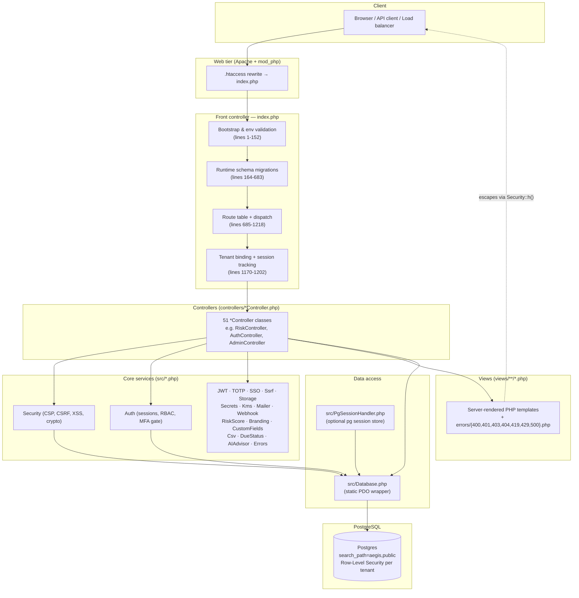
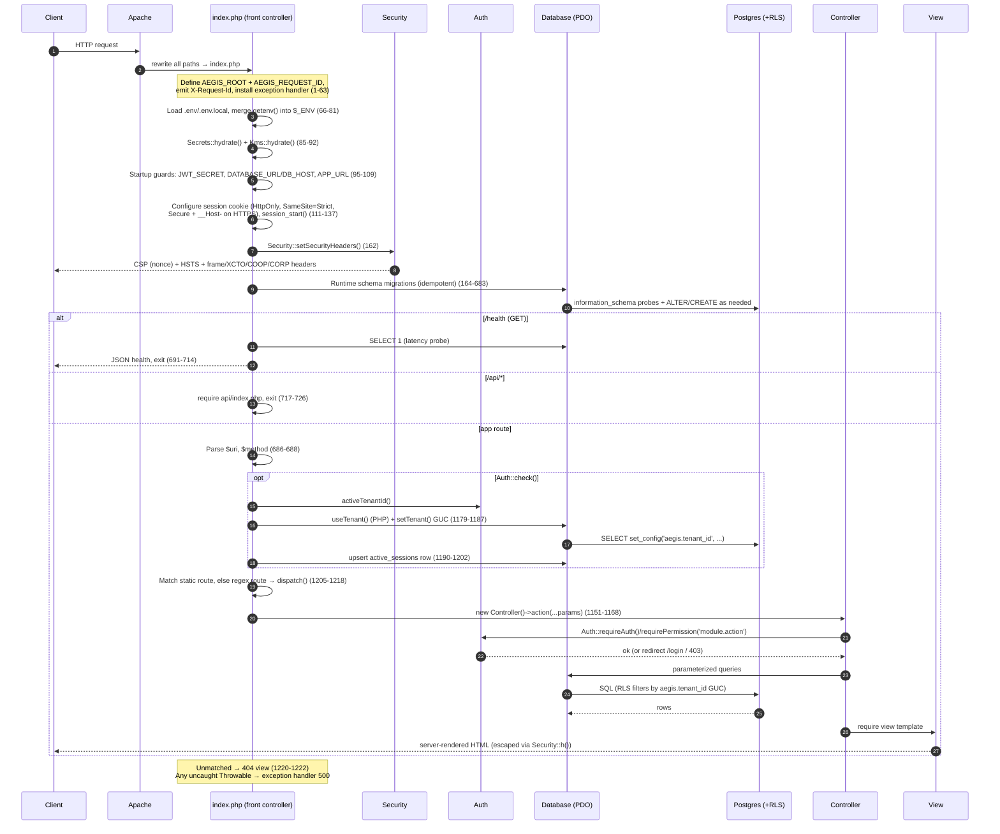

# AEGIS GRC — System & Application Architecture

> Audience: a brand-new engineering team with zero prior knowledge of this codebase.
> Everything below is derived from the actual source. File paths and line numbers are cited so you can verify each claim. Where a feature is *absent* or *inert by default*, that is called out explicitly.

---

## 1. What AEGIS Is

AEGIS is a **server-rendered, multi-module Governance / Risk / Compliance (GRC) platform** built in **plain PHP 8** with **no framework and no Composer dependencies**. It follows a hand-rolled **front-controller + MVC-ish** pattern:

- A single front controller (`index.php`) handles bootstrap, routing, security headers, tenant binding, and dispatch.
- **Controllers** (`controllers/*Controller.php`, 51 files) hold request-handling logic.
- **Views** (`views/**/*.php`, 41 directories) are PHP templates rendered server-side into HTML.
- A small set of **core service classes** (`src/*.php`, 21 classes) provide cross-cutting concerns: security, auth, database access, JWT, TOTP, SSO, storage, secrets, KMS, mail, webhooks, branding, etc.
- **PostgreSQL** is the single backing store, accessed through **PDO** with a thin static `Database` wrapper, and isolated per tenant with **Row-Level Security (RLS)**.

The app runs under **Apache + mod_php** in a Docker image based on `php:8.3-apache` (`Dockerfile:2`), is deployed on **Render** (`render.yaml`), and self-installs its schema on container start (`scripts/startup.sh`).

> Note on PHP version: the project is documented as PHP 8.2-targeted, and the runtime image pins **`php:8.3-apache`** (`Dockerfile:2`). Both are PHP 8.x; the code uses `declare(strict_types=1)`, first-class callable/union types, `match`, `never` return types, and named-argument spread.

---

## 2. Application Layers

AEGIS is organized as a top-down stack. A request enters at the front controller and flows down to Postgres, with the `src/` service classes acting as the shared middle tier.



### Layer responsibilities

| Layer | Location | Responsibility |
|---|---|---|
| Web tier | Apache (`Dockerfile`) | TLS termination upstream, `.htaccess` rewrite of all paths to `index.php`, static asset serving |
| Front controller | `index.php` | Bootstrap, env validation, autoload, security headers, routing, dispatch, tenant binding, session tracking |
| Controllers | `controllers/*Controller.php` (51) | Per-feature request handling; call `Auth::require*`, read input, query via `Database`, render views or emit JSON |
| Core services | `src/*.php` (21) | Security primitives, authentication/authorization, DB access, crypto, mail, integrations |
| Views | `views/**/*.php` (41 dirs) | Server-rendered HTML templates and standalone error pages |
| Data access | `src/Database.php`, `src/PgSessionHandler.php` | PDO connection management, parameterized queries, tenant GUC binding, optional shared session store |
| Database | PostgreSQL | Single source of truth; RLS-based multitenancy; `search_path=aegis,public` |

---

## 3. Runtime Requirements

Derived from `Dockerfile`, `config/database.php`, and `src/Database.php`:

- **PHP 8.x** with `declare(strict_types=1)` throughout. Runtime image: `php:8.3-apache` (`Dockerfile:2`).
- **PHP extensions** (`Dockerfile:12`): `pdo`, `pdo_pgsql` (required — the DSN is `pgsql:...`, see `config/database.php:27`), `gd` (image processing), `opcache`. `libpq-dev` provides the Postgres client libs; `poppler-utils` is installed for PDF tooling.
- **Sodium** is used for settings encryption (`src/Security.php:205` `sodium_crypto_aead_aes256gcm_*`); this ships with PHP 8 by default.
- **PostgreSQL** as the database. Connection is either a single `DATABASE_URL` or discrete `DB_HOST/DB_PORT/DB_NAME/DB_USER/DB_PASS` (`config/database.php:2-23`).
- **Apache** with `mod_rewrite` and `mod_headers` enabled (`Dockerfile:13`), `AllowOverride All` so `.htaccess` works, listening on **port 8080** as the non-root `www-data` user (`Dockerfile`).
- **PDO settings** (`src/Database.php:11-15`): `ERRMODE_EXCEPTION`, default fetch mode `FETCH_ASSOC`, and **`EMULATE_PREPARES = false`** (real server-side prepared statements — important for the parameterized-query safety guarantees).

OPcache is enabled with `validate_timestamps=0` (`Dockerfile`), so **code changes require a container restart** in production — the running process will not pick up edited PHP files.

---

## 4. Folder & Source Organization

Repo root: `aegis/`.

```
aegis/
├── index.php              # Front controller: bootstrap, routes, dispatch (~1223 lines)
├── install.php            # Authoritative installer (run by startup.sh)
├── config/
│   ├── app.php            # App-level config array (name, env, jwt, session/csrf lifetimes, rate limits, password policy)
│   └── database.php       # getDatabaseConfig() + getDSN()
├── controllers/           # 51 *Controller.php — one per feature module
├── views/                 # 41 dirs of *.php server-rendered templates + views/errors/*
├── src/                   # 21 core classes (see §5)
├── api/                   # API surface (api/index.php, api/docs.php — Swagger UI)
├── database/
│   ├── schema.sql         # Complete idempotent schema (manual-setup reference)
│   ├── migrations/        # 32 migration files
│   └── tenancy/           # RLS templates (rls_template.sql)
├── scripts/               # analyzers + cron + startup.sh
├── tests/                 # 15 suites + integration tests
├── render.yaml            # Render deploy manifest
├── Dockerfile             # php:8.3-apache image
├── startup.sh / scripts/startup.sh
└── .env.example           # placeholder env (never commit .env)
```

### Autoloading

`index.php:144-152` registers a single `spl_autoload_register` that resolves a bare class name to either `src/{Class}.php` or `controllers/{Class}.php`. There is **no PSR-4 namespacing** — all classes are global. A handful of core classes are additionally `require_once`’d eagerly during bootstrap (`index.php:154-160`) so they are guaranteed loaded before security headers and routing run.

### Core classes (`src/`)

| Class | Role |
|---|---|
| `Security` | CSP nonce, security headers, CSRF, output escaping (`h()`), settings encryption (libsodium) |
| `Auth` | Session-backed authentication, RBAC (`can`/`requirePermission`), MFA gating, tenant identity |
| `Database` | Static PDO wrapper: `query/fetchOne/fetchAll/insert/update`, tenant GUC + write-path stamping |
| `JWT` | Token signing/verification (uses `JWT_SECRET`) |
| `TOTP` | Time-based OTP for MFA |
| `SSO` | Single sign-on (OIDC/SAML-style) login + callback |
| `Ssrf` | Server-side request forgery guards for outbound fetches |
| `Storage` | File/object storage abstraction for uploads |
| `Secrets` | Resolves `*_FILE` secret mounts into `$_ENV` (`Secrets::hydrate()`) |
| `Kms` | Envelope-encryption key unwrap (`Kms::hydrate()`) — inert unless `KMS_PROVIDER` set |
| `Mailer` | Outbound email |
| `Webhook` | Outbound webhook delivery |
| `RiskScore` | Risk scoring SQL/logic (e.g. `RiskScore::sqlCondition('critical')`) |
| `Branding` | Logo / name / accent-color branding |
| `CustomFields` | User-defined fields per entity |
| `Csv` | CSV import/export |
| `DueStatus` | Due-date status computation |
| `PgSessionHandler` | Postgres-backed PHP session handler (opt-in shared sessions) |
| `AIAdvisor` | AI inference helper (logged to `ai_inference_log`) |
| `Errors` | Centralized HTTP error responses (HTML or JSON) |

---

## 5. The Request Lifecycle (End to End)

Every request rewrites to `index.php`. The lifecycle below is read directly from that file.



### Step-by-step

1. **Constants & correlation ID** (`index.php:6-12`): `AEGIS_ROOT` and a random `AEGIS_REQUEST_ID` (8 random bytes hex) are defined; the ID is emitted as the `X-Request-Id` response header for log correlation.
2. **Error display suppressed** (`index.php:14-18`): `display_errors=0`, `log_errors=1`, `error_reporting(E_ALL)`. Users never see PHP errors; everything goes to the log.
3. **Top-level exception handler** (`index.php:28-63`): see §7.
4. **Environment loading** (`index.php:66-81`): reads `.env.local` then `.env` into `$_ENV`, then merges the system environment via `getenv()`. The comment explains that `variables_order="GPCS"` in `php.ini-production` leaves `$_ENV` empty on Docker/Render, so the `getenv()` merge is required.
5. **Secret hydration** (`index.php:85-92`): `Secrets::hydrate()` resolves `*_FILE` mounts (Docker/K8s/Vault secrets); `Kms::hydrate()` unwraps a KMS-wrapped data key into `APP_ENCRYPTION_KEY` (inert unless `KMS_PROVIDER` is set).
6. **Startup guards** (`index.php:95-109`): throw `RuntimeException` if `JWT_SECRET` is missing/`<32` chars, if no DB is configured, or (in production) if `APP_URL` is unset. These are the only exceptions whose message is shown to the operator (see §7).
7. **Session configuration** (`index.php:111-137`): `cookie_httponly`, `SameSite=Strict`, `use_strict_mode`, `use_only_cookies`. On HTTPS (detected via `REQUEST_SCHEME`, `X-Forwarded-Proto`, or `$_SERVER['HTTPS']`) it sets `cookie_secure` and renames the cookie to **`__Host-AEGIS`** (forces Secure/Path=/, no Domain). If `SESSION_DRIVER=pg`, the Postgres session handler is registered (with a fallback to file sessions on failure); then `session_start()`.
8. **Header hardening** (`index.php:139-141`): removes `X-Powered-By`, disables `expose_php`.
9. **Autoload + eager core loads** (`index.php:144-160`).
10. **Security headers** (`index.php:162` → `Security::setSecurityHeaders()`).
11. **Runtime schema migrations** (`index.php:164-683`): a long series of `try { ... } catch (Throwable) {}` blocks that probe `information_schema` and apply `ALTER TABLE`/`CREATE TABLE IF NOT EXISTS`/seed inserts as needed. Each block is **idempotent and individually guarded** so a failure (e.g. pre-migration DB, permission issue) never aborts the request. This is *belt-and-suspenders* on top of the authoritative `install.php`/`database/schema.sql`.
12. **Route parsing** (`index.php:686-688`): `parse_url(REQUEST_URI, PHP_URL_PATH)` normalized to a leading `/`, plus uppercased method.
13. **Special endpoints** handled before the route table: `/health` (`691-714`, unauthenticated DB+disk probe), `/api/docs` (Swagger UI, `717-720`), and any `/api/*` path delegated to `api/index.php` (`723-726`).
14. **Tenant binding & session tracking** (`index.php:1170-1202`): see §8 and §9.
15. **Dispatch** (`index.php:1205-1218`): static route lookup first, then regex (dynamic) routes; `dispatch()` instantiates the controller and calls the action.
16. **404 fallback** (`index.php:1220-1222`): unmatched paths render `views/errors/404.php`.

---

## 6. Routing & Dispatch (MVC-ish)

### Route table structure

Routes are plain PHP arrays in `index.php`, keyed by HTTP method:

- **Static routes** — `$routes['GET']` (`index.php:730-855`) and `$routes['POST']` (`index.php:856-1010`): exact-path → `[ControllerClass, method]`.
- **Dynamic routes** — `$dynamicRoutes['GET']` and `$dynamicRoutes['POST']`: a regex pattern (e.g. `'#^/risk/(\d+)/accept$#'`) → `[ControllerClass, method]`, where capture groups become positional action arguments (`index.php:1040-1148`).

`grep` counts **202 regex (dynamic) route entries** plus **~275 static entries** across GET/POST, consistent with the project’s “~407 routes” figure (a handful of static keys are duplicated in the array, e.g. `/vendor/contracts`, so the effective count is slightly lower than the raw line count).

Dispatch order (`index.php:1205-1218`):

1. Exact match in `$routes[$method][$uri]` → `dispatch()`.
2. Otherwise iterate `$dynamicRoutes[$method]`, `preg_match` each pattern; on first match, `array_shift` the full-match element and pass the remaining captures as params.
3. Otherwise 404.

### `dispatch()` (`index.php:1151-1168`)

```php
function dispatch(string $controller, string $action, array $params = []): void {
    $file = AEGIS_ROOT . "/controllers/{$controller}.php";
    if (!file_exists($file)) { http_response_code(404); die('Controller not found'); }
    require_once $file;
    $ctrl = new $controller();
    if (!method_exists($ctrl, $action)) { http_response_code(404); die('Action not found'); }
    // Reflection: coerce string regex captures to the action's declared builtin param types
    ...
    $ctrl->$action(...$params);
}
```

A notable detail: dispatch uses **reflection** (`ReflectionMethod`) to read each action parameter’s declared type and `settype()`-coerce the raw string captures (e.g. `"42"` → `int 42`) before invocation. This is why controller actions can declare `function accept(int $id)` and trust the type.

### The "MVC-ish" pattern

It is MVC in spirit, not by framework convention:

- **Controllers** are flat classes (no base controller inheritance enforced) that begin actions by calling `Auth::requirePermission('module.action')` (see `RiskController::dashboard` at `controllers/RiskController.php:13-14`), then query via `Database` and `require` a view.
- **Models** are not formal classes — data access is direct SQL through `Database::fetchAll/fetchOne`, with domain logic in services like `RiskScore`.
- **Views** are PHP templates `require`d by controllers; output is escaped with `Security::h()` per the project’s CSP/XSS rules.

There is **no router object, no DI container, no middleware pipeline** — cross-cutting concerns (auth, CSRF, tenant, headers) are applied imperatively in the front controller and at the top of each controller action.

---

## 7. Error Handling & Logging

### Top-level exception handler (`index.php:28-63`)

A `set_exception_handler` catches every uncaught `Throwable`:

- It always logs `"[AEGIS][{request_id}] Uncaught {Class}: {message} in {file}:{line}"` to the error log.
- **Only `RuntimeException`** instances render their message to the user — and only because AEGIS uses `RuntimeException` *exclusively* for startup configuration guards with operator-safe messages (e.g. “JWT_SECRET must be set…”). These render a dark themed “Configuration Error” page naming the required env vars and the request-id reference.
- **Every other throwable** (e.g. `PDOException`, `TypeError`) renders a **generic 500** (`views/errors/500.php`, or a minimal inline fallback) so SQL, paths, env values, and internal network details never leak. The request-id is shown so an operator can correlate to the log.

### `Errors` helper (`src/Errors.php`)

`Errors::abort(int $code, ?string $message)` centralizes HTTP error responses for the front controller and controllers. It:

- Sets the status code, then renders either an **HTML error view** (`views/errors/{400,401,403,404,419,429,500}.php`) or a **structured JSON body** when the request “wants JSON.”
- `wantsJson()` (`src/Errors.php:63-72`) returns true for `/api/*` paths, `Accept: application/json`, or `X-Requested-With: XMLHttpRequest`.
- The JSON body includes `success:false`, `error`, and a `meta` block (`status`, `request_id`, `timestamp`), encoded with `JSON_HEX_TAG | JSON_HEX_AMP | JSON_HEX_APOS | JSON_HEX_QUOT`.

`Auth::requirePermission` also renders `views/errors/403.php` directly on permission failure (`src/Auth.php:430-437`).

### Database error policy (`src/Database.php:16-24`)

On connection failure, `Database::getInstance()` logs the PDO message server-side and throws a **catchable `RuntimeException('Database unavailable', 503, $e)`**. The comment is explicit that it must **never `die()` mid-output**, so callers that can degrade gracefully catch it, and the front controller renders a clean error otherwise.

### Logging

Logging is via PHP’s `error_log()` to stderr/the Apache error log. In the Docker image, Apache’s `ErrorLog` is routed to `/dev/stderr` and `TransferLog` to `/dev/stdout` (`Dockerfile`), so logs are container-stdout/stderr friendly (12-factor). There is **no structured log framework** — log lines are plain text, consistently prefixed with `[AEGIS]` and the request-id where available.

---

## 8. Multitenancy & Row-Level Security

AEGIS supports multi-tenant isolation that is **inert by default for single-tenant deployments** and enforced in the database via Postgres RLS when configured.

There are **two complementary tenant mechanisms**, both bound once per request in `index.php:1179-1187` after `Auth::check()`:

### a) Read-path isolation — the `aegis.tenant_id` GUC (`Database::setTenant`)

`Database::setTenant(int $tenantId)` (`src/Database.php:77-82`) runs:

```sql
SELECT set_config('aegis.tenant_id', ?, false)
```

This sets a **session GUC** (a custom Postgres runtime setting) that the per-table `tenant_isolation` RLS policies (migration 028) filter on. Because it uses `set_config` with a bound parameter — never string interpolation — the tenant id can’t be an injection vector. When the GUC is unset, the policies are permissive, so single-tenant installs are unaffected.

Companion methods: `currentTenant()` reads the GUC back (`src/Database.php:85-89`); `clearTenant()` resets it (`92-94`).

### b) Write-path stamping — PHP-side tenant context (`Database::useTenant`)

`Database::useTenant(?int $tenantId)` (`src/Database.php:142-144`) sets an **in-process** tenant context (no DB round-trip). On `INSERT`, `Database::insert()` calls `applyTenantStamp()` (`src/Database.php:158-165`), which auto-fills `tenant_id` **only when**:

1. a tenant context is set,
2. the target table is in the tenant-owned allowlist `TENANT_TABLES` (`src/Database.php:104-131`), and
3. the caller didn’t already provide `tenant_id`.

When no context is set, rows fall back to the column `DEFAULT` (tenant 1), so the write path is safe even before authentication binds a tenant. The `TENANT_TABLES` list is split into **primary entities** (migration 027) and **child/detail/link tables** (migration 029), and the comment notes an integration test asserts this list matches the tables that physically carry `tenant_id`.

### Which tenant gets bound

The bound tenant is `Auth::activeTenantId()` (`src/Auth.php:262-272`): the user’s **home tenant** for everyone, except a **platform admin** who has explicitly switched into another tenant (the switch is time-limited via `$_SESSION['active_tenant']['expires']`, falling back to home on expiry). Platform tenant switching is exposed via `POST /platform/switch-tenant` / `/platform/exit-tenant` (`index.php:857-858`).

### Resilience

The `setTenant()` call in the front controller is wrapped in `try/catch` with an `error_log` (`index.php:1182-1186`) so a failure (e.g. a pre-migration database without the GUC machinery) **never takes down the request**.

### Search path

The DSN sets `options='--search_path=aegis,public'` (`config/database.php:27`), so tables resolve from the `aegis` schema first, then `public`. `Database::tableExists()` checks specifically against `table_schema='aegis'` (`src/Database.php:167-173`).

---

## 9. State & Session Management

### Default: file-based PHP sessions

By default AEGIS uses PHP’s built-in **file session handler**, which pins a user to one app instance. Session cookies are hardened in `index.php:111-137` (HttpOnly, SameSite=Strict, strict-mode, cookies-only; Secure + `__Host-AEGIS` name on HTTPS). Authentication state lives in `$_SESSION['user']` (`Auth::check()` at `src/Auth.php:226-228`). Session lifetime is 8 hours (`config/app.php:7`) and idle timeout is enforced in `Auth::requireAuth()` (`src/Auth.php:370-374`).

### Optional: Postgres-backed shared sessions (`src/PgSessionHandler.php`)

For horizontal scaling behind a load balancer, set `SESSION_DRIVER=pg` (`index.php:129-136`). `PgSessionHandler` implements `SessionHandlerInterface` + `SessionUpdateTimestampHandlerInterface` and stores sessions in the `php_sessions` table (provisioned by migration 030), so **any instance can serve any request**. Key design points (from the class header and methods):

- Payloads are **base64-encoded** into a TEXT column because binary-serialized session data can contain non-UTF-8 bytes (`src/PgSessionHandler.php:57-81`).
- Concurrent requests for the **same session id** are serialized with a **Postgres advisory lock** (`pg_advisory_lock(hashtext(id))`) taken in `read()` and released in `close()`/`destroy()` (`118-134`) — matching the file handler’s locking to prevent lost writes.
- `gc()` deletes expired rows; `validateId`/`updateTimestamp` support lazy-write.
- The `php_sessions` table is a **system table with no `tenant_id` and no RLS**, because the handler runs at `session_start()` *before* authentication binds a tenant.
- Registration is wrapped so that if the handler can’t be installed, it **falls back to file sessions** rather than bricking login.

### Active-session tracking (admin)

Independently of the session driver, every authenticated request upserts a row into `active_sessions` (id = `session_id()`, user, IP, truncated user-agent, `last_seen_at`) (`index.php:1190-1202`). This powers the admin session-management UI (`GET /admin/sessions`, kill via `POST /admin/sessions/{id}/kill`). The upsert is wrapped in `try/catch` so tracking failures never break the request.

---

## 10. Security Headers & CSP

`Security::setSecurityHeaders()` (`src/Security.php:337-380`), called at `index.php:162`, sets a strict header set on every response:

- **Content-Security-Policy** (nonce-based, no `'unsafe-inline'` for scripts): `default-src 'self'`; `script-src 'self' 'nonce-{nonce}'` (no external origin — all JS is vendored locally); `style-src 'self' 'unsafe-inline' https://cdn.jsdelivr.net`; `img-src 'self' data: blob: https:` (the `https:` allows externally-hosted branding logos); `connect-src 'self'`; `frame-ancestors 'none'`; `base-uri 'self'`; `form-action 'self'`; `object-src 'none'`.
- The **per-request nonce** is generated once via `Security::nonce()` (`src/Security.php:330-335`, 18 random bytes base64) and reused across all `<script>` tags — every script tag must carry it (per project rules).
- Additional headers: `X-Frame-Options: DENY`, `X-Content-Type-Options: nosniff`, `X-XSS-Protection: 0` (deliberately disabled per current OWASP guidance), `Referrer-Policy: strict-origin-when-cross-origin`, `Cross-Origin-Opener-Policy: same-origin`, `Cross-Origin-Resource-Policy: same-origin`, `X-Permitted-Cross-Domain-Policies: none`, and a restrictive `Permissions-Policy`.
- **HSTS** (`max-age=31536000; includeSubDomains; preload`) is added only when the request is HTTPS (`src/Security.php:375-379`).

The only external asset is the Bootstrap **stylesheet** from jsdelivr, **Subresource-Integrity pinned** in the markup (`style-src`); all JavaScript is vendored locally so `script-src` carries no CDN origin. The header comments note that for air-gapped/IL5+ deployments you should vendor that stylesheet locally and drop the CDN origin from `style-src`.

---

## 11. Deployment & Bootstrapping in Production

- **Image** (`Dockerfile`): `php:8.3-apache`, installs `pdo_pgsql`/`gd`/`opcache`, enables `mod_rewrite`+`mod_headers`, hardens `php.ini` (`expose_php=Off`, `display_errors=Off`, `log_errors=On`, OPcache pinned), runs entirely as non-root `www-data` on port 8080, and defines a `HEALTHCHECK` against `/healthz`.
- **Startup** (`scripts/startup.sh`): runs `php install.php` (the **authoritative installer**) to create/migrate the schema, tolerating a not-ready DB (`|| echo ... continuing`), then `exec apache2-foreground`.
- **Render** (`render.yaml`): a Docker web service `aegis-grc` with `healthCheckPath: /healthz`, a managed `aegis-db` Postgres, `JWT_SECRET`/`ADMIN_PASSWORD` auto-generated, and `APP_URL`/`ADMIN_EMAIL` set per environment (`sync: false`).
- **Health endpoints**: `/health` (front-controller JSON probe with DB latency + disk check, `index.php:691-714`), plus `HealthController::live` (`/healthz`) and `HealthController::ready` (`/readyz`) which return minimal JSON and never disclose internal detail (`controllers/HealthController.php`).

### Configuration surface (`config/`)

- `config/app.php` returns the runtime config array: app name/env/url, `jwt_secret`, **session lifetime 8h**, **CSRF lifetime 2h**, login rate-limit (5 attempts / 300s window / 900s lockout), password policy (min 12 chars, upper/number/special), and API settings (v1, 60 req/min).
- `config/database.php` builds the connection from `DATABASE_URL` (parsed) or discrete `DB_*` vars, and assembles the `pgsql:` DSN with the `aegis,public` search path.

---

## 12. Notable Absences / Caveats (for new engineers)

- **No framework, no Composer, no namespaces** — all classes are global and autoloaded from `src/` or `controllers/` only.
- **No formal model layer** — persistence is direct parameterized SQL via the static `Database` wrapper; there is no ORM.
- **Runtime migrations in `index.php` are a safety net, not the source of truth** — the authoritative schema setup is `install.php` + `database/schema.sql` + `database/migrations/`. The inline blocks exist so a partially-migrated DB self-heals on request, and they are individually `try/catch`-guarded.
- **Tenant isolation is inert until configured** — single-tenant installs run with the permissive RLS path and tenant 1 defaults; the GUC + stamping only "activate" isolation once multiple tenants and the migration-028/029 policies are present.
- **OPcache `validate_timestamps=0`** means edited PHP is ignored until the container restarts.
- **PHP version**: docs say 8.2; the image pins 8.3 (`Dockerfile:2`).
