# AEGIS GRC — Database Documentation & ERD

This document describes the AEGIS GRC database: a single PostgreSQL database whose
objects live in the **`aegis` schema**. It covers every table (grouped by module),
the multi-tenant `tenant_id` / Row-Level-Security (RLS) isolation pattern, primary
keys, foreign keys, indexes, constraints, notable status/enum fields, the immutable
`activity_log` HMAC hash chain, and the full migration history.

> **Sources of truth.** Two files together describe the schema:
> - `database/schema.sql` — a complete, **idempotent, manual-setup reference**
>   (`CREATE TABLE IF NOT EXISTS`, `INSERT ... ON CONFLICT DO NOTHING`). It can be
>   run against a fresh database to produce a working schema.
> - `database/migrations/001…032_*.sql` — the **authoritative, chronological**
>   record of how the schema evolved. `install.php` is the authoritative installer
>   that seeds defaults and runs the migrations.
>
> Several feature tables (e.g. `assets`, `threats`, `kris`, `bcp_plans`,
> `documents`, `audit_findings`, `poam_items`, `ssp_plans`) exist **only in the
> migrations**, not in `schema.sql`. Where this document and `schema.sql` disagree,
> the migrations win. Everything below is grounded in the SQL actually present in
> the repository as of migration `032`.

---

## Table of Contents

1. [Conventions](#1-conventions)
2. [Multi-Tenancy: `tenant_id` + RLS](#2-multi-tenancy-tenant_id--rls)
3. [The Immutable Audit Log (HMAC Hash Chain)](#3-the-immutable-audit-log-hmac-hash-chain)
4. [Identity, Auth & Platform Tables](#4-identity-auth--platform-tables)
5. [Compliance & Controls Module](#5-compliance--controls-module)
6. [Audit Module](#6-audit-module)
7. [Policy Module](#7-policy-module)
8. [Risk Module](#8-risk-module)
9. [Incident & Issue Module](#9-incident--issue-module)
10. [Vendor / Third-Party Module](#10-vendor--third-party-module)
11. [Asset, Threat & KRI Modules](#11-asset-threat--kri-modules)
12. [BCP / DR Module](#12-bcp--dr-module)
13. [Compliance Programs: SSP, POA&M, CUI, ODP, Projects](#13-compliance-programs-ssp-poam-cui-odp-projects)
14. [Awareness & Privacy Modules](#14-awareness--privacy-modules)
15. [Questionnaires, Workflows, Approvals & Automation](#15-questionnaires-workflows-approvals--automation)
16. [Webhooks, Reporting, Email & Notifications](#16-webhooks-reporting-email--notifications)
17. [Evidence, Documents, Tags & Custom Fields](#17-evidence-documents-tags--custom-fields)
18. [System & Settings Tables](#18-system--settings-tables)
19. [Mermaid ERD (Core Entities)](#19-mermaid-erd-core-entities)
20. [Migration History (001–032)](#20-migration-history-001032)
21. [Removed Tables (Migration 032)](#21-removed-tables-migration-032)

---

## 1. Conventions

The schema follows consistent patterns. Understanding them once avoids repeating
them on every table:

- **Schema namespace.** All objects live in the `aegis` schema. Migrations from
  `010` onward qualify identifiers as `aegis.<table>`; earlier ones rely on the
  connection `search_path`.
- **Primary keys.** Every table has a surrogate key `id SERIAL PRIMARY KEY`
  (integer auto-increment), except: `tenants.id` is `BIGSERIAL`; `settings.key`,
  `rate_limits.key`, `php_sessions.id`, and `active_sessions.id` are natural string
  PKs.
- **Timestamps.** Most tables carry `created_at TIMESTAMP NOT NULL DEFAULT
  CURRENT_TIMESTAMP`; mutable entities also carry `updated_at`. The application's
  `Database::update()` helper **automatically appends `updated_at = NOW()`** — never
  pass `updated_at` in an update payload.
- **User references.** Audit/ownership columns (`created_by`, `owner_id`,
  `assigned_to`, `reviewed_by`, `granted_by`, etc.) are `INTEGER REFERENCES
  users(id)`. Most are nullable (`ON DELETE` not specified → restrict); detail rows
  generally use `ON DELETE CASCADE` to their parent.
- **JSON columns.** Configuration and list-valued fields use `JSONB` (e.g.
  `risks.treatment_strategies`, `report_schedules.recipients`,
  `risk_matrix_config.cells`). The single exception is `activity_log.changes`, which
  is `TEXT` by design — see [§3](#3-the-immutable-audit-log-hmac-hash-chain).
- **Enums.** Status/type fields are `VARCHAR` columns constrained with `CHECK (col
  IN (...))` rather than native Postgres `ENUM` types. This keeps them migratable.
- **Human-readable identifiers.** Many entities carry a unique business key in
  addition to the numeric `id` (e.g. `incidents.incident_number`,
  `audits.audit_number`, `audit_findings.finding_number`, `poam_items.poam_number`,
  `grc_projects.project_code`). These are application-generated (migration `020`).
- **Tenant ownership.** Tenant-owned tables carry `tenant_id BIGINT NOT NULL DEFAULT
  1 REFERENCES tenants(id)` and an RLS policy — see [§2](#2-multi-tenancy-tenant_id--rls).

---

## 2. Multi-Tenancy: `tenant_id` + RLS

AEGIS ships single-tenant by default but is built for SaaS multi-tenancy. The
mechanism is **inert until activated**, so existing single-tenant installs behave
identically.

### 2.1 The tenant registry

```sql
CREATE TABLE tenants (
    id         BIGSERIAL PRIMARY KEY,
    name       VARCHAR(255) NOT NULL,
    slug       VARCHAR(100) UNIQUE NOT NULL,
    is_active  BOOLEAN NOT NULL DEFAULT TRUE,
    created_at TIMESTAMP NOT NULL DEFAULT CURRENT_TIMESTAMP
);
```

A **default tenant (`id = 1`, slug `default`)** is seeded and the identity sequence
bumped past it. Every `tenant_id` column defaults to `1` and FKs back to `tenants`,
so the default tenant **must** exist before any tenant-bearing row is inserted.
Created in migration **026** (`tenancy_foundation`).

### 2.2 `tenant_id` columns (migrations 027 + 029)

`tenant_id BIGINT NOT NULL DEFAULT 1 REFERENCES aegis.tenants(id)` plus an
`idx_<table>_tenant` index is added to two tiers of tables:

- **Primary entities (migration 027):** `users`, `risks`, `policies`, `audits`,
  `audit_findings`, `compliance_packages`, `compliance_objectives`,
  `control_implementations`, `incidents`, `issues`, `vendors`, `assets`, `threats`,
  `poam_items`, `kris`, `documents`, `bcp_plans`, `privacy_records`,
  `account_reviews`*, `awareness_programs`, `change_requests`*, `grc_projects`,
  `cui_inventory`, `odp_entries`, `ssp_plans`, `questionnaires`.
- **Child/detail + link tables (migration 029):** `audit_schedules`, `audit_items`,
  `finding_updates`, `policy_versions`, `policy_mappings`, `policy_reviews`,
  `policy_attestations`, `policy_attestation_campaigns`, `risk_score_history`,
  `risk_control_links`, `risk_related_links`, `risk_treatments`, `risk_acceptances`,
  `risk_bowtie_causes`, `risk_bowtie_consequences`, `risk_bowtie_barriers`,
  `risk_scenarios`, `risk_reviews`, `risk_review_items`, `risk_exceptions`,
  `treatment_plans`, `treatment_milestones`, `incident_updates`,
  `incident_sla_events`, `issue_updates`, `vendor_assessments`, `vendor_contracts`,
  `asset_risk_links`, `threat_risk_links`, `poam_milestones`, `kri_values`,
  `document_versions`, `bcp_plan_sections`, `bcp_exercises`, `data_subject_requests`,
  `account_review_items`*, `awareness_assignments`, `ssp_packages`,
  `ssp_control_statements`, `questionnaire_questions`, `questionnaire_assignments`,
  `questionnaire_responses`, `questionnaire_answers`, `change_request_updates`*,
  `grc_project_tasks`, `grc_project_links`, `control_mappings`, `control_tests`,
  `raci_assignments`, `shared_responsibility`, `evidence`, `evidence_files`.

> \* `account_reviews`, `account_review_items`, `change_requests`, and
> `change_request_updates` were **dropped in migration 032**. They appear in the
> 027/028/029 table arrays but those blocks are existence-checked, so dropping the
> tables simply skips them. See [§21](#21-removed-tables-migration-032).

The application mirror of this list is `Database::TENANT_TABLES` in
`src/Database.php` (lines 104–131). An integration test asserts that constant
matches the tables that physically carry `tenant_id`.

### 2.3 The `tenant_isolation` RLS policy (migration 028)

Every tenant-owned table has RLS **enabled and forced** with a single policy:

```sql
ALTER TABLE aegis.<t> ENABLE ROW LEVEL SECURITY;
ALTER TABLE aegis.<t> FORCE  ROW LEVEL SECURITY;
CREATE POLICY tenant_isolation ON aegis.<t>
  USING (
    NULLIF(current_setting('aegis.tenant_id', true), '') IS NULL
    OR tenant_id = NULLIF(current_setting('aegis.tenant_id', true), '')::bigint)
  WITH CHECK (
    NULLIF(current_setting('aegis.tenant_id', true), '') IS NULL
    OR tenant_id = NULLIF(current_setting('aegis.tenant_id', true), '')::bigint);
```

Key properties:

- **Permissive fallback.** When the `aegis.tenant_id` session GUC is **unset or
  empty** (single-tenant deployments, CLI scripts, cron, background workers, and any
  request before a tenant is bound), the policy is permissive — all rows are
  visible. The system is therefore **inert** out of the box.
- **Hard isolation when bound.** When a request binds a tenant, reads *and* writes
  are confined to that tenant **inside the database** — a forgotten `WHERE` clause
  or even a SQL injection cannot cross the tenant boundary.
- **`FORCE` + non-superuser.** `FORCE ROW LEVEL SECURITY` makes the policy apply
  even to the table owner. The runtime app **must connect as a non-superuser role**
  (superusers bypass RLS — see `database/roles.sql`).
- **`NULLIF(..,'')` guard.** SQL `OR` is not guaranteed to short-circuit, so an
  empty-string GUC cast directly to `bigint` could raise error `22P02`. `NULLIF`
  makes the cast total: an unset/empty GUC becomes `NULL` (→ permissive) instead of
  erroring.

> The migration comments note a future **Phase 4 / hard cutover** to
> **deny-by-default** (NULL GUC ⇒ *no* rows) plus `NOT NULL`. That is not yet
> implemented; the current state is permissive-fallback.

### 2.4 Binding a tenant (application side)

`src/Database.php` provides two complementary mechanisms:

- **Read/write isolation (DB):** `Database::setTenant(int)` runs
  `SELECT set_config('aegis.tenant_id', ?, false)` — parameterized, never string
  interpolation. `currentTenant()` reads it back; `clearTenant()` resets it.
- **Write-path stamping (PHP):** `Database::useTenant(?int)` sets an in-process
  context; `applyTenantStamp()` auto-injects `tenant_id` into `Database::insert()`
  payloads for tenant-owned tables *only when* a context is set, the table is
  tenant-owned, and the caller didn't already supply `tenant_id`. With no context,
  rows fall back to the column `DEFAULT 1`.

**Platform admins** (`users.is_platform_admin`, migration 031) are the SaaS-operator
role that may switch tenant context (`Auth::switchTenant` / `exitTenant`), audited
and time-boxed. This is deliberately **not** a `module.action` permission, because
tenant `admin` users bypass permission checks.

---

## 3. The Immutable Audit Log (HMAC Hash Chain)

The `activity_log` table is a **tamper-evident, append-only audit trail** secured by
a keyed HMAC hash chain. Implementation: `Auth::appendAuditLog()` /
`Auth::computeLogHash()` (`src/Auth.php`), key from `Security::auditKey()`,
verifier `scripts/verify_audit_log.php`.

### 3.1 Table

```sql
CREATE TABLE activity_log (
    id          SERIAL PRIMARY KEY,
    user_id     INTEGER REFERENCES users(id),  -- NULL for system / failed-login rows
    action      VARCHAR(255) NOT NULL,
    entity_type VARCHAR(100),
    entity_id   INTEGER,
    changes     TEXT,                           -- exact json_encode() bytes (see below)
    ip_address  VARCHAR(50),
    user_agent  VARCHAR(500),                   -- added in migration 001
    log_hash    VARCHAR(64),                    -- HMAC-SHA256 chain link (migration 001)
    created_at  TIMESTAMP NOT NULL DEFAULT CURRENT_TIMESTAMP
);
```
Indexes: `idx_al_user(user_id)`, `idx_al_entity(entity_type, entity_id)`,
`idx_al_created(created_at)`.

### 3.2 How the chain is computed

Each new row's `log_hash` is an **HMAC-SHA256** over the **previous row's hash**
concatenated (with `|`) to the new row's own fields, in this exact order:

```
log_hash = HMAC_SHA256( key,
    prev_hash | user_id | action | entity_type | entity_id | changes | ip )
```

- The very first row chains from the literal string **`'genesis'`** (also the
  back-fill value migration 001 applies to pre-existing rows).
- `user_id` is the empty string `''` for system / failed-login rows, so **every**
  row type is verifiable.
- The **key** comes from `Security::auditKey()`: a dedicated `AUDIT_HMAC_KEY` env
  var if set, otherwise derived from `JWT_SECRET`. Because it is **keyed** (HMAC,
  not a bare SHA-256), an attacker who can write the database but cannot read the
  key **cannot forge** the chain.
- Writes are serialized with a **PostgreSQL session advisory lock**
  (`pg_advisory_lock(hashtext('aegis_audit_chain'))`) so concurrent requests can't
  read the same previous hash and fork the chain. The lock is best-effort and always
  released.

### 3.3 Why `changes` is `TEXT`, not `JSONB` (migration 025)

The chain hashes the **exact** `json_encode()` string written to `changes`.
PostgreSQL `JSONB` *normalizes* values on storage (re-spaces, reorders keys), so the
value read back never matched the hashed input — silently breaking verification for
any row carrying a before/after payload. Migration **025** converts the column to
`TEXT` to preserve the exact bytes. No JSON operators (`->` / `->>`) are used on it
anywhere in the codebase.

### 3.4 Verification

`scripts/verify_audit_log.php` walks the rows in `id` order, reconstructs each
`log_hash` from the stored columns (`prev_hash`, `user_id`, `action`, `entity_type`,
`entity_id`, `changes`, `ip`) using the same key, and flags any mismatch — detecting
edited, deleted, or inserted rows.

---

## 4. Identity, Auth & Platform Tables

| Table | Purpose / key columns |
|---|---|
| **users** | People & accounts. `name`, `email UNIQUE`, `password_hash`, `role` (default `viewer`), `department`, `job_title`, `is_active`. SSO/MFA (migration 001): `sso_provider`, `sso_subject`, `sso_only`, `mfa_secret`, `mfa_enabled` — partial unique index `idx_users_sso(sso_provider, sso_subject)`. `email_verified_at` (006). `is_platform_admin` (031). Tenant-owned. |
| **tenants** | Tenant registry (see [§2.1](#21-the-tenant-registry)). |
| **api_keys** | Programmatic access keys. `user_id` (CASCADE), `key_prefix`, `key_hash`, `permissions JSONB` (default `["read"]`), `expires_at`, `is_active`. |
| **user_permissions** | Granular page-level grants. `user_id` (CASCADE), `module`, `permission`, `granted_by`, `UNIQUE(user_id, module, permission)`. `module` ∈ risk/compliance/audit/policy/incident/vendor/issue/asset/change/bcp/threat/awareness/report/kri/ssp/automation/approval; `permission` ∈ view/create/edit/delete/accept/review/… (full list in `schema.sql` header). Coarse `read/write/edit` grants were migrated to granular ones in migration 021. |
| **user_notification_prefs** | Per-user notification toggles (migration 008). `user_id` (CASCADE), `notification_type`, `enabled`, `digest_mode` ∈ `immediate/daily/weekly`, `digest_time`, `UNIQUE(user_id, notification_type)`. |
| **active_sessions** | Live session tracking (003). String PK `id`, `user_id` (CASCADE), `ip_address`, `user_agent`, `last_seen_at`. |
| **password_reset_tokens** | One token per user (003). `user_id UNIQUE` (CASCADE), `token_hash`, `expires_at`, `used`. |
| **email_verification_tokens** | New-account email verification (006). `user_id` (CASCADE), `token_hash UNIQUE`, `expires_at`, `used_at`. |
| **mfa_backup_codes** | TOTP recovery codes (003). `user_id` (CASCADE), `code_hash`, `used_at`. |
| **php_sessions** | Shared Postgres session store (030, `SESSION_DRIVER=pg`). String PK, `data TEXT`, `expires_at`. **System table — no `tenant_id`, no RLS** (read at `session_start()` before a tenant is bound). |
| **rate_limits** | Brute-force throttling. Natural PK `key`, `attempts`, `window_start`, `blocked_until`. |

---

## 5. Compliance & Controls Module

| Table | Purpose / key columns |
|---|---|
| **standards** | Framework catalog (ISO 27001, NIST, etc.). `code UNIQUE`, `name`, `version`, `category`, `authority`, `url`. |
| **compliance_packages** | An imported framework instance. `standard_id` (CASCADE), `name`, `version`, `price`, `objectives_count`, `imported_by`. Tenant-owned. |
| **compliance_objectives** | The control/requirement tree. `package_id` (CASCADE), self-referencing `parent_id`, `code`, `title`, `level` (1 = domain), `weight`, `sort_order`. Tenant-owned. Indexes on `package_id`, `parent_id`. |
| **control_implementations** | Org's implementation of one objective. `objective_id UNIQUE` (CASCADE), `status` (default `not_started`), `implementation_notes`, `evidence`, `assigned_to`, `due_date`, `last_reviewed`, `reviewed_by`. Tenant-owned. |
| **control_mappings** | Cross-framework crosswalk (002). `source_obj_id` / `target_obj_id` (both CASCADE), `mapping_type` ∈ equivalent/subset/superset/related, `UNIQUE(source_obj_id, target_obj_id)`. |
| **control_tests** | Control effectiveness testing (003). `objective_id` + `package_id` (CASCADE), `test_date`, `tester_id`, `result` ∈ pass/fail/partial/not_tested, `effectiveness` 0–100, `next_test_date`. |
| **raci_assignments** | RACI matrix per objective (017). `package_id` + `objective_id` + `user_id` (all CASCADE), `raci_role`, `UNIQUE(package_id, objective_id, user_id, raci_role)`. |
| **shared_responsibility** | Customer/provider responsibility split (017). `package_id` + `objective_id`, `UNIQUE(package_id, objective_id)`. |
| **risk_appetite** | Appetite statements per category (003). `category`, `appetite` ∈ zero/low/moderate/high, `statement`, `max_score`, `amber_threshold`, `red_threshold` (heat-map thresholds, 007). Seeded with 6 default categories. |

---

## 6. Audit Module

| Table | Purpose / key columns |
|---|---|
| **audits** | Audit engagements. `name`, `package_id`, `audit_type` (default `internal`), `frequency`, `status` (default `planned`), `scheduled_date`/`start_date`/`completed_date`, `auditor_id`, `created_by`, `score`. `audit_number VARCHAR(20) UNIQUE` (020). Tenant-owned. |
| **audit_schedules** | Recurring audit cadence. `package_id`, `frequency` (default `annual`), `last_audit_date`, `next_due_date`, `assigned_auditor`. |
| **audit_items** | Per-objective audit results. `audit_id` (CASCADE), `objective_id`, `status` (default `not_assessed`), `finding`, `evidence`, `risk_level`, `remediation`, `remediation_due`. Index on `audit_id`. |
| **audit_findings** | External-audit findings register (016). `finding_number UNIQUE`, `objective_id`/`package_id` (`ON DELETE SET NULL`), `severity` ∈ critical/high/medium/low/info, `status` ∈ open/in_progress/resolved/risk_accepted/closed, `owner_id`. Tenant-owned. |
| **finding_updates** | Comment/status-change thread on a finding (016). `finding_id` (CASCADE), `user_id`, content. |

---

## 7. Policy Module

| Table | Purpose / key columns |
|---|---|
| **policies** | Policy documents. `title`, `policy_number`, `content`, `version` (default `1.0`), `status` (default `draft`), `category`, `owner_id`, `approver_id`, `review_frequency`, `next_review_date`, `approved_at`, `published_at`. Tenant-owned. |
| **policy_versions** | Version history. `policy_id` (CASCADE), `version`, `content`, `change_summary`, `created_by`. |
| **policy_mappings** | Policy ↔ objective coverage. `policy_id` + `objective_id` (both CASCADE), `UNIQUE(policy_id, objective_id)`. Indexes on each. |
| **policy_reviews** | Scheduled policy reviews. `policy_id` (CASCADE), `reviewer_id`, `scheduled_date`, `completed_date`, `status` (default `pending`), `outcome`. |
| **policy_attestations** | User attestations (003). `policy_id` + `user_id` (CASCADE), `attested_at`, `ip_address`, `UNIQUE(policy_id, user_id)`. |
| **policy_attestation_campaigns** | Attestation drives (003). `policy_id` (CASCADE), `title`, `due_date`, `is_active`. |

---

## 8. Risk Module

The richest module. The hub table is **`risks`**; many satellite tables reference it
`ON DELETE CASCADE`.

### 8.1 `risks` (core)

`title`, `risk_id` (display code), `description`, `category_id REFERENCES
risk_categories`, **`likelihood`** & **`impact`** (both `CHECK BETWEEN 1 AND 5`,
default 3), `inherent_score`, residual axes (`residual_likelihood`,
`residual_impact`, `residual_score`), `status` (default `open`), `treatment_type`,
**`treatment_strategies JSONB`** (multi-select, e.g. `["mitigate","transfer"]` —
migration 004), `owner_id`, `review_date`, `identified_date`, `tags JSONB`,
`created_by`.

**Enterprise columns (migration 005):** `velocity` (1–5), `proximity` ∈
immediate/short_term/medium_term/long_term, financial exposure
(`financial_min`/`financial_likely`/`financial_max`/`financial_currency`),
self-referencing `parent_risk_id` (roll-up hierarchy), `assessment_status` ∈
draft/pending_review/approved, `reviewed_by`/`reviewed_at`/`review_notes`,
`risk_source` (9-value taxonomy), `confidence` ∈ low/medium/high, target axes
(`target_likelihood`/`target_impact`/`target_score` — 023).
**Scanner ingestion (003):** `source`, `source_external_id` (partial index).
Indexes: `status`, `inherent_score`, `residual_score`, `owner_id`,
`parent_risk_id`, `assessment_status`, `risk_source`. Tenant-owned.

### 8.2 Risk satellites

| Table | Purpose / key columns |
|---|---|
| **risk_categories** | Category lookup. `name`, `color` (default `#6366f1`), `sort_order`. |
| **risk_score_history** | Auto-logged score timeline (005). `risk_id` (CASCADE), likelihood/impact/score + residual, `status`, `treatment_strategies`, `changed_by`, `note`. Indexes `(risk_id, created_at)`, `(created_at)`. |
| **risk_control_links** | Risk ↔ control coverage (005). `risk_id` + `control_implementation_id` (CASCADE), `effectiveness` ∈ none/partial/substantial/full, `UNIQUE(risk_id, control_implementation_id)`. |
| **risk_related_links** | Causal/related links between risks (005). `risk_id` + `related_id` (CASCADE), `link_type` ∈ related/causes/caused_by/aggregates, `UNIQUE(risk_id, related_id)`. |
| **risk_treatments** | Treatment actions. `risk_id` (CASCADE), `treatment_type`, `description`, `cost_estimate`, `effort`, `due_date`, `status` (default `planned`, indexed), `owner_id`, `completion_date`, `completion_notes`. |
| **treatment_plans** | Structured treatment plans (003). `risk_id` (CASCADE), `strategy` ∈ mitigate/transfer/accept/avoid, `target_score`, `start_date`/`target_date`, `status` ∈ draft/active/completed/cancelled. `plan_code UNIQUE` (020). |
| **treatment_milestones** | Milestones within a plan (003). `plan_id` (CASCADE), `title`, `due_date`, `completed_at`/`completed_by`, `sort_order`. |
| **risk_acceptances** | Formal risk acceptances (007). `risk_id` (CASCADE), `accepted_by`, `acceptance_reason`, `valid_until`, `status` ∈ active/expired/revoked/superseded, snapshot of score/level at acceptance, `renewed_from` (self-ref), revocation fields. |
| **risk_exceptions** | Exception/acceptance workflow (003). `risk_id` (CASCADE), `requested_by`, `approved_by`, `status` ∈ pending/approved/rejected/expired, `exception_type` ∈ accept/transfer/defer, `rationale`, `compensating_controls`, `expiry_date`. |
| **risk_bowtie_causes** | Bowtie left side (007). `risk_id` (CASCADE), `cause_type` ∈ threat/vulnerability/hazard/event, `likelihood_contribution` ∈ low/medium/high. |
| **risk_bowtie_consequences** | Bowtie right side (007). `risk_id` (CASCADE), `consequence_type` ∈ financial/operational/reputational/legal/safety/impact, `severity` ∈ low/medium/high/critical. |
| **risk_bowtie_barriers** | Bowtie barriers (007). `risk_id` (CASCADE), `side` ∈ left/right, `barrier_type` ∈ control/procedure/training/technology/monitoring, `effectiveness` ∈ degraded/partial/substantial/full, optional `control_implementation_id` (`ON DELETE SET NULL`). |
| **risk_scenarios** | Stress/what-if scenarios (007). `risk_id` (CASCADE), `scenario_type` ∈ stress/base/optimistic/catastrophic/regulatory, likelihood/impact multipliers, scenario axes & score, `financial_impact_est`, `probability`, `assumptions`. |
| **risk_reviews** | Formal review sessions (006). `review_type` ∈ periodic/triggered/ad_hoc/board, `scheduled_date`, `status` ∈ planned/in_progress/completed/cancelled, `lead_reviewer_id`, `scope_filter JSONB`, count rollups, sign-off fields. |
| **risk_review_items** | Per-risk review record (006). `review_id` + `risk_id` (CASCADE), `status` ∈ pending/reviewed/escalated/deferred/not_applicable, `new_likelihood`/`new_impact`, `treatment_adequate`, `reviewed_by`, `UNIQUE(review_id, risk_id)`. |
| **risk_matrix_config** | Heat-map configuration. `rows`/`cols` (default 5×5), `row_labels`/`col_labels`/`thresholds`/`colors` (JSONB), per-cell `cells JSONB` (010), `is_active`. |

---

## 9. Incident & Issue Module

> The Incidents **UI** was removed (migration 032) but the **tables are kept** —
> the retained Incident-SLA feature depends on them.

| Table | Purpose / key columns |
|---|---|
| **incidents** | `incident_number UNIQUE`, `title`, `severity` ∈ critical/high/medium/low, `category`, `status` ∈ open/investigating/resolved/closed, `reported_by`, `assigned_to`, `affected_systems`, `detected_at`, `resolved_at`. Indexes on `status`, `severity`. Tenant-owned. |
| **incident_updates** | Comment thread. `incident_id` (CASCADE), `user_id`, `content`. |
| **incident_sla_policies** | Per-severity SLA targets (003). `severity UNIQUE`, `acknowledge_hours`, `resolve_hours`, `escalate_hours`. Seeded for critical/high/medium/low. |
| **incident_sla_events** | SLA milestone log (003). `incident_id` (CASCADE), `event_type` ∈ acknowledged/resolved/escalated/breach, `occurred_at`. |
| **issues** | `issue_number UNIQUE`, `title`, `severity` ∈ critical/high/medium/low, `status` ∈ open/in_progress/resolved/closed, `source_type`/`source_id` (workflow auto-create, 002), `assigned_to`, `created_by`, `due_date`. Index on `status`. Tenant-owned. |
| **issue_updates** | Comment thread. `issue_id` (CASCADE), `user_id`, `content`. |
| **playbooks** / **playbook_steps** / **incident_playbook_runs** / **playbook_step_completions** | Incident response playbooks (003). A playbook has ordered steps; a run links a playbook to an incident (`UNIQUE(incident_id, playbook_id)`); completions track per-step sign-off (`UNIQUE(run_id, step_id)`). |

---

## 10. Vendor / Third-Party Module

| Table | Purpose / key columns |
|---|---|
| **vendors** | `name`, `category`, `status` ∈ active/inactive/under_review, `risk_rating` ∈ critical/high/medium/low, contact fields, `owner_id`, `created_by`. Index on `status`. `vendor_code` business key (020). Tenant-owned. |
| **vendor_assessments** | `vendor_id` (CASCADE), `assessment_type` (default `security`), `status` ∈ planned/in_progress/completed/cancelled, `assessed_by`, `score` 0–100, `findings`, `recommendations`. |
| **vendor_contracts** | Contracts (003). `vendor_id` (CASCADE), `title`, `contract_number`, `status` ∈ draft/active/expired/terminated, `value`/`currency`, `start_date`/`end_date`, `auto_renewal`, `renewal_notice_days`. Indexes on `vendor_id`, `end_date`. |
| **vendor_portal_tokens** | External self-assessment links (003). `vendor_id` (CASCADE), `token_hash UNIQUE`, `questions JSONB`, `expires_at`, `used_at`, `response JSONB`. |

---

## 11. Asset, Threat & KRI Modules

| Table | Purpose / key columns |
|---|---|
| **assets** | Inventory (003). `name`, `asset_type` (server/workstation/application/database/network/cloud/mobile/iot/saas), `criticality` ∈ critical/high/medium/low, `classification` ∈ public/internal/confidential/restricted, `status` ∈ active/decommissioned/maintenance, `owner_id`, `ip_address INET`, `hostname`, `vendor`, `version`, `tags JSONB`. `asset_code UNIQUE` (020). Indexes on type/criticality/status. Tenant-owned. |
| **asset_risk_links** | Asset ↔ risk join (003). `asset_id` + `risk_id` (CASCADE), `UNIQUE(asset_id, risk_id)`. |
| **threats** | Threat register (003). `title`, `category` ∈ people/process/technology/natural/regulatory/financial, `likelihood`/`impact` (1–5), `status` ∈ active/mitigated/accepted/retired, `mitigations`, `owner_id`. `threat_number UNIQUE` (020). Tenant-owned. |
| **threat_risk_links** | Threat ↔ risk join (003). `threat_id` + `risk_id` (CASCADE), `UNIQUE(threat_id, risk_id)`. |
| **kris** | Key Risk Indicators (003). `title`, `unit`, `direction` ∈ higher_worse/lower_worse, thresholds `threshold_green`/`amber`/`red`, `frequency` ∈ daily/weekly/monthly/quarterly, `owner_id`, `linked_risk_id` (`ON DELETE SET NULL`), `is_active`. Tenant-owned. |
| **kri_values** | KRI measurements (003). `kri_id` (CASCADE), `value`, `recorded_at`, `recorded_by`. Indexes on `kri_id`, `recorded_at`. |

---

## 12. BCP / DR Module

| Table | Purpose / key columns |
|---|---|
| **bcp_plans** | Business continuity plans (003). `title`, `version`, `status` ∈ draft/active/archived, `owner_id`, `rto_hours`, `rpo_hours`, `last_tested`, `next_test_date`. `plan_code UNIQUE` (020). Tenant-owned. |
| **bcp_plan_sections** | Plan sections (003). `plan_id` (CASCADE), `section_type` (scope/threats/procedures/contacts/recovery/dependencies), `title`, `content`, `sort_order`. |
| **bcp_exercises** | Tabletop/walkthrough/full-scale exercises (003). `plan_id` (CASCADE), `exercise_type`, `scheduled_date`/`conducted_date`, `outcome` (passed/passed_with_findings/failed/cancelled), `findings`, `lessons_learned`. |

---

## 13. Compliance Programs: SSP, POA&M, CUI, ODP, Projects

| Table | Purpose / key columns |
|---|---|
| **ssp_plans** | System Security Plans (013). Heavily extended in **018** (versioning + authorization signatures) and **019** (company info, approval, certification, system boundary/environment, and JSONB inventories: `team_contacts`, `data_inventory`, `hardware_inventory`, `software_inventory`, `network_devices`, `server_inventory`, etc.). `created_by`. Tenant-owned. |
| **ssp_packages** | SSP ↔ package m:n (013). `ssp_id` + `package_id` (CASCADE), `UNIQUE(ssp_id, package_id)`. |
| **ssp_control_statements** | Per-control SSP narrative (013). `ssp_id` + `objective_id` (CASCADE), `UNIQUE(ssp_id, objective_id)`. |
| **poam_items** | Plans of Action & Milestones (014). `poam_number UNIQUE`, `objective_id`/`package_id` (`ON DELETE SET NULL`), `status` (indexed), `owner_id`, `created_by`. Tenant-owned. |
| **poam_milestones** | POA&M milestones (014). `poam_id` (CASCADE). |
| **odp_entries** | Organizationally Defined Parameters (014). `objective_id` (CASCADE), `parameter_name`, `updated_by`, `UNIQUE(objective_id, parameter_name)`. Tenant-owned. |
| **cui_inventory** | Controlled Unclassified Information register (015). `inventory_number UNIQUE`, `asset_id` (`ON DELETE SET NULL`), `storage_type` (indexed), `created_by`. Tenant-owned. |
| **grc_projects** | GRC project tracker (015). `project_code UNIQUE`, `status` ∈ planning/active/on_hold/completed/cancelled, `project_lead`, `created_by`. Tenant-owned. |
| **grc_project_tasks** | Project tasks (015). `project_id` (CASCADE), `status` ∈ todo/in_progress/done, `assigned_to`. |
| **grc_project_links** | Project ↔ entity links (015). `project_id` (CASCADE), `UNIQUE(project_id, entity_type, entity_id)`. |

---

## 14. Awareness & Privacy Modules

| Table | Purpose / key columns |
|---|---|
| **awareness_programs** | Security awareness training (012). `created_by`. Tenant-owned. |
| **awareness_assignments** | Per-user training assignment (012). `program_id` + `user_id` (CASCADE), `UNIQUE(program_id, user_id)`. Index on `program_id`. |
| **privacy_records** | Records of Processing Activities (RoPA) (012). `created_by`, `status` (indexed). Tenant-owned. |
| **data_subject_requests** | DSAR queue (012). `request_type`, `status` (indexed), `assigned_to`. |
| **account_reviews** / **account_review_items** | Access certification (012). **Dropped in migration 032** — see [§21](#21-removed-tables-migration-032). |

---

## 15. Questionnaires, Workflows, Approvals & Automation

| Table | Purpose / key columns |
|---|---|
| **questionnaires** | Reusable questionnaires (003). `title`, `entity_type` (general/vendor/audit), `is_active`, `created_by`. Tenant-owned. |
| **questionnaire_questions** | Questions (003). `questionnaire_id` (CASCADE), `section`, `question_type` (text/scale/boolean/choice/multiselect), `options JSONB`, `weight`, `is_required`. |
| **questionnaire_assignments** | Assignment to an entity/user (003). `questionnaire_id`, `entity_type`/`entity_id`, `assigned_to`, `due_date`, `status` ∈ pending/in_progress/submitted/reviewed. |
| **questionnaire_responses** | Submitted responses (003). `assignment_id` (CASCADE), `submitted_by`, `total_score`/`max_score`. |
| **questionnaire_answers** | Per-question answers (003). `response_id` (CASCADE), `question_id`, `score`, `UNIQUE(response_id, question_id)`. |
| **workflows** | Rule-based automation (core + 001). `trigger_type`, `trigger_config JSONB`, `actions JSONB`, `is_active`, `last_triggered_at`, `cooldown_seconds`. |
| **workflow_executions** | Workflow run log (001). `workflow_id` (CASCADE), `trigger_data`/`actions_taken JSONB`, `status`, `error_message`. |
| **approval_templates** / **approval_template_steps** | Approval-chain definitions (001). Templates target an `entity_type` with a `trigger_condition JSONB`; ordered steps name a `required_role` or `required_user_id`, `due_hours` SLA. `UNIQUE(template_id, step_number)`. |
| **approval_requests** / **approval_request_steps** | Live approval instances (001). A request snapshots `context_data JSONB`, tracks `current_step`/`status` (pending/approved/rejected/withdrawn); steps record per-step `decision` and `due_at`. Indexes on `(entity_type, entity_id)`, `status`. |
| **automation_rules** / **automation_logs** | Automation rules engine (016). Rules carry `is_active` (indexed); logs reference `rule_id` (CASCADE). |
| **alerts** | In-app notifications. `type`, `severity` (default `info`), `user_id`, `related_type`/`related_id`, `is_read`, `read_at`. Index `(user_id, is_read)`. |
| **alert_configs** | Alert trigger configuration. `type`, `trigger_config`/`recipients`/`channels JSONB`. |

---

## 16. Webhooks, Reporting, Email & Notifications

| Table | Purpose / key columns |
|---|---|
| **webhook_endpoints** | Outbound webhooks (003). `url`, `secret` (HMAC signing key), `event_types JSONB`, `provider` (generic/slack/jira/pagerduty/servicenow), `custom_headers JSONB`, `is_active`. |
| **webhook_deliveries** | Delivery log + retry queue (003). `endpoint_id` (CASCADE), `event_type`, `payload JSONB`, `status` (pending/delivered/failed), `attempts`, `response_code`, `next_retry_at`. Indexes `(status, next_retry_at)`, `endpoint_id`. |
| **report_schedules** | Scheduled email reports (002/006). `report_type`, `frequency` ∈ daily/weekly/monthly/quarterly, `day_of_week`/`day_of_month`/`send_time`, `recipients`/`filters JSONB`, `format` ∈ html/csv/both, `last_sent_at`/`next_send_at`. Seeded with 3 inactive samples. |
| **report_schedule_logs** | Report send log (002). `schedule_id` (CASCADE), `recipients JSONB`, `status`, `error`. |
| **email_templates** | Per-type HTML/text templates with `{{variable}}` substitution (006). `type UNIQUE`, `subject`, `body_html`, `body_text`, `variables JSONB`. Seeded with 9 default templates (overdue controls, policy review, pending approval, risk assigned, incident aging, risk review overdue, treatment due, risk score worsened, review session due). |
| **email_bounces** | Suppression list (006). `email`, `bounce_type` ∈ hard/soft/complaint. Partial unique index on hard bounces. |
| **email_unsubscribes** | Unsubscribe tokens (006). `email`, `token UNIQUE`, `notification_type` (NULL = all). |
| **notification_log** | Sent-notification dedupe/throttle ledger. `notification_type`, `entity_id`, `recipient_email`, `sent_at`. Indexes on `sent_at`, `(type, entity_id, sent_at)`, `recipient_email`. |
| **metrics_snapshots** | Daily GRC scorecard snapshots (002). `snapshot_date UNIQUE`, compliance/risk/policy/audit health, `grc_score`, open/critical counts, `details JSONB`. |

---

## 17. Evidence, Documents, Tags & Custom Fields

| Table | Purpose / key columns |
|---|---|
| **evidence** | Legacy evidence files. Polymorphic `entity_type`/`entity_id`, `filename`, `stored_name`, `file_size`, `mime_type`, `uploaded_by`. Index `(entity_type, entity_id)`. |
| **evidence_files** | Full-lifecycle evidence (supersedes `evidence`). Adds `original_name`, `file_hash`, `description`, `expires_at`. Index `(entity_type, entity_id)`. |
| **documents** | Document management (002). `title`, `doc_number`, `classification` ∈ public/internal/confidential/restricted, `status` ∈ draft/under_review/approved/published/archived/expired, `current_version`, `owner_id`/`approver_id`, `next_review_date`/`expiry_date`, `tags`/`dlp_metadata JSONB`. Tenant-owned. |
| **document_versions** | Document file versions (002). `document_id` (CASCADE), `version`, `file_name`/`stored_name`/`mime_type`/`file_size`/`file_hash`, `change_summary`, `uploaded_by`. |
| **tags** / **entity_tags** | Cross-cutting tagging (003). `tags.name UNIQUE` + `color`; `entity_tags` polymorphic join `UNIQUE(tag_id, entity_type, entity_id)`. |
| **custom_field_definitions** | User-defined fields (002). `entity_type` + `name` (`UNIQUE`), `field_type` (text/textarea/number/date/select/multiselect/boolean/url), `options JSONB`, `is_required`. |
| **custom_field_values** | Custom-field data (002). `definition_id` (CASCADE), polymorphic `entity_type`/`entity_id`, typed value columns + `value_json`, `UNIQUE(definition_id, entity_type, entity_id)`. |
| **custom_dashboards** / **dashboard_widgets** | Per-user dashboards (017). `owner_id` (CASCADE) → widgets reference `dashboard_id` (CASCADE). |

---

## 18. System & Settings Tables

| Table | Purpose / key columns |
|---|---|
| **settings** | Key/value app config. Natural PK `key`, `value TEXT`, `type`, `description`. Seeded **Branding** keys (`org_name`, `company_logo_data`, `company_logo_name`, `brand_accent` — migration 022) and the AI kill-switch (`ai_enabled` — migration 024). |
| **activity_log** | Immutable audit trail with HMAC chain — see [§3](#3-the-immutable-audit-log-hmac-hash-chain). |
| **data_retention_policies** | Per-entity retention (003). `entity_type UNIQUE`, `retention_days`, `action` (delete/…), `is_enabled`, `last_run_at`. Seeded for `activity_log`, `notification_log`, `webhook_deliveries`, `alerts`. |

> **System tables explicitly excluded from tenancy/RLS:** `php_sessions`,
> `settings`, `rate_limits`, `standards`, and the auth/session/token tables — they
> are referenced pre-authentication or are global reference data. See the
> "deferred" notes in migrations 027/029.

---

## 19. Mermaid ERD (Core Entities)

The diagram below shows the principal entities and their relationships. It is a
curated subset (the full schema has ~90 tables); satellite/detail tables and most
polymorphic links are omitted for clarity. `||--o{` = one-to-many,
`}o--o{` = many-to-many (via a join table).

```mermaid
erDiagram
    tenants   ||--o{ users        : owns
    tenants   ||--o{ risks        : owns
    tenants   ||--o{ policies     : owns
    tenants   ||--o{ audits       : owns
    tenants   ||--o{ vendors      : owns
    tenants   ||--o{ assets       : owns

    users     ||--o{ risks            : owns
    users     ||--o{ user_permissions : "granted"
    users     ||--o{ activity_log     : "acts in"

    standards            ||--o{ compliance_packages    : "instantiated as"
    compliance_packages  ||--o{ compliance_objectives  : contains
    compliance_objectives ||--o| control_implementations : "implemented by"
    compliance_objectives ||--o{ compliance_objectives  : "parent of"
    compliance_objectives }o--o{ control_mappings       : "crosswalked"

    audits               ||--o{ audit_items            : "assesses"
    audit_items          }o--|| compliance_objectives  : "for"
    audit_findings       }o--o| compliance_objectives  : "against"
    audit_findings       ||--o{ finding_updates        : "tracked by"

    policies             ||--o{ policy_versions        : "versioned as"
    policies             ||--o{ policy_attestations    : "attested by"
    policies             }o--o{ policy_mappings        : "covers"
    policy_mappings      }o--|| compliance_objectives  : "maps to"

    risk_categories      ||--o{ risks                  : classifies
    risks                ||--o{ risks                  : "parent of"
    risks                ||--o{ risk_score_history     : "history"
    risks                ||--o{ risk_treatments        : "treated by"
    risks                ||--o{ treatment_plans        : "planned via"
    treatment_plans      ||--o{ treatment_milestones   : "has"
    risks                ||--o{ risk_acceptances       : "accepted via"
    risks                ||--o{ risk_scenarios         : "modeled by"
    risks                ||--o{ risk_review_items       : "reviewed in"
    risk_reviews         ||--o{ risk_review_items       : "covers"
    risks                }o--o{ risk_control_links      : "mitigated by"
    risk_control_links   }o--|| control_implementations : "uses"

    vendors              ||--o{ vendor_assessments     : "assessed by"
    vendors              ||--o{ vendor_contracts       : "contracted via"

    assets               }o--o{ asset_risk_links       : "exposed to"
    asset_risk_links     }o--|| risks                  : "risk"
    threats              }o--o{ threat_risk_links       : "drives"
    threat_risk_links    }o--|| risks                  : "risk"

    kris                 ||--o{ kri_values             : "measured by"
    kris                 }o--o| risks                  : "linked to"

    incidents            ||--o{ incident_updates       : "updated by"
    incidents            ||--o{ incident_sla_events     : "tracked by"
    issues               ||--o{ issue_updates          : "updated by"

    bcp_plans            ||--o{ bcp_plan_sections      : "structured as"
    bcp_plans            ||--o{ bcp_exercises          : "tested by"

    compliance_packages  }o--o{ ssp_packages           : "scoped into"
    ssp_packages         }o--|| ssp_plans              : "ssp"
    ssp_plans            ||--o{ ssp_control_statements : "narrated by"

    poam_items           ||--o{ poam_milestones        : "has"
    grc_projects         ||--o{ grc_project_tasks      : "has"
    grc_projects         ||--o{ grc_project_links      : "links"

    questionnaires       ||--o{ questionnaire_questions    : "has"
    questionnaires       ||--o{ questionnaire_assignments  : "assigned via"
    questionnaire_assignments ||--o{ questionnaire_responses : "answered by"
    questionnaire_responses   ||--o{ questionnaire_answers   : "contains"
```



> Many tables also carry a **polymorphic** `(entity_type, entity_id)` reference
> rather than a hard FK — `evidence`, `evidence_files`, `custom_field_values`,
> `entity_tags`, `alerts`, `approval_requests`, `grc_project_links`. These are not
> drawn as FK edges above because they can point at any module.

---

## 20. Migration History (001–032)

Run in order by `install.php` after `schema.sql`. All are idempotent
(`IF NOT EXISTS` / `IF EXISTS` / `ON CONFLICT DO NOTHING`).

| # | File | Purpose |
|---|---|---|
| 001 | `enterprise_phase1.sql` | Audit-log hash chain (`log_hash`, `user_agent`); SSO/MFA user columns; workflow execution tracking; approval-chain tables. |
| 002 | `phase2.sql` | Cross-framework `control_mappings`; `report_schedules` + logs; custom fields; `metrics_snapshots`; document management; issue `source_*`/`assigned_to`. |
| 003 | `phase3.sql` | Big batch: webhooks, questionnaires, change management, BCP/DR, assets, risk exceptions, data retention, active sessions, password reset, vendor portal tokens, tags, policy attestation, risk appetite, control testing, playbooks, vendor contracts, threats, treatment plans, KRIs, MFA backup codes, incident SLAs. |
| 004 | `risk_enhancements.sql` | Multi-select `risks.treatment_strategies JSONB`; `risk_treatments.completion_notes`; treatment status index. |
| 005 | `risk_enterprise.sql` | `risk_score_history`, `risk_control_links`, `risk_related_links`; enterprise risk columns (velocity, proximity, financial, parent, assessment lifecycle, source, confidence, target axes). |
| 006 | `email_risk_review.sql` | `email_templates` (9 seeded), `report_schedules`, `email_verification_tokens`, `email_bounces`, `email_unsubscribes`, `risk_reviews` + items; `users.email_verified_at`; digest prefs. |
| 007 | `risk_extensions.sql` | `risk_acceptances`, bowtie (causes/consequences/barriers), `risk_scenarios`; risk-appetite amber/red thresholds. |
| 008 | `notification_prefs.sql` | `user_notification_prefs` (per-user, per-type toggles with digest mode). |
| 009 | `remove_seeded_packages.sql` | Removes auto-seeded compliance packages so users start empty. |
| 010 | `risk_matrix_cells.sql` | Per-cell `cells JSONB` + `description` on `risk_matrix_config`; default 5×5 cell data. |
| 011 | `drop_builtin_columns.sql` | Drops legacy `standards.is_builtin` and `compliance_packages.is_paid`. |
| 012 | `awareness_account_reviews_privacy.sql` | `awareness_programs`/`assignments`, `account_reviews`/`items`, `privacy_records`, `data_subject_requests`. |
| 013 | `ssp.sql` | System Security Plans: `ssp_plans`, `ssp_packages` (m:n), `ssp_control_statements`. |
| 014 | `poam.sql` | `poam_items` + `poam_milestones`; ODP center `odp_entries`. |
| 015 | `projects.sql` | `grc_projects` + tasks + links; `cui_inventory`. |
| 016 | `findings_automation.sql` | External `audit_findings` + `finding_updates`; automation rules engine (`automation_rules`/`automation_logs`). |
| 017 | `dashboards_raci.sql` | `custom_dashboards`/`dashboard_widgets`; `raci_assignments`; `shared_responsibility`. |
| 018 | `ssp_versioning.sql` | SSP versioning + authorization-signature fields. |
| 019 | `ssp_extended.sql` | Extensive SSP fields: company info, approval, certification, system boundary/environment, and JSONB inventories. |
| 020 | `module_identifiers.sql` | Human-readable unique identifiers across modules (`audit_number`, `change_number`, `asset_code`, `threat_number`, `plan_code`, etc.). |
| 021 | `granular_permissions.sql` | Migrates coarse `read/write/edit` grants → granular `view/create/edit`; deletes old rows. |
| 022 | `branding.sql` | Seeds Settings → Branding keys (`org_name`, `company_logo_data`, `company_logo_name`, `brand_accent`). |
| 023 | `risk_scoring.sql` | Stored `risks.target_score` + backfill; indexes inherent/residual scores. |
| 024 | `ai_governance.sql` | Global AIAdvisor kill-switch setting `ai_enabled` (default `'1'`). |
| 025 | `audit_changes_text.sql` | Converts `activity_log.changes` `JSONB → TEXT` to keep the HMAC chain verifiable (JSONB normalization was breaking it). |
| 026 | `tenancy_foundation.sql` | Multi-tenancy Phase 1: `tenants` registry + default tenant (inert). |
| 027 | `tenancy_columns.sql` | Phase 2: adds `tenant_id` (DEFAULT 1) + index to ~26 primary entity tables (inert; no RLS yet). |
| 028 | `tenancy_rls.sql` | Phase 3: enables + forces RLS with the permissive-fallback `tenant_isolation` policy on primary entities. |
| 029 | `tenancy_child_tables.sql` | Phase 4 (coverage): extends `tenant_id` + RLS to child/detail/link tables. |
| 030 | `php_sessions.sql` | Shared `php_sessions` store for horizontal scaling (`SESSION_DRIVER=pg`). System table — no tenancy. |
| 031 | `platform_admin.sql` | Adds `users.is_platform_admin` (cross-tenant SaaS-operator flag, default FALSE). |
| 032 | `remove_modules.sql` | Drops Change Requests (`change_requests`, `change_request_updates`) and Account Reviews (`account_reviews`, `account_review_items`) tables `CASCADE`. Incidents UI removed but tables kept (SLA feature depends on them). |

---

## 21. Removed Tables (Migration 032)

The following tables were dropped (`DROP TABLE ... CASCADE`) and **no longer exist**
in a fully-migrated database, even though they still appear in the `schema.sql`
tenancy arrays and the 027/028/029 migration table lists (those blocks are
existence-checked, so the entries are simply skipped):

- `change_requests`, `change_request_updates`
- `account_reviews`, `account_review_items`

`CASCADE` also removed their child FKs, indexes, and `tenant_isolation` RLS
policies. The **Incidents** module UI was removed in the same product change, but
its tables (`incidents`, `incident_updates`, `incident_sla_policies`,
`incident_sla_events`) are **deliberately retained** because the surviving Incident
SLA feature depends on them.
