# AEGIS GRC — Dependency Inventory & Maps

> **Audience:** A brand-new engineering team with zero prior knowledge of AEGIS.
> **Scope:** Every external thing AEGIS relies on to run — language runtime,
> OS packages, the database, and remote network services — plus how AEGIS's own
> internal code modules depend on one another.
>
> Everything below is derived from reading the actual source tree at the repo
> root (`/home/user/jessicarojas1.github.io/aegis`). File paths and line numbers
> are cited so you can verify each claim. Where something is *absent*, that is
> stated explicitly rather than assumed.

---

## Table of Contents

1. [The Zero-Third-Party-Library Posture](#1-the-zero-third-party-library-posture)
2. [Runtime & Platform Dependencies](#2-runtime--platform-dependencies)
3. [Required PHP Extensions (Inferred From Usage)](#3-required-php-extensions-inferred-from-usage)
4. [External Services & Integrations](#4-external-services--integrations)
5. [Internal Dependency Map (Controllers → Core Services → Database)](#5-internal-dependency-map-controllers--core-services--database)
6. [Per-Class Internal Dependency Reference](#6-per-class-internal-dependency-reference)
7. [Upgrade & Maintenance Considerations](#7-upgrade--maintenance-considerations)

---

## 1. The Zero-Third-Party-Library Posture

**AEGIS ships with no third-party application libraries.** This is a deliberate
supply-chain decision, not an oversight.

Confirmed by absence:

| Manifest | Present? |
| --- | --- |
| `composer.json` | **No** — not in repo root |
| `composer.lock` | **No** |
| `package.json` | **No** |
| `package-lock.json` | **No** |
| `vendor/` directory | **No** |
| `node_modules/` directory | **No** |

Every capability that an app would normally pull from Packagist or npm is instead
implemented in-house against PHP's standard library and extensions:

- **JWT** — hand-rolled HS256 encode/decode and RS256 verification
  (`src/JWT.php`), not `firebase/php-jwt`.
- **TOTP / 2FA** — Base32 + HMAC-SHA1 implemented from scratch
  (`src/TOTP.php`), not `spomky-labs/otphp`.
- **AWS S3 SigV4 signing** — the full AWS Signature Version 4 algorithm is
  written by hand with `hash_hmac` (`src/Storage.php`, lines 148–284), not the
  `aws/aws-sdk-php` package.
- **SMTP client** — a raw socket SMTP conversation
  (`stream_socket_client` + `EHLO`/`STARTTLS`/`AUTH LOGIN`/`DATA`) in
  `src/Mailer.php`, not PHPMailer or Symfony Mailer.
- **OIDC/OAuth2 SSO client** — discovery, code exchange, and ID-token
  verification hand-written in `src/SSO.php`, not a league/oauth2-client.
- **AI API clients** — raw cURL calls to Anthropic and OpenAI HTTP APIs
  (`src/AIAdvisor.php`), no vendor SDK.
- **Front-end** — a single vanilla `app.js` / `app.css`; no React/Vue/jQuery,
  no build step, no bundler.

The classes confirm this intent in their own docblocks — e.g. `AIAdvisor.php:9`
(*"No Composer — raw cURL calls only"*), `Secrets.php` (*"No Composer — pure
PHP"*), and `Kms.php` (*"framework-free, no cloud SDK bundled"*).

**Why this matters for the new team:**

- **Supply-chain attack surface is near-zero.** There is no transitive
  dependency tree to audit, no `composer audit` / `npm audit` to run, and no
  risk of a compromised upstream package (the typosquat / dependency-confusion
  class of attack). The only code that runs is code in this repo plus the
  PHP runtime and OS packages baked into the Docker image.
- **The trade-off** is that AEGIS owns the maintenance and security of
  protocol-level code (SMTP, SigV4, OIDC, JWT) that a library would normally
  carry. Bugs in those areas are *our* bugs to fix. Treat `src/JWT.php`,
  `src/SSO.php`, `src/Mailer.php`, and `src/Storage.php` as security-critical
  code requiring careful review on every change.
- **There is no autoloader from Composer.** AEGIS uses its own
  `spl_autoload_register` in `index.php` (lines 144–152) that maps a class name
  to `src/{Class}.php` or `controllers/{Class}.php`. Core security classes are
  also explicitly `require_once`'d during bootstrap (`index.php:154–160`).

---

## 2. Runtime & Platform Dependencies

These are the things that must exist on the host/container for AEGIS to boot at
all. All are sourced from the **`Dockerfile`** (the authoritative build) and
**`render.yaml`** (the deploy target).

### 2.1 Base image & language runtime

```dockerfile
FROM php:8.3-apache@sha256:954d6198d9877b396382aa8a93d8be4832ab4908a7dc64f58dcc4be2833b8e29
```
— `Dockerfile:2`

- **PHP 8.3** running under **`mod_php` / Apache** (the official
  `php:8.3-apache` image). The image is **pinned by digest**, so builds are
  reproducible and not subject to a moving `:8.3-apache` tag.
  > **Note for the team:** The project description referred to "PHP 8.2," but the
  > actual `Dockerfile` builds on **PHP 8.3**. The source files use
  > `declare(strict_types=1)` and PHP 8 syntax (enums of union return types,
  > first-class callable syntax, `match`-style code). PHP 8.3 is the ground truth.
- **Apache HTTP Server** with `mod_rewrite` and `mod_headers` enabled
  (`a2enmod rewrite headers`, `Dockerfile:11`). `AllowOverride All` is set so
  `.htaccess` front-controller rewrites work (`Dockerfile:31`).
- Apache is reconfigured to **listen on unprivileged port 8080** and run the
  entire process tree as the non-root `www-data` user (`USER www-data`,
  `Dockerfile`). PID file, mutex, and logs are routed to `/tmp` and
  stdout/stderr so no root PID 1 is needed. This satisfies the
  `runAsNonRoot` / `no-new-privileges` container-security posture.
- **OPcache** is enabled and hardened for production:
  `opcache.validate_timestamps=0` (`Dockerfile:21`) means **code changes require
  a container rebuild/restart** to take effect — there is no live-reload in prod.

### 2.2 PHP INI hardening (baked into the image)

`Dockerfile:14–18`:

```
expose_php = Off
display_errors = Off
log_errors = On
```

Errors go to the log, never to the response body. Do not flip `display_errors`
on in production.

### 2.3 Operating-system packages (apt)

Installed in `Dockerfile:4–13`:

| Package | Why it is there | Criticality |
| --- | --- | --- |
| `libpq-dev` | Build/runtime support for the `pdo_pgsql` PostgreSQL driver | **Critical** — no DB without it |
| `libpng-dev`, `libjpeg-dev`, `libfreetype6-dev` | Headers used to compile the `gd` image extension (`docker-php-ext-configure gd --with-freetype --with-jpeg`) | Low — see note below |
| `poppler-utils` | Provides the **`pdftotext`** CLI used for PDF compliance-package import | Medium — only the PDF-import path needs it |
| `curl` | Used by the container `HEALTHCHECK` to hit `/healthz` | Low (ops/health only) |

> **Honest note on `gd`:** the Dockerfile installs and compiles the PHP `gd`
> extension, but a repo-wide search found **no PHP code that calls any `gd`
> function** (no `imagecreate*`, `imagepng`, `imagejpeg`, `getimagesize`, etc.).
> `gd` is currently **provisioned but unused**. It is safe for the team to know
> it is present (e.g. for future thumbnailing) but nothing depends on it today.

### 2.4 PostgreSQL database

- AEGIS connects via PDO with the **`pgsql`** driver. DSN is built in
  `config/database.php:25–28` and **pins the schema search path to
  `aegis,public`**:
  ```php
  return "pgsql:host={$cfg['host']};port={$cfg['port']};dbname={$cfg['dbname']};options='--search_path=aegis,public'";
  ```
- The connection string is read from `DATABASE_URL` (parsed with `parse_url`) or
  from individual `DB_HOST`/`DB_PORT`/`DB_NAME`/`DB_USER`/`DB_PASS` env vars
  (`config/database.php:2–23`).
- PDO is configured for **exceptions, associative fetches, and real (non-emulated)
  prepared statements** (`src/Database.php:11–15`) —
  `PDO::ATTR_EMULATE_PREPARES => false` is the parameterization guarantee that
  underpins the project's SQL-injection posture.
- Postgres is a **hard dependency** for more than data: it also backs
  **Row-Level-Security multitenancy** (`aegis.tenant_id` GUC set via
  `set_config`, `src/Database.php:77–82`) and **optionally PHP sessions** (see
  `PgSessionHandler`, §4.7).

On Render, the database is provisioned automatically and wired in via
`render.yaml`:

```yaml
- key: DATABASE_URL
  fromDatabase:
    name: aegis-db
    property: connectionString
databases:
  - name: aegis-db
    databaseName: aegis
    user: aegis
```

### 2.5 Bootstrap / startup sequence

`scripts/startup.sh` is the container `CMD`:

```bash
php /var/www/html/install.php || echo "[AEGIS] Install skipped or DB not ready — continuing"
exec apache2-foreground
```

On every boot it runs the **authoritative installer** `install.php` (idempotent
schema setup/migration) and then starts Apache. The installer — not
`database/schema.sql` — is the source of truth for schema (the schema file is a
manual reference, per project rules).

### 2.6 Secrets & key-management hooks (platform-level, optional)

Two bootstrap shims run *before* anything reads secrets (`index.php:85–92`):

- **`Secrets::hydrate()`** (`src/Secrets.php`) — resolves the `*_FILE`
  convention: if `JWT_SECRET_FILE`, `DB_PASS_FILE`, `APP_ENCRYPTION_KEY_FILE`,
  etc. point to a mounted file, its contents become the value. This is the
  standard pattern for Docker/K8s secrets and Vault Agent sidecars and keeps
  secrets **out of the process environment**.
- **`Kms::hydrate()`** (`src/Kms.php`) — optional envelope encryption. **Inert
  by default** (`KMS_PROVIDER` unset). When configured it unwraps a wrapped data
  key via HashiCorp Vault transit (`vault` provider) or an operator-supplied
  command (`exec` provider, an escape hatch for AWS/GCP/Azure KMS CLIs) — **no
  cloud SDK is bundled**.

Neither is a *required* runtime dependency; both are opt-in integration points
that default to inert so plain `JWT_SECRET` / `APP_ENCRYPTION_KEY` env vars work
out of the box.

---

## 3. Required PHP Extensions (Inferred From Usage)

The base image bundles most of these; the table below ties each extension to the
**actual code that needs it**, so you know what would break if it were missing.

| Extension | Required by | Evidence (file:line) | Criticality |
| --- | --- | --- | --- |
| **pdo + pdo_pgsql** | All database access | Installed `Dockerfile:9`; `new PDO($dsn, …)` in `src/Database.php:11` | **Critical** — nothing works without it |
| **sodium** (libsodium) | Encryption of secrets at rest in the `settings` table (AES-256-GCM) | `sodium_crypto_aead_aes256gcm_encrypt/decrypt` in `src/Security.php:205–226` | **Critical** — SMTP/S3/AI/SSO secrets are stored encrypted; without sodium they can't be read |
| **openssl** | RS256 signature verification of OIDC ID tokens | `openssl_pkey_get_public`, `openssl_verify(... OPENSSL_ALGO_SHA256)` in `src/JWT.php:102–105` | High — SSO login breaks without it; bundled with PHP by default |
| **curl** | All outbound HTTPS (S3, webhooks, AI, SSO discovery/token) | `curl_init`/`curl_setopt_array` in `Storage.php`, `Webhook.php`, `AIAdvisor.php`, `SSO.php` | **Critical** for every external integration |
| **fileinfo** (finfo) | MIME-type validation on uploads; `mime_content_type` for S3 `Content-Type` | `mime_content_type` in `src/Storage.php:135`; finfo used across `AuditController`, `DocumentController`, `EvidenceController`, `ImportController`, etc. | High — secure file uploads depend on it |
| **mbstring / ctype / json** | String handling, validation, and JSON across the codebase | `json_encode`/`mb_*`/`ctype_*` throughout `src/` | **Critical** — pervasive |
| **opcache** | Production bytecode cache (perf, not correctness) | Enabled `Dockerfile:20–23` | Low (performance) |
| **gd** | *(provisioned, no current caller)* | Installed `Dockerfile:8`; no `gd` calls found in code | None today |

> **Cryptography note:** AEGIS uses **two different crypto stacks for two
> different jobs** — `ext-sodium` (AES-256-GCM AEAD) to encrypt application
> secrets at rest, and `ext-openssl` only to verify RS256 JWT signatures from the
> SSO IdP. Symmetric app secrets do **not** go through OpenSSL. Keep both
> extensions present.

---

## 4. External Services & Integrations

These are **remote network services** AEGIS talks to. All are **optional and
admin-configured at runtime** via the `settings` table (encrypted where
sensitive) — none is required for the core app to boot. Each integration shares a
common security spine: secrets are decrypted on read with
`Security::decryptSetting()`, and every outbound request is screened by the
centralized **SSRF guard** (`src/Ssrf.php`, §4.6).

### 4.1 SMTP (outbound email)

| Aspect | Detail |
| --- | --- |
| **Purpose** | Send notification, scheduled-report, and workflow emails. |
| **Where used** | `src/Mailer.php`. Called by `AuthController`, `AdminController`, and cron scripts `send_notifications.php`, `send_scheduled_reports.php`, `run_workflows.php`. |
| **How** | Raw socket SMTP conversation via `stream_socket_client` — `EHLO` → optional `STARTTLS` (`STREAM_CRYPTO_METHOD_TLS_CLIENT`) → `AUTH LOGIN` → `MAIL FROM`/`RCPT TO`/`DATA` (`Mailer.php:81–137`). No library. |
| **Config** | `smtp_host`, `smtp_port` (default 587), `smtp_user`, `smtp_pass` (stored encrypted, decrypted at `Mailer.php:20`), `smtp_from`, `smtp_from_name`, `smtp_tls`, and the `email_notifications` on/off flag — all in `settings` (`Mailer.php:7–24`). |
| **Criticality** | Medium. Email failures degrade gracefully — `send()` returns `false` and logs; the app keeps running. |
| **Security** | Header-injection defense: CR/LF/NUL stripped from addresses and header values (`sanitizeHeaderValue`/`sanitizeAddress`, `Mailer.php:30–45`); addresses validated with `FILTER_VALIDATE_EMAIL`. **SSRF guard** refuses loopback / cloud-metadata / link-local SMTP hosts (`Ssrf::isDangerousInfraHost`, `Mailer.php:76`). Password is held encrypted at rest. |
| **Upgrade considerations** | Because the SMTP protocol is hand-implemented, new auth mechanisms (e.g. `AUTH XOAUTH2`) or SMTPS-on-465 (implicit TLS) would require code changes — only `STARTTLS` on the configured port is implemented today. |

### 4.2 S3-compatible object storage

| Aspect | Detail |
| --- | --- |
| **Purpose** | Optional cloud storage backend for uploaded evidence/documents, as an alternative to the local filesystem. |
| **Where used** | `src/Storage.php`. Driver selected by `storage_driver` setting (`local` default, or `s3`). Admin UI in `AdminController`. |
| **Compatible with** | Any S3 API: AWS S3, MinIO, Cloudflare R2, etc. — via the optional `s3_endpoint` override (`Storage.php:11`). |
| **How** | Hand-written **AWS Signature Version 4** signing (`s3DeriveKey`, `s3Request`, `s3PresignedUrl`, `Storage.php:148–284`); transport via cURL with `CURLOPT_SSL_VERIFYPEER => true` and `FOLLOWLOCATION => false` (`Storage.php:260–267`). |
| **Config** | `s3_bucket`, `s3_region`, `s3_access_key`, `s3_secret_key` (encrypted, decrypted at `Storage.php:54–56`), optional `s3_endpoint`, optional `s3_public_url` (CDN base). Cached per-request (`$_cfg`). |
| **Criticality** | High **when enabled** — it is the persistence layer for uploaded files. Inert when `storage_driver=local`. |
| **Security** | **Hard denylist** of server-executable / dangerous file extensions enforced regardless of caller (CWE-434 defense-in-depth, `Storage.php:29–42, 68`); randomized stored filenames (`bin2hex(random_bytes(16))`, `Storage.php:72`); secret encrypted at rest; **SSRF guard** blocks loopback/metadata S3 endpoints (`Storage.php:214`); local files chmod'd `0640` (non-executable). Presigned URLs default to 15-minute expiry. |
| **Upgrade considerations** | SigV4 is region/service-specific (`s3/aws4_request`). A provider that requires SigV4A or path-style quirks beyond the current implementation would need code changes. |

### 4.3 AI providers — Anthropic Claude & OpenAI

| Aspect | Detail |
| --- | --- |
| **Purpose** | AI-assisted **control-gap analysis** and **compliance-narrative generation** — *suggestions only, never writes records* (`AIAdvisor.php:18–20`, ISO 42001 human-oversight). |
| **Where used** | `src/AIAdvisor.php`. Invoked from `ComplianceController`. |
| **Endpoints** | Claude: `https://api.anthropic.com/v1/messages`, model **`claude-haiku-4-5-20251001`** (`AIAdvisor.php:252,260`). OpenAI: `https://api.openai.com/v1/chat/completions`, model **`gpt-4o-mini`** (`AIAdvisor.php:316,324`). Provider chosen by the `ai_provider` setting; default `claude`. |
| **Config** | `ai_settings` JSON blob (or legacy `ai_provider`/`ai_api_key` rows); API key stored **encrypted** and decrypted via `Security::decryptSetting()` (`AIAdvisor.php:214–240`). Global admin kill-switch `ai_enabled` (`globallyEnabled()`, `AIAdvisor.php:27–36`). |
| **Criticality** | Low — purely additive. Disabled/absent key ⇒ methods return `[]`/`''` and the feature is hidden. Errors are caught and logged silently. |
| **Security** | **PII/secret redaction before egress** — emails, bearer tokens, `sk-`/`pk-` keys, `AKIA…`, IPs, and long hex secrets are stripped from prompts (`redact()`, `AIAdvisor.php:49–59`) so control text never leaks. Every call is recorded in a tamper-evident **`ai_inference_log`** (provider, model, prompt **hash**, tokens, latency, success) for ISO-42001 traceability (`logInference`, `AIAdvisor.php:294–304`) and an `ai.gap_analysis` audit event (`AIAdvisor.php:74`). |
| **Upgrade considerations** | Model IDs are **hard-coded string literals** in `AIAdvisor.php`. When Anthropic/OpenAI deprecate a model, update the literals (and the `anthropic-version: 2023-06-01` header, `AIAdvisor.php:269`). Token-accounting reads provider-specific JSON shapes (`usage.input_tokens`/`output_tokens` vs `usage.total_tokens`). |

> See the project's `claude-api` skill / Anthropic API reference for current
> Claude model IDs, pricing, and the `anthropic-version` header before changing
> the model literal.

### 4.4 SSO — OIDC / OAuth 2.0 identity providers

| Aspect | Detail |
| --- | --- |
| **Purpose** | Single sign-on against any standards-compliant IdP (Azure AD, Okta, Google Workspace, Keycloak, Ping, Auth0), with optional auto-provisioning and IdP-role → AEGIS-role mapping. |
| **Where used** | `src/SSO.php`, driven by `SSOController` (the only controller that references it). Requires migration `001_enterprise_phase1.sql`. |
| **How** | OIDC Authorization Code flow: fetch discovery doc → build authorize URL with `state`+`nonce` → exchange code at `token_endpoint` → **verify the ID token's RS256 signature against the IdP `jwks_uri`** via `JWT::verifyRS256` (`SSO.php:147–154`). |
| **Config** | `sso_enabled`, `sso_provider_name`, `sso_client_id`, `sso_client_secret` (encrypted), `sso_discovery_url`, `sso_default_role`, `sso_auto_provision`, `sso_role_claim`, `sso_role_mapping` (`SSO.php:18–22`). |
| **Criticality** | High when enabled (it is an authentication path). Inert when `sso_enabled != '1'`. |
| **Security** | `state` checked with `hash_equals` (CSRF, `SSO.php:93`); `nonce` carried into ID-token verification; `token_endpoint` host **must match the issuer host** (`SSO.php:109`); **SSRF guard pins the connection to the validated IP** via `Ssrf::curlResolve(..., true)` (HTTPS-only, DNS-rebinding/TOCTOU defense, `SSO.php:50,115`); `CURLOPT_SSL_VERIFYPEER/VERIFYHOST` enforced; auto-provisioned users get a random Argon2id password and `sso_only` flag (`SSO.php:206–210`). |
| **Upgrade considerations** | Only the OIDC **code flow with RS256 ID tokens** is supported. Other algorithms, PKCE, or pure SAML are **not** implemented in `SSO.php`. JWKS is fetched per request (no persistent cache). |

### 4.5 Outbound webhooks (alerting / ITSM integrations)

| Aspect | Detail |
| --- | --- |
| **Purpose** | Push GRC events to external systems on subscribed event types. |
| **Where used** | `src/Webhook.php`. **Not** called from any controller — `dispatch()` records pending deliveries and the **cron script `scripts/dispatch_webhooks.php`** performs the actual HTTP `send()` (`Webhook.php:7,82`). Also referenced by `api/ingest.php`. |
| **Providers (payload shaping)** | `generic`, `slack`, `pagerduty`, `jira`, `teams`, `discord`, `google_chat`, `opsgenie`, `servicenow` — each gets a provider-specific JSON body in `formatPayload()` (`Webhook.php:162–289`). PagerDuty is force-routed to `https://events.pagerduty.com/v2/enqueue` (`Webhook.php:94`). |
| **Config** | `webhook_endpoints` / `webhook_deliveries` tables; per-endpoint `url`, `provider`, `event_types` (JSONB), `secret` (encrypted), `custom_headers` (JSON). |
| **Criticality** | Low/medium — best-effort, retried by cron (`next_retry_at`). Failures don't block the app. |
| **Security** | Optional **HMAC-SHA256 request signing** (`X-AEGIS-Signature: sha256=…`, `Webhook.php:101–111, 295–298`) using the decrypted endpoint secret; **SSRF guard with IP pinning** (`Ssrf::curlResolve`, `Webhook.php:74`) on every non-PagerDuty target; `FOLLOWLOCATION => false`, TLS verification on (`Webhook.php:136–139`); short 10s timeout. |
| **Upgrade considerations** | Adding a new destination = adding a `case` in `formatPayload()`. No external SDK to bump. |

### 4.6 SSRF guard — the shared egress chokepoint

Not an external service, but the **single security dependency that every outbound
integration above flows through**, so the team must know it exists.

`src/Ssrf.php` is the *single source of truth* for validating any URL before a
server-side fetch (webhooks, OIDC discovery/token, S3 endpoints, SMTP hosts, AI —
and logo URLs / URL imports). It:

- resolves **both A (IPv4) and AAAA (IPv6)** records and validates every result
  (closing the IPv6-bypass hole in the legacy `gethostbyname()` approach);
- blocks private, loopback, link-local, **cloud-metadata (169.254.x / CGNAT)**,
  unique-local IPv6, IPv4-mapped IPv6, and unspecified ranges;
- returns the validated IP so callers **pin the cURL connection
  (`CURLOPT_RESOLVE`)**, defeating DNS-rebinding (TOCTOU).

Any new outbound-request feature **must** route through `Ssrf::inspect()` /
`Ssrf::curlResolve()`.

### 4.7 Postgres-backed sessions (optional horizontal-scaling dependency)

`src/PgSessionHandler.php` — an **opt-in** session store. The default PHP file
session handler pins a user to one app instance; behind a load balancer with
multiple instances that breaks. Enabling `SESSION_DRIVER=pg` (`index.php:131–132`)
stores sessions in Postgres (a `php_sessions` system table) so any instance can
serve any request. **Inert unless enabled.** It adds no *new* external service —
it reuses the existing Postgres dependency.

### 4.8 Quick reference — external integration summary

| Integration | File | Trigger | Required? | Secret stored | SSRF-guarded |
| --- | --- | --- | --- | --- | --- |
| SMTP email | `Mailer.php` | settings + cron | No | `smtp_pass` (enc) | Yes |
| S3 storage | `Storage.php` | `storage_driver=s3` | No | `s3_secret_key` (enc) | Yes |
| Claude AI | `AIAdvisor.php` | `ai_enabled` + key | No | `ai_api_key` (enc) | n/a (fixed host) |
| OpenAI | `AIAdvisor.php` | `ai_provider=openai` | No | `ai_api_key` (enc) | n/a (fixed host) |
| OIDC SSO | `SSO.php` | `sso_enabled=1` | No | `sso_client_secret` (enc) | Yes (pinned) |
| Webhooks | `Webhook.php` | active endpoints + cron | No | endpoint `secret` (enc) | Yes (pinned) |
| Vault/KMS | `Kms.php` | `KMS_PROVIDER` | No | — | n/a |

---

## 5. Internal Dependency Map (Controllers → Core Services → Database)

AEGIS is a server-rendered MVC app. The **51 controllers** in `controllers/`
depend on the **21 core classes** in `src/`, which ultimately funnel persistence
through **`Database`** to **PostgreSQL**.

The three classes that nearly every controller depends on (measured by
`ClassName::` references across `controllers/`):

| Core class | Controllers depending on it |
| --- | --- |
| `Database` | **50 / 51** |
| `Auth` | **49 / 51** |
| `Security` | **48 / 51** |

This is the backbone: a typical controller calls `Auth::requireAuth()` /
`Auth::requirePermission()` for access control, `Security::h()` /
`Security::validateCsrf()` for output/CSRF safety, and `Database::fetchAll()` /
`insert()` / `update()` for data. The remaining `src/` classes are
**feature-specific** and used by only one or two controllers each.

```mermaid
graph TD
    subgraph Bootstrap["index.php — front controller / bootstrap"]
        ROUTER["Router (~407 routes)<br/>spl_autoload_register"]
    end

    subgraph Controllers["controllers/ (51 *Controller.php)"]
        UNIV["Every controller"]
        AUTHC["AuthController"]
        ADMINC["AdminController"]
        SSOC["SSOController"]
        COMPC["ComplianceController"]
        RISKC["RiskController"]
        EXPORTC["ExportController"]
        OTHERC["...44 more controllers"]
    end

    subgraph Cron["scripts/ (cron, no HTTP)"]
        DISPATCH["dispatch_webhooks.php"]
        NOTIFY["send_notifications.php<br/>send_scheduled_reports.php<br/>run_workflows.php"]
    end

    subgraph Core["src/ — core services (21 classes)"]
        SEC["Security<br/>(CSP, CSRF, XSS, AES-256-GCM)"]
        AUTH["Auth<br/>(authN/Z, audit log)"]
        BRAND["Branding"]
        JWTC["JWT"]
        TOTPC["TOTP"]
        SSOX["SSO"]
        STORE["Storage"]
        MAIL["Mailer"]
        HOOK["Webhook"]
        AI["AIAdvisor"]
        RISK["RiskScore"]
        CSVX["Csv"]
        CFLD["CustomFields"]
        DUE["DueStatus"]
        SSRFX["Ssrf<br/>(egress guard)"]
        SECR["Secrets"]
        KMSX["Kms"]
        ERR["Errors"]
        PGS["PgSessionHandler"]
    end

    subgraph Data["Persistence"]
        DB["Database (PDO wrapper)<br/>tenant stamping + RLS GUC"]
        PG[("PostgreSQL<br/>schema: aegis")]
    end

    subgraph External["External services (optional)"]
        SMTPSVC(["SMTP relay"])
        S3SVC(["S3 / MinIO / R2"])
        AISVC(["Anthropic / OpenAI"])
        IDP(["OIDC IdP"])
        WHSVC(["Slack / PagerDuty / Jira / ..."])
    end

    ROUTER --> UNIV
    UNIV --> SEC
    UNIV --> AUTH
    UNIV --> DB

    AUTHC --> TOTPC
    AUTHC --> MAIL
    SSOC --> SSOX
    ADMINC --> STORE
    ADMINC --> BRAND
    ADMINC --> MAIL
    ADMINC --> CSVX
    EXPORTC --> CSVX
    COMPC --> AI
    RISKC --> RISK

    DISPATCH --> HOOK
    NOTIFY --> MAIL

    SSOX --> JWTC
    SSOX --> SSRFX
    MAIL --> SSRFX
    STORE --> SSRFX
    HOOK --> SSRFX
    JWTC --> SSRFX

    SEC --> DB
    AUTH --> DB
    BRAND --> DB
    STORE --> DB
    MAIL --> DB
    HOOK --> DB
    AI --> DB
    RISK --> DB
    SSOX --> DB

    DB --> PG

    MAIL -.-> SMTPSVC
    STORE -.-> S3SVC
    AI -.-> AISVC
    SSOX -.-> IDP
    HOOK -.-> WHSVC

    SECR -.bootstrap.-> ROUTER
    KMSX -.bootstrap.-> ROUTER
    PGS -.opt-in.-> ROUTER
```



**How to read the map**

- **Solid arrows** = direct in-process code dependency (`A::method()` calls).
- **Dotted arrows to External** = network calls over cURL/sockets to optional
  remote services.
- **Dotted "bootstrap" arrows** (`Secrets`, `Kms`, `PgSessionHandler`) = wired in
  `index.php` startup, not called by controllers.
- The **`Database` → PostgreSQL** edge is the single persistence chokepoint; the
  `Ssrf` node is the single **egress** chokepoint that `SSO`, `Mailer`,
  `Storage`, `Webhook`, and `JWT` all route through.

---

## 6. Per-Class Internal Dependency Reference

The 21 `src/` classes, what they do, and who depends on them. "Used by N
controllers" is the count of controllers referencing `Class::` in `controllers/`.

| Class | Purpose | Depends on | Used by |
| --- | --- | --- | --- |
| `Database` | PDO wrapper; query helpers; tenant stamping (`applyTenantStamp`) + RLS GUC (`setTenant`) | `config/database.php`, PostgreSQL | **50** controllers + most `src/` classes |
| `Auth` | Authentication, `requireAuth`/`requirePermission`, audit logging (`Auth::log`) | `Database`, `Security` | **49** controllers |
| `Security` | CSP nonces, CSRF tokens, `Security::h()` output escaping, AES-256-GCM secret encryption (`encrypt/decryptSetting`) | `Database`, `ext-sodium` | **48** controllers |
| `Errors` | Centralized 4xx/5xx responses (HTML vs JSON) for the front controller | error views | front controller |
| `Branding` | Org name / logo / accent from `settings`, sanitized for markup | `Database` | `AdminController` (+ layout/views) |
| `JWT` | HS256 encode/decode; **RS256 verify** for OIDC ID tokens | `Ssrf`, `ext-openssl` | via `SSO` (0 direct) |
| `TOTP` | Base32 + HMAC TOTP for 2FA | (stdlib only) | `AuthController` |
| `SSO` | OIDC/OAuth2 client | `Ssrf`, `JWT`, `Database`, `Security`, `ext-curl` | `SSOController` |
| `Ssrf` | Centralized SSRF egress guard (A+AAAA, IP pinning) | (stdlib only) | `SSO`, `Mailer`, `Storage`, `Webhook`, `JWT` |
| `Storage` | Local + S3 (SigV4) file storage; dangerous-extension denylist | `Database`, `Security`, `Ssrf`, `ext-curl`, `ext-fileinfo` | `AdminController` |
| `Mailer` | Raw-socket SMTP client | `Database`, `Security`, `Ssrf` | `AuthController`, `AdminController`, cron |
| `Webhook` | Outbound webhook dispatch + provider payload shaping + HMAC signing | `Database`, `Security`, `Ssrf`, `ext-curl` | cron (`dispatch_webhooks.php`), `api/ingest.php` |
| `AIAdvisor` | Claude/OpenAI gap analysis + narrative; redaction; inference log | `Database`, `Security`, `Auth`, `ext-curl` | `ComplianceController` |
| `RiskScore` | Risk scoring calculations | `Database` (reads) | `RiskController` |
| `Csv` | CSV export helper | (stdlib only) | `AdminController`, `ExportController` |
| `CustomFields` | Custom-field definitions/values | `Database` | views/helpers (0 direct controller `::` hits) |
| `DueStatus` | Due-date status computation | `Database` | views/helpers (0 direct controller `::` hits) |
| `Secrets` | `*_FILE` secret hydration at bootstrap | (stdlib only) | `index.php` bootstrap |
| `Kms` | Envelope-encryption key unwrap (Vault/exec); inert by default | `ext-curl` (vault) | `index.php` bootstrap |
| `PgSessionHandler` | Opt-in Postgres session store for horizontal scaling | `Database` | `index.php` bootstrap (`SESSION_DRIVER=pg`) |

> Classes showing "0 direct controller `::` hits" (`JWT`, `Ssrf`, `CustomFields`,
> `DueStatus`, `Secrets`, `Kms`, `PgSessionHandler`, `Webhook`) are **not unused**
> — they are consumed transitively by other `src/` classes, by views, by
> bootstrap, or by cron scripts rather than directly by controller code.

---

## 7. Upgrade & Maintenance Considerations

Because there is no dependency manifest, "upgrading dependencies" means three
distinct, manual activities. There is **no `composer update` / `npm update`**.

1. **PHP / base image.** Bump the pinned `php:8.3-apache` digest in
   `Dockerfile:2`. The digest pin means CVE patches in the base image are only
   picked up when you **rebuild with a new digest** — schedule periodic rebuilds.
   On a PHP minor/major bump, re-verify the extension list in §3 still resolves
   and that `declare(strict_types=1)` code still passes.
2. **OS packages.** `libpq-dev`, `poppler-utils`, `curl`, and the `gd` build
   libs come from `apt-get update` at build time (`Dockerfile:4`). A rebuild
   pulls current Debian security updates. If you drop the (currently unused) `gd`
   extension, you can also drop `libpng-dev`/`libjpeg-dev`/`libfreetype6-dev`.
3. **External API contracts.** The team owns protocol/version drift directly:
   - **AI model IDs** are hard-coded literals in `src/AIAdvisor.php`
     (`claude-haiku-4-5-20251001`, `gpt-4o-mini`) along with the
     `anthropic-version: 2023-06-01` header — update when providers deprecate.
   - **AWS SigV4** (`src/Storage.php`) is hand-rolled; new S3 signing variants
     require code, not a library bump.
   - **OIDC** (`src/SSO.php`) supports only the RS256 code flow — adding PKCE,
     other algorithms, or SAML is a code change.
   - **SMTP** (`src/Mailer.php`) supports only `AUTH LOGIN` + `STARTTLS`.

**Security-review focus areas** (the code a library would normally own, that
AEGIS owns instead): `src/JWT.php`, `src/SSO.php`, `src/Mailer.php`,
`src/Storage.php`, `src/Webhook.php`, `src/Ssrf.php`, and the crypto in
`src/Security.php`. Any change to outbound-request code **must** keep routing
through `Ssrf`, and any change to secret-handling must preserve the
encrypt-at-rest + `*_FILE`/KMS hydration path.

---

*Generated from direct source inspection of the AEGIS GRC repository. All
behaviors cite the file (and line, where useful) they were read from; anything
not present in the code is called out as absent.*
