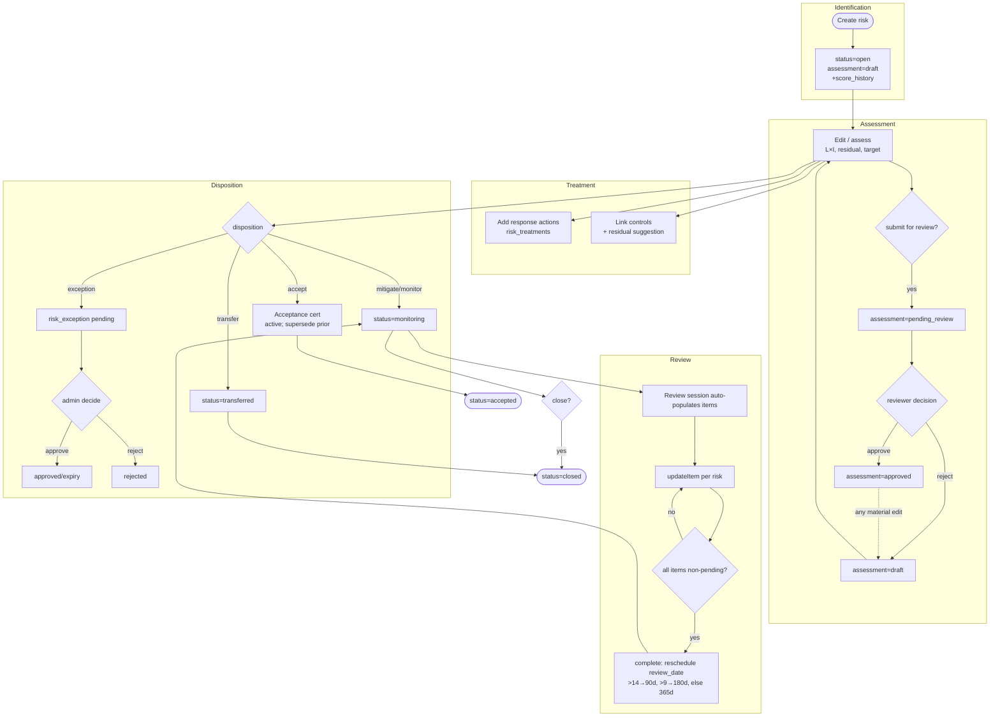
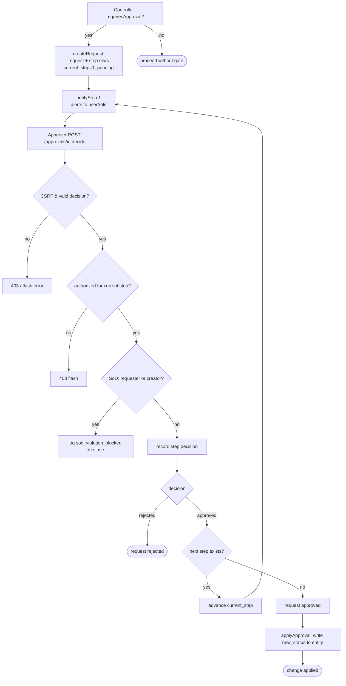
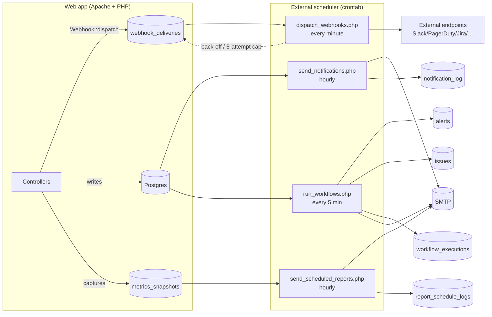

# AEGIS GRC — Business Workflow Documentation

This document describes the end-to-end business workflows implemented in the AEGIS GRC
platform, written for engineers with **zero prior knowledge** of the codebase. Every
workflow below is described in terms of its **Trigger**, **Preconditions**, **Steps**,
**Decision points**, **Alternate paths**, **Error handling**, and **Final state**, and
each statement is grounded in the actual source code (file path + line references are
cited inline). Mermaid flowcharts are provided for the four most important flows.

AEGIS is a server-rendered PHP 8.2 MVC application (no framework). The request lifecycle
for every workflow is the same:

1. `index.php` (front controller) matches the URL against ~407 routes, applies the CSP,
   and dispatches to a controller method.
2. The controller method enforces authentication/authorization
   (`Auth::requireAuth()` / `Auth::requirePermission()` / `Auth::requireAdmin()`), and on
   `POST` validates the CSRF token (`Security::validateCsrf()`).
3. The method runs parameterized SQL via the `Database` helper, writes to the
   tamper-evident audit chain (`Auth::log()` — see `src/Auth.php:542`), sets a flash
   message in `$_SESSION`, and redirects (PRG pattern) or renders a view.

Background work (notifications, webhook delivery, scheduled reports, workflow automation)
runs as **CLI cron scripts** under `scripts/`, which are CLI-only (they `die('CLI only')`
when `php_sapi_name() !== 'cli'`).

---

## Table of Contents

1. [Login + MFA](#1-login--mfa)
2. [Password Reset](#2-password-reset)
3. [Logout & Session Lifecycle](#3-logout--session-lifecycle)
4. [Risk Lifecycle (create → assess → treat → accept/except → review → close)](#4-risk-lifecycle)
5. [Approval Flow (multi-level chains)](#5-approval-flow)
6. [Compliance Control Testing](#6-compliance-control-testing)
7. [Audit Lifecycle](#7-audit-lifecycle)
8. [Global Search](#8-global-search)
9. [Bulk Import](#9-bulk-import)
10. [Export](#10-export)
11. [Notifications (cron)](#11-notifications-cron)
12. [Webhook Dispatch & Delivery](#12-webhook-dispatch--delivery)
13. [Scheduled Reports (cron)](#13-scheduled-reports-cron)
14. [Workflow Automation Engine (cron)](#14-workflow-automation-engine-cron)
15. [Background Job / Cron Pipeline (overview)](#15-background-job--cron-pipeline-overview)

---

## 1. Login + MFA

**Source:** `controllers/AuthController.php` (`loginForm`, `login`, `mfaVerify`,
`mfaBackupVerify`, `mfaSetupForm`, `mfaSetupVerify`); `src/Auth.php` (`login`, `check`);
`src/TOTP.php`.

### Trigger
User submits the login form (`POST /login`) after viewing `GET /login` (`loginForm`,
`AuthController.php:3`).

### Preconditions
- User is **not** already authenticated. Both `loginForm` and `login` redirect to `/`
  if `Auth::check()` is already true (`AuthController.php:4`, `:12`).
- A valid CSRF token is present (`Security::validateCsrf`, `AuthController.php:15`).

### Steps
1. Validate CSRF; on failure set `login_error` and redirect to `/login`
   (`AuthController.php:15-18`).
2. Sanitize `email`; require both `email` and `password`
   (`AuthController.php:20-26`).
3. Call `Auth::login($email, $password)` (`AuthController.php:28`). Inside
   `Auth::login` (`src/Auth.php:443`):
   - Two rate-limit gates: per-IP (`login_<ip>`) and per-email-hash
     (`login_email_<sha256>`). Either tripped → returns `false`
     (`src/Auth.php:447-448`).
   - Look up an **active** user (`is_active = TRUE`) and `Security::verifyPassword`
     (`src/Auth.php:450-451`). Failure appends a `login_failed` audit row
     (`src/Auth.php:452-457`) and returns `false`.
   - Success: reset the per-IP rate limit, `session_regenerate_id(true)` (session-fixation
     defense), populate `$_SESSION['user']` (including `tenant_id`, `is_platform_admin`),
     stamp `last_login`, and write a `login` audit row (`src/Auth.php:460-476`).
4. Back in the controller, fetch `mfa_enabled`, `mfa_secret`, `role`
   (`AuthController.php:30`).
5. **MFA enforcement check** (`AuthController.php:33-41`): read the `mfa_enforcement`
   setting (a comma-separated role list). If the user's role is enforced but MFA is not
   yet configured, set `force_mfa_setup` + a warning flash and redirect to `/mfa/setup`.
6. **MFA challenge check** (`AuthController.php:42-58`): if the user has
   `mfa_enabled` + `mfa_secret`, save the intended post-login redirect, then
   `session_unset()` / `session_destroy()` / `session_start()` to **un-authenticate**
   until the second factor passes; set `mfa_pending`, `mfa_user_id`, `mfa_redirect`;
   redirect to `/mfa/verify`.
7. **No MFA** → compute the post-login redirect, sanitize it against
   `#^/[a-zA-Z0-9/_?=&%.@-]*$#` and reject `/admin`, `/login`, `/mfa` targets
   (open-redirect guard, `AuthController.php:60-69`), then redirect.

### MFA verification (`POST /mfa/verify` → `mfaVerify`, `AuthController.php:94`)
1. Requires `mfa_pending` in session; else redirect to `/login`
   (`AuthController.php:96`).
2. CSRF check (`AuthController.php:98-101`).
3. Rate-limit MFA attempts via `Security::checkRateLimit('mfa_'.$userId)`
   (`AuthController.php:107-110`).
4. Load active user + `mfa_secret`; absence → `/login` (`AuthController.php:112-115`).
5. Match the entered code against the 3 TOTP windows `[-1, 0, 1]` using `hash_equals`
   and `TOTP::getCode` (`AuthController.php:120-127`).
6. **Replay protection (NIST 800-171 IA.3.083):** the matched `window_counter` is checked
   against `totp_used_codes`; reuse is rejected, otherwise the counter is inserted
   (`ON CONFLICT DO NOTHING`) and codes older than 10 minutes are pruned
   (`AuthController.php:134-147`).
7. On success: reset the rate limit, regenerate the session, populate `$_SESSION['user']`,
   stamp `last_login`, write an `mfa_login` audit row, and redirect to the (sanitized)
   stored target (`AuthController.php:149-176`).

### Decision points
- Already authenticated? → `/`.
- MFA enforced for role but not set up? → `/mfa/setup`.
- MFA enabled? → `/mfa/verify`; else straight in.
- TOTP code valid / not replayed? → finish; else error + retry.

### Alternate paths
- **Backup code** (`mfaBackupVerify`, `AuthController.php:459`): on the verify page the
  user may submit a one-time backup code. Codes are stored Argon2id-hashed in
  `mfa_backup_codes`; matching is tolerant of hyphen formatting; a match marks the code
  used (`used_at = NOW()`), regenerates the session, and logs `mfa_backup_code_used`
  (`AuthController.php:474-522`). Eight codes are generated `XXXX-XXXX` by
  `generateBackupCodes` (`AuthController.php:432-457`).
- **First-time MFA setup** (`mfaSetupForm` / `mfaSetupVerify`, `AuthController.php:179`,
  `:205`): a pending secret is held in session and **only written to the DB after a
  successful verifying code** (`AuthController.php:219-225`), then `enable_mfa` is logged.

### Error handling
- All failure branches set a session flash (`login_error` / `mfa_error` / `flash_error`)
  and redirect back to the relevant form — credentials are never echoed.
- The generic failure message (`AuthController.php:72`) does not distinguish "bad
  password" from "locked account."
- CSRF failures on setup/disable return HTTP 403 (`AuthController.php:207-209`, `:234-236`).

### Final state
Fully authenticated session (`$_SESSION['user']` populated, `last_activity` stamped),
`last_login` updated, an audit row (`login` or `mfa_login` / `mfa_backup_code_used`)
appended, user redirected to dashboard or their original destination.

```mermaid
flowchart TD
    A([GET /login]) --> B[POST /login]
    B --> C{CSRF valid?}
    C -- no --> Cerr[flash login_error] --> A
    C -- yes --> D{email & password present?}
    D -- no --> Cerr
    D -- yes --> E[Auth::login]
    E --> F{rate limit OK?}
    F -- no --> G[return false] --> H[flash 'Invalid or locked'] --> A
    F -- yes --> I{active user & password valid?}
    I -- no --> J[audit login_failed] --> G
    I -- yes --> K[regenerate session, set user, audit login]
    K --> L{role MFA-enforced but not set up?}
    L -- yes --> M([/mfa/setup])
    L -- no --> N{mfa_enabled & secret?}
    N -- no --> O[sanitize redirect] --> Z([Dashboard / target])
    N -- yes --> P[un-auth, set mfa_pending] --> Q([/mfa/verify])
    Q --> R{CSRF & rate limit OK?}
    R -- no --> Qerr[flash mfa_error] --> Q
    R -- yes --> S{TOTP matches window -1/0/+1?}
    S -- no --> T{backup code valid?}
    T -- no --> Qerr
    T -- yes --> X[mark code used]
    S -- yes --> U{code replayed (totp_used_codes)?}
    U -- yes --> Qerr
    U -- no --> V[record window_counter]
    V --> W[regenerate session, set user, audit mfa_login]
    X --> W
    W --> Z
```

---

## 2. Password Reset

**Source:** `controllers/AuthController.php` (`forgotPasswordForm`, `forgotPassword`,
`resetPasswordForm`, `resetPassword`); `src/Mailer.php`; `src/Security.php`
(`validatePasswordPolicy`, `hashPassword`).

### Trigger
`POST /forgot-password` (request a link) and later `POST /reset-password/{token}`
(set a new password).

### Preconditions
- User not logged in (`AuthController.php:244`, `:252`, `:322`, `:341`).
- Valid CSRF on both POSTs.

### Steps — request (`forgotPassword`, `AuthController.php:251`)
1. CSRF check (`:254-257`).
2. Per-IP rate-limit `forgot_password_<ip>` (`:259-262`).
3. Look up an active user by email (`:268-271`).
4. If found: generate a 32-byte random token, store its **SHA-256 hash** in
   `password_reset_tokens` with a 1-hour expiry (`ON CONFLICT (user_id) DO UPDATE`,
   resetting `used = FALSE`), email the reset link, and log
   `password_reset_request` (`:273-314`).
5. **Always** show the same neutral success message — "If that email is registered, a
   reset link has been sent." — regardless of whether the email exists (user-enumeration
   defense, `:316-318`).

### Steps — consume (`resetPassword`, `AuthController.php:340`)
1. CSRF check (`:343-346`).
2. Look up an **unused, unexpired** token by its hash (`:348-356`); invalid/expired →
   flash error and redirect to `/forgot-password`.
3. Require `new_password === confirm_password` (`:361-364`).
4. Enforce `Security::validatePasswordPolicy` (`:366-370`).
5. **Password history (NIST 800-171 3.5.8):** reject reuse of any of the last 12 hashes
   from `password_history` (`:372-384`).
6. Hash the new password, update `users.password_hash`, append to `password_history`,
   mark the token `used = TRUE` (`:386-403`).
7. Log `password_reset` via `Auth::logSystem` (no active session at this point,
   `:406`).

### Decision points
- Email exists? (silent — never leaked).
- Token valid & unexpired? Passwords match? Policy satisfied? Not in last-12 history?

### Alternate paths / Error handling
- Any validation failure redirects back to `/reset-password/{token}` with a flash error;
  the rawurlencoded token is preserved in the redirect (`:345`, `:363`, `:369`, `:381`).
- The history-check block is wrapped in `try/catch` so a missing/legacy
  `password_history` table never blocks a reset (`:373-384`, `:393-398`).

### Final state
Password updated, history recorded, token consumed (`used = TRUE`), success flash, user
redirected to `/login`.

---

## 3. Logout & Session Lifecycle

**Source:** `AuthController.php:76` (`logout`); `src/Auth.php` (`logout`, `requireAuth`).

- **Logout** requires auth and a valid CSRF token (else HTTP 403), writes a `logout`
  audit row, calls `Auth::logout()` (which `session_destroy()` + `session_start()`),
  and redirects to `/login` (`AuthController.php:76-84`, `src/Auth.php:479-482`).
- **Idle timeout & revocation** live in `Auth::requireAuth` (`src/Auth.php:363`): every
  protected request checks `last_activity` against `config/app.php`'s `session_lifetime`
  and forces logout to `/login?reason=timeout` on idle expiry (`:371-375`); it also
  re-reads the user row and force-logs-out if the account was deactivated or its sessions
  were revoked after login (`sessions_revoked_at`, SOC 2 CC6.5 / NIST AC-2, `:379+`).

---

## 4. Risk Lifecycle

The risk lifecycle spans four controllers: `RiskController` (core CRUD + assessment
approval + treatments + control links), `RiskReviewController` (periodic review sessions),
`RiskAcceptanceController` (formal acceptance certificates), and `RiskExceptionController`
(exceptions/waivers). Status values are constrained by
`RiskController::STATUSES = ['open','in_review','monitoring','accepted','closed','transferred']`
and `STRATEGIES = ['mitigate','accept','transfer','avoid']` (`RiskController.php:6-7`).
A separate `assessment_status` field (`draft → pending_review → approved`) tracks the
review/approval sub-state independently of the risk `status`.

### 4.1 Create

**Trigger:** `POST /risk/create` (`create`, `RiskController.php:238`).
**Preconditions:** `Auth::requirePermission('risk.create')`; valid CSRF.
**Steps:**
1. Sanitize/clamp inputs: `likelihood`, `impact`, `velocity` clamped to 1–5; `proximity`,
   `risk_source`, `confidence` validated against allow-lists; `treatment_strategies`
   filtered to the valid set (`:242-263`).
2. Require a `title` (else flash + redirect, `:265-268`).
3. Generate the human ID `RSK-NNNN` from `MAX(id)+1` (`:270-271`).
4. `Database::insert('risks', …)` with `inherent_score = likelihood × impact`,
   `status = 'open'`, `assessment_status = 'draft'`, `identified_date = today`
   (`:273-298`).
5. Insert the first `risk_score_history` row (note "Risk created") (`:301-310`).
6. `Auth::log('create_risk', …)` and redirect to `/risk/{id}` (`:312-313`).

**Final state:** `open` / `draft` risk with one history entry.

### 4.2 Assess / Update

**Trigger:** `POST /risk/{id}` (`update`, `RiskController.php:510`).
**Preconditions:** `risk.edit`; valid CSRF.
**Steps:** clamp inherent/residual/target L×I, validate enums, recompute
`inherent_score`, and persist. **A key rule:** if the risk was previously `approved`,
editing automatically resets `assessment_status` back to `draft`
(`CASE WHEN assessment_status = 'approved' THEN 'draft' …`, `:561`) so material changes
re-enter review. **Every** update writes a `risk_score_history` row (full audit trail,
`:580-592`), then logs `update_risk`.

### 4.3 Assessment approval sub-workflow

A lightweight 1-step approval gate on the assessment itself (distinct from the generic
multi-level [Approval Flow](#5-approval-flow)):

| Action | Method | Permission | Effect |
| --- | --- | --- | --- |
| Submit for review | `submitReview` (`:605`) | `risk.review` | `assessment_status = 'pending_review'` |
| Approve | `approve` (`:619`) | `risk.review` | `assessment_status = 'approved'`, stamps `reviewed_by`, `reviewed_at`, `review_notes` |
| Reject | `rejectReview` (`:634`) | `risk.review` | `assessment_status = 'draft'` (sent back for revision) |

`bulkUpdate` (`:816`) can also batch a `submit_review` or status/strategy change across
selected risk IDs.

### 4.4 Treat (response actions & controls)

- **Response actions** (`addResponseAction` `:729`, `updateResponseAction` `:763`):
  rows in `risk_treatments` with `treatment_type ∈ STRATEGIES`, `status ∈
  ['planned','in_progress','completed','cancelled']`. Marking `completed` auto-sets
  `completion_date` if absent (`:776`).
- **Control links** (`linkControl` `:650`, `removeControlLink` `:675`): join
  `risk_control_links` to `control_implementations`; effectiveness is one of
  `none/partial/substantial/full`. The view derives a **suggested residual score** from
  the best linked-control effectiveness via a multiplier map (`RiskController.php:484-504`).
- **Related risks** (`linkRelated` `:691`): typed edges (`related/causes/caused_by/aggregates`).

### 4.5 Accept (formal acceptance certificate)

**Source:** `RiskAcceptanceController.php`.
**Trigger:** `POST /risk/{id}/accept` (`create`, `:112`); **Permission:** `risk.accept`.
**Steps:**
1. Require `acceptance_reason` and a **future** `valid_until` date (`:137-164`).
2. Capture the **score and level at time of acceptance** (`scoreToLevel`, `:8-13`,
   `:179-180`) for an immutable record.
3. **Supersede** any existing `active` acceptance for the risk
   (`status = 'superseded'`, `:182-192`) before inserting the new `active` certificate.
4. Log `risk_acceptance_created`; redirect to the risk (`:209-218`).

**Lifecycle of a certificate:** `active → {superseded | revoked | expired}`.
- **Revoke** (`revoke`, `:222`): sets `revoked`, `revoked_by`, `revoked_at`,
  `revocation_reason`.
- **Renew** (`renew`, `:264`): re-opens the form pre-filled, carrying `renewed_from`.
- **Expiry:** the acceptances index surfaces an `expiring_soon_count` for certificates
  whose `valid_until` is within 30 days (`:48-52`).

### 4.6 Except / Waiver

**Source:** `RiskExceptionController.php`.
**Trigger:** `POST /risk/{id}/exception/create` (`create`, `:93`); **Permission:**
`Auth::requireAuth()` (any authenticated user may request).
**Steps:** require `rationale`; validate `exception_type ∈ [accept, transfer, defer]`;
require a future `expiry_date` if provided; insert `risk_exceptions` with
`status = 'pending'` (`:108-148`).
**Decision** (`decide`, `:195`): **admin-only** (`Auth::requireAdmin()`). `approve`
stamps `approved_by/approved_at`; `reject` stores `rejection_reason` (`:212-239`).
**Expiry sweep** (`checkExpired`, `:244`): CLI-or-admin job that flips `approved`
exceptions past their `expiry_date` to `expired` (`:251-257`).
**List visibility:** managers/admins see all; everyone else sees only their own requests
(`index`, `:9-40`).

### 4.7 Review (periodic review sessions)

**Source:** `RiskReviewController.php`.
**Trigger:** `POST /risk/reviews/create` (`create`, `:47`); **Permission:** `risk.review`.
**Steps:**
1. Create a `risk_reviews` row (`status='planned'`, `review_type ∈
   [periodic, triggered, ad_hoc, board]`) with a JSON `scope_filter`
   (category/owner/min_score/status) (`:80-92`).
2. **Auto-populate** `risk_review_items` (one per in-scope, non-closed/transferred risk)
   and store `total_risks` (`:94-133`).
3. `start` (`:314`) moves `planned → in_progress` (only from `planned`).
4. `updateItem` (`:219`) records per-risk review outcome (`reviewed/escalated/deferred/
   not_applicable`); if the reviewer supplied new L×I **and didn't confirm the existing
   score**, the parent risk's score is updated and a `risk_score_history` row written
   (`:269-285`). After each item, review progress counters are recomputed (`:288-303`).
5. `complete` (`:328`) **blocks if any item is still `pending`** (`:334-343`); otherwise
   sets `completed`, captures `conclusion` + sign-off, and **re-schedules `review_date`**
   on every reviewed risk by inherent score: **>14 → +90 days, >9 → +180, else +365**
   (`:361-384`).
6. `cancel` (`:391`) sets `cancelled`.

### 4.8 Close / Transfer / Delete

- **Close / Transfer:** terminal `status` values set via `update` or `bulkUpdate`; closed
  and transferred risks are excluded from dashboards, the heat map, and most notification
  queries (e.g. `RiskController.php:41`, `:862`).
- **Delete** (`delete`, `:788`): `risk.delete`, CSRF, hard `DELETE FROM risks`, log
  `delete_risk`.

### Risk-lifecycle error handling (cross-cutting)
- Every mutating method validates CSRF first and returns HTTP 403 on failure.
- Enum/range inputs are clamped or coerced to safe defaults rather than rejected.
- Missing entities return 404 (`view`, `:337`) or are guarded with `try/catch` for
  optional satellite tables (KRIs, scenarios, acceptances) so absent features degrade
  gracefully (`:447-480`).



---

## 5. Approval Flow

**Source:** `controllers/ApprovalController.php`.

The approval engine implements **multi-level, ordered approval chains** defined by
admin-managed templates. Other controllers call its static API; web routes let approvers
act on pending requests.

### Static API (called by other controllers)
- `ApprovalController::requiresApproval($entityType, $entityData): bool` (`:21`) —
  is there a matching active template?
- `ApprovalController::createRequest($entityType, $entityId, $entityData): ?int` (`:39`)
  — create a request + per-step rows, notify step 1, log `approval_requested`.
- `ApprovalController::isPending($entityType, $entityId): bool` (`:28`).

### Trigger
An approver opens `GET /approvals` (`pending`, `:81`) or `GET /approvals/{id}`
(`review`, `:108`) and submits a decision via `POST` (`decide`, `:154`).

### Preconditions
- A template exists for the entity type and its `trigger_condition` JSON matches the
  entity data. Matching supports `min_score`, `status_change`, and `risk_tier`
  predicates; an **empty condition matches everything** (`matchesCondition`, `:395-409`).
- The acting user holds `approval.approve` and is authorized for the **current step**.

### Steps (`createRequest` → `decide`)
1. **Create:** insert `approval_requests` (`current_step = 1`, `status = 'pending'`,
   `context_data` = JSON snapshot) and one `approval_request_steps` row per template
   step, each with a `due_at = now + due_hours` (`:49-70`).
2. **Notify** step 1 approvers — `notifyStep` writes in-app `alerts` rows to the named
   user or all users of the required role (`:73`, `:411-444`).
3. **Decide** (`:154`): validate CSRF and the `decision ∈ [approved, rejected]`.
4. **Authorization:** acting user must be `admin`, the step's `required_user_id`, or hold
   the step's `required_role` (`:187-195`).
5. **Segregation of Duties (SoD):** the **requester cannot approve their own request**
   (`:198-205`), and for `risk`/`policy`/`change` entities the **entity creator cannot
   approve** (`:207-223`). Both blocks log `sod_violation_blocked` and refuse.
6. Record the decision on the current step (`decision`, `notes`, `actioned_by`,
   `actioned_at`, `:226-231`).
7. **Branch:**
   - **Rejected** → request `status = 'rejected'`, `completed_at` set, log
     `approval_rejected` (`:233-241`).
   - **Approved with a next step** → advance `current_step`, notify the next approver
     (`:244-257`).
   - **Approved, last step** → request `status = 'approved'`, then **apply the change**:
     `applyApproval` writes the originally-requested `new_status` to the entity table
     (risks/policies/audits/vendors/incidents) and logs `approval_completed`
     (`:258-267`, `:446-465`).

### Decision points
Template match? → User authorized for step? → SoD clear? → Approve or reject? → More
steps remaining?

### Alternate paths
- No matching template → `createRequest` returns `null` and the calling controller
  proceeds without an approval gate.
- Template with zero steps → returns `null` (`:48`).

### Error handling
- CSRF failure → HTTP 403 (`:156-158`).
- Invalid decision, already-closed request, or unauthorized actor → flash error + redirect
  (`:166-179`, `:191-195`).

### Final state
Request ends `approved` (with the entity's status change applied) or `rejected`, with each
step's decision permanently recorded and an audit trail of every transition.



---

## 6. Compliance Control Testing

**Source:** `controllers/ComplianceController.php` (`testControl` `:979`,
`saveTest` `:1008`, `gapAnalysis` `:1041`, `testingDashboard` `:1096`).

### Trigger
`GET /compliance/control/{objId}/test` (test form) → `POST` to record a result
(`saveTest`).

### Preconditions
- `Auth::requirePermission('compliance.test')` (`:980`, `:1009`); valid CSRF on save.
- The objective must exist (`control_tests` references `compliance_objectives`); a missing
  objective returns 404 (`:989`, `:1013`).

### Steps (`saveTest`)
1. Validate `result ∈ [pass, fail, partial, not_tested]` (default `not_tested`, `:1014-1015`).
2. Clamp `effectiveness` to 0–100 (`:1016`).
3. Insert a `control_tests` row (test date, tester, method, findings, evidence refs,
   `next_test_date`, package linkage) (`:1019-1030`).
4. **Side effect:** stamp `last_reviewed = NOW()` on the related
   `control_implementations` row so the dashboard reflects the test (`:1032-1035`).
5. Log `control_tested` with result + effectiveness; redirect back to the test page
   (`:1036-1038`).

### Decision points / Alternate paths
- The test form (`testControl`) shows the **last 10 historical tests** for the objective
  (`:990-994`).
- **Gap analysis** (`gapAnalysis`, `:1041`, perm `compliance.gap`) aggregates per-package
  implementation/overdue counts, top gaps (not-started or overdue controls), and
  cross-framework controls appearing in multiple packages.

### Final state
A new immutable `control_tests` record; the control's `last_reviewed` updated; audit row
written. (Note: a non-compliant control can later be picked up by the
`control_non_compliant` workflow trigger — see [§14](#14-workflow-automation-engine-cron).)

---

## 7. Audit Lifecycle

**Source:** `controllers/AuditController.php`.

Status flow: `planned → in_progress → completed` (also `overdue`, `cancelled`).

### Create (`create`, `:41`)
**Permission:** `audit.create`; CSRF. Generates `AUD-NNNN` from `MAX(id)+1` (`:61-63`),
inserts the audit (`status='planned'`), and — **if a compliance package is selected** —
auto-creates one `audit_items` row per level-2 objective (`:78-88`). For recurring
frequencies it also writes an `audit_schedules` row with the computed `next_due_date`
(`:90-103`). Logs `create_audit`.

### Assess items (`updateItem`, `:156`)
**Permission:** `audit.edit`; CSRF. Sets each item's `status ∈ [not_assessed, compliant,
non_compliant, partial, not_applicable]` plus finding/evidence/risk_level/remediation
(`:163-172`). **Evidence upload** is hardened: max 10 files, 20 MB each,
**MIME sniffed via `finfo`** against an allow-list, extension allow-list, randomized
stored filename (`bin2hex(random_bytes(16))`), and a SHA-256 file hash recorded in
`evidence_files` (`:174-216`). Returns a **JSON** response (`{success, status, files}`)
for the AJAX UI (`:225-226`).

### Advance & complete
- `update` (`:229`): change audit `status`; entering `in_progress` back-fills `start_date`
  (`:242-244`).
- `complete` (`:249`, perm `audit.close`): computes a **score = compliant ÷ total × 100**,
  sets `status='completed'`, `completed_date=today`, logs `complete_audit`
  (`:256-267`).
- `exportPackage` (`:280`): assembles the audit + items + evidence for an export package.

### Error handling / Final state
CSRF failures → 403; missing audit → 404. Final state: a completed audit with a numeric
compliance score and a full set of assessed items with attached, hash-verified evidence.

---

## 8. Global Search

**Source:** `controllers/SearchController.php`.

### Trigger
`GET /search?q=…` (`index`, `:11`). **Precondition:** `Auth::requireAuth()`.

### Steps
1. Sanitize `q`. Queries shorter than 2 characters are flagged `tooShort` and skipped
   (`:20-21`).
2. Run **up to 7 independent `ILIKE` queries** across risks, policies, audits, vendors,
   controls (`compliance_objectives` level 2), and assets — **each gated by the viewer's
   module permission** (`Auth::can('risk.view')`, `'policy.view'`, etc.) so search never
   leaks records the user cannot open (`:29-124`).
3. Each block is wrapped in `try/catch`; an error (e.g. a not-yet-created `assets` table)
   logs and yields an empty result set instead of failing the page (`:40-43`, `:110-124`).
4. Merge non-empty result sets keyed by type and total the hit count (`:126-139`).

### Decision points / Final state
Per-module permission gate decides whether each source is queried. The view renders grouped
results with a total count, or a "too short" / "no results" state.

---

## 9. Bulk Import

**Source:** `controllers/ImportController.php`; CSV format documented in
`views/import/index.php`.

### Trigger
`POST /import` with a `csv_file` upload and `import_type ∈ [risks, vendors, incidents]`
(`upload`, `:22`).

### Preconditions
`Auth::requirePermission('compliance.import')`; valid CSRF (`:23-26`).

### Steps
1. Validate `import_type` against the allow-list (`:28-32`).
2. **File validation:** upload OK; extension ∈ `[csv, txt]`; MIME sniffed via `finfo`
   against `[text/csv, text/plain, application/csv, application/vnd.ms-excel]`; size ≤ 10 MB
   (`:34-63`).
3. Parse the CSV: first row is the header; **every data row must have exactly the header's
   column count** or the import aborts at that line (`:71-89`).
4. Dispatch to the typed importer (`importRisks` `:115` / `importVendors` `:165` /
   `importIncidents` `:208`). Each validates required headers and per-row fields (e.g.
   risk `likelihood`/`impact` must be 1–5; vendor `website` must be http(s); incident
   `severity` enum) and generates human IDs (`RSK-`/`INC-`) where applicable.
5. **All-or-nothing semantics:** if any importer returns errors, the whole import is
   reported failed (first 5 errors shown) and the user is redirected back to `/import`
   (`:102-105`). On success, log `bulk_import_{type}` and redirect to the module list
   (`:107-110`).

### Decision points
Valid type? Valid file (ext/MIME/size)? Column counts match? All rows pass validation?

### Error handling
Each failure sets `flash_error` and redirects to `/import`. Inputs are passed through
`Security::sanitizeInput` before insertion (`:148-156`).

### Final state
N validated rows inserted into `risks` / `vendors` / `incidents`; audit row written; user
redirected to the relevant module.

---

## 10. Export

**Source:** `controllers/ExportController.php`; `src/Csv.php`.

### Trigger
`POST /export` single-type download (`download`, `:26`) or multi-type ZIP
(`downloadAll`, `:69`). Form at `GET /export` (`index`, `:17`).

### Preconditions
`Auth::requireAuth()` + valid CSRF. **Per-type permission** is enforced: each export type
maps to a permission (e.g. `risks → risk.view`, `activity_log → admin`); the controller
calls `Auth::requireAdmin()` or `Auth::requirePermission()` accordingly
(`:6-15`, `:40-45`).

### Steps (`download`)
1. Validate `type` against the registry and `format ∈ [csv, json]` (`:33-38`).
2. Enforce that type's permission (`:40-45`).
3. `fetchData($type)` runs the type's read-only SQL (`:141-213`).
4. Emit the file:
   - **CSV:** UTF-8 BOM for Excel, header row, then each row passed through
     `Csv::row()` — the **formula-injection guard** that prefixes any cell starting with
     `= + - @ TAB CR` with a single quote (`src/Csv.php:19-29`; `ExportController.php:62`).
   - **JSON:** pretty-printed, unescaped unicode (`:51-54`).
5. Log `export_data` with format + row count (`:48`).

### Alternate path (`downloadAll`, `:69`)
Builds a ZIP (`ZipArchive`) containing one CSV per selected, permitted type plus a
`README.txt` manifest. Types the user lacks permission for are silently skipped
(`:95-100`); missing `ZipArchive` extension → flash error (`:82-85`). Logs
`export_data_all`.

### Final state
A downloaded CSV/JSON file or ZIP archive; audit row written. No state mutation.

---

## 11. Notifications (cron)

**Source:** `scripts/send_notifications.php` (CLI-only).
**Suggested cadence (from the file header):** hourly — `0 * * * *`.

### Trigger
Cron invocation. Refuses to run under a web SAPI (`:13-16`).

### Preconditions
Loads `.env.local`/`.env`, bootstraps `Database`/`Security`/`Auth`/`Mailer`, and
**self-bootstraps** its tables (`notification_log`, `user_notification_prefs`) with
`CREATE TABLE IF NOT EXISTS` (`:44-68`).

### Steps
The script evaluates **12 notification categories**, each in its own `try/catch` so one
failing category never aborts the rest (errors go to STDERR):

1. Overdue compliance controls (per user, daily) — `:206`
2. Policy review due (within 7 days) — `:294`
3. Pending approval reminders (request > 4h old, per request / 24h) — `:367`
4. New risk assigned (created < 2h, per risk / 24h) — `:432`
5. Open incident aging (> 48h unresolved, per incident / 48h) — `:498`
6. Risk review overdue (`review_date < today`, per user / 48h) — `:571`
7. Treatment due (`due_date <= today`, planned/in-progress, per treatment / 24h) — `:670`
8. Risk score worsened (latest history > 20% above previous, per risk / 24h) — `:756`
9. Vendor assessment expiring (within 30 days, per vendor / 7 days) — `:874`
10. Document expiring (within 30 days, per document / 7 days) — `:958`
11. Assessment pending stale (`pending_review` > 48h → owner **and all admins**) — `:1051`
12. Evidence file expiry (within 30 days, per file / 7 days) — `:1158+`

For each candidate the script:
- Checks the user's **per-type preference** (`notifEnabled`, default enabled, `:89-98`).
- Applies **idempotent throttling** via `alreadyNotified` against `notification_log`
  within a per-category window (`:105-117`).
- Either **sends immediately** (`Mailer::sendFromSettings`) or, for users in
  digest mode, **queues** the item (`maybeSendOrQueue` / `collectDigest`, `:160-190`).
- On a successful immediate send, records it in `notification_log` (`logNotification`,
  `:122-128`).

### Decision points
SAPI is CLI? Preference enabled? Already notified within the window? Immediate vs. digest?

### Error handling
Per-category `try/catch` writing to STDERR; missing tables are created on bootstrap so a
fresh DB doesn't crash the run.

### Final state
Emails sent (or queued for digest), with each delivery throttle-logged in
`notification_log` for idempotency across overlapping cron runs.

---

## 12. Webhook Dispatch & Delivery

**Source:** `src/Webhook.php`; `scripts/dispatch_webhooks.php` (CLI-only). Event catalog
in `controllers/WebhookController.php` (e.g. `risk.created`, `risk.score_high`,
`policy.approved`, `scanner.ingest`).

This is a **two-stage** pipeline: synchronous enqueue, asynchronous delivery.

### Stage 1 — Dispatch (enqueue, no HTTP)
`Webhook::dispatch($eventType, $payload)` (`src/Webhook.php:15`) finds active
`webhook_endpoints` whose `event_types` JSONB array **contains** the event
(`@> ?::jsonb`), and inserts one `webhook_deliveries` row per endpoint with
`status='pending'`, `attempts=0`, `next_retry_at=now` (`:18-38`). It makes **no** HTTP
calls. Example caller: the scanner ingest API dispatches `scanner.ingest` after a bulk
import (`api/ingest.php:113-121`).

### Stage 2 — Delivery (cron)
`scripts/dispatch_webhooks.php` (header cadence: every minute, `* * * * *`):

**Trigger:** cron. **Preconditions:** CLI-only; bootstraps `Database` + `Webhook`.

**Steps:**
1. Fetch up to `BATCH_SIZE = 50` pending deliveries that are **due**
   (`next_retry_at <= NOW()`), oldest first (`:45-51`).
2. For each, load the target `webhook_endpoints` row; if the endpoint was deleted, mark
   the delivery permanently `failed` ("Endpoint not found") to avoid an infinite loop
   (`:60-77`).
3. Call `Webhook::send($delivery, $endpoint, …)` (`:82`), which:
   - **Formats the payload per provider** — Slack/PagerDuty/Jira/Teams/Discord/
     Google Chat/Opsgenie/ServiceNow/generic (`formatPayload`, `Webhook.php:162-289`).
   - **SSRF defense:** validates the target via `Ssrf::curlResolve` and **pins cURL to
     the validated IP** (`CURLOPT_RESOLVE`) to prevent DNS rebinding; a blocked target
     returns false (`Webhook.php:73-79`, `:140-142`). PagerDuty is overridden to its
     fixed Events API URL (`:82-98`).
   - **Signs** the body with HMAC-SHA256 (`X-AEGIS-Signature`) when a decrypted endpoint
     secret exists (`:100-112`), adds custom headers, and POSTs with TLS verification on,
     10s timeout, no redirects (`:126-143`).
   - Returns `true` on HTTP 2xx (`:156`).

**Decision / retry logic (`dispatch_webhooks.php`):**
- **Success** → `status='delivered'`, store response code/body, stamp `delivered_at`
  (`:86-97`).
- **Failure & attempts ≥ `MAX_ATTEMPTS` (5)** → `status='failed'` (give up, `:99-110`).
- **Failure & attempts < 5** → stay `pending`, schedule
  `next_retry_at = now + 2^attempts minutes` (exponential back-off: 2, 4, 8, 16 min)
  (`:111-124`).

**Final state:** each delivery ends `delivered` or `failed`; a one-line run summary is
printed (`Processed N (delivered/retried/failed)`).

---

## 13. Scheduled Reports (cron)

**Source:** `scripts/send_scheduled_reports.php` (CLI-only).
**Cadence (header):** hourly — `0 * * * *`; the script decides which schedules are due.

### Trigger / Preconditions
Cron; CLI-only (`:9`); loads env and `Database` + `Mailer`. Reads SMTP config from env
(`:33-37`).

### Steps
1. Load active `report_schedules` (`:29-31`).
2. For each, `isDue` decides eligibility by `frequency` vs. `last_sent_at` and the calendar
   (daily ≈ 23h gap; weekly checks `day_of_week`; monthly/quarterly check `day_of_month`
   and—for quarterly—the quarter-start months) (`:68-79`).
3. `buildReportBody($report_type)` renders an HTML email from the latest
   `metrics_snapshots` row plus a type-specific section (`compliance` framework breakdown,
   `risk` top-10, or executive summary) (`:81-166`).
4. Send to each JSON-decoded recipient via `Mailer::send`; if there are no recipients or
   SMTP is unset, log `skipped` (`:44-61`).
5. Stamp `last_sent_at = NOW()` and insert a `report_schedule_logs` row recording
   `sent`/`error`/`skipped` and any error message (`:63-65`, `:168-174`).

### Final state
Due report emails sent; `last_sent_at` advanced; an audit-style log row per schedule run.

---

## 14. Workflow Automation Engine (cron)

**Source:** `scripts/run_workflows.php` (CLI-only).
**Cadence (header):** every 5 minutes — `*/5 * * * *`.

### Trigger / Preconditions
Cron; CLI-only (`:26-29`); defines `AEGIS_WORKER`; loads env + `Database`/`Security`/
`Mailer`.

### Steps
1. Load active `workflows` (`:56-58`).
2. For each workflow, honor its **cooldown**: skip if `last_triggered_at` is within
   `cooldown_seconds` (default 3600) (`:68-74`).
3. `evaluateTrigger` runs the matching query for the workflow's `trigger_type` (`:109-120`):
   - `risk_score_threshold` — risks with `inherent_score >= min_score` in configured
     statuses.
   - `audit_overdue` — planned audits past `scheduled_date` (− grace days).
   - `policy_review_due` — published policies due within N days.
   - `incident_created_severity` — recent incidents of configured severities.
   - `vendor_assessment_overdue` — overdue planned/in-progress vendor assessments.
   - `control_non_compliant` — `control_implementations.status = 'non_compliant'`.
   - `scheduled` — synthetic single match once per configured cadence (`:193-208`).
4. For every matched entity, run each configured **action** (`executeAction`, `:214-224`):
   - `create_alert` — insert in-app `alerts` for users in the configured roles (`:226-245`).
   - `send_email` — email configured addresses + role users + the entity owner/assignee
     (skips if SMTP unconfigured) (`:247-286`).
   - `create_issue` — open a remediation `issues` row, **de-duplicating** against existing
     open issues from the same workflow/source (`:288-310`).
5. Record a `workflow_executions` row (trigger data + actions taken) and update
   `last_triggered_at` (`:91-100`).

### Decision points
Cooldown elapsed? Any matches? Per-action sub-decisions (roles configured, SMTP present,
duplicate issue exists).

### Error handling
SMTP-not-configured returns a structured `smtp_not_configured` action result rather than
throwing; duplicate-issue detection prevents alert storms. SQL interpolation of
`grace_days`/`days_ahead` uses values cast to `int` before interpolation.

### Final state
Alerts/emails/issues created per matched entity; a `workflow_executions` audit row written;
the workflow's cooldown timer reset.

---

## 15. Background Job / Cron Pipeline (overview)

AEGIS deploys on Render via Docker; `scripts/startup.sh` runs `install.php` (idempotent
schema setup) then `apache2-foreground`. The four background scripts are **CLI-only** and
intended to be driven by an external scheduler (each file's header gives a crontab line).
`render.yaml` defines only the web service and the Postgres database — the cron lines are
operational configuration, not committed infrastructure.

| Script | Suggested cadence | Reads | Writes | Idempotency / safety |
| --- | --- | --- | --- | --- |
| `send_notifications.php` | hourly | 12 source queries + `user_notification_prefs` | emails, `notification_log` | per-type prefs + windowed `alreadyNotified` throttle |
| `dispatch_webhooks.php` | every minute | `webhook_deliveries` (pending & due) | HTTP POSTs, delivery status | 5-attempt cap + exponential back-off; SSRF-pinned cURL |
| `send_scheduled_reports.php` | hourly | `report_schedules`, `metrics_snapshots` | emails, `report_schedule_logs`, `last_sent_at` | `isDue` calendar/gap check |
| `run_workflows.php` | every 5 min | `workflows` + trigger queries | `alerts`, emails, `issues`, `workflow_executions` | per-workflow cooldown + duplicate-issue guard |

There are also additional operational scripts in `scripts/` (e.g.
`capture_metrics_snapshot.php`, and the CI/analyzer checks `check_csrf.php`,
`check_route_auth.php`, `check_ui.php`, `verify_audit_log.php`, `verify_migrations.php`).
`RiskExceptionController::checkExpired()` is a hybrid CLI/admin sweep that expires lapsed
exceptions (`RiskExceptionController.php:244`).



---

### Cross-cutting conventions (apply to every workflow above)

- **Auth first, CSRF second:** protected controller methods call
  `Auth::requireAuth()` / `requirePermission()` / `requireAdmin()` and validate CSRF on
  every `POST` (403 on failure).
- **PRG + flash:** mutations redirect with a `$_SESSION['flash_*']` message rather than
  rendering directly.
- **Tamper-evident audit:** state changes call `Auth::log()` (or `Auth::logSystem()` when
  unauthenticated), appending to the HMAC-chained activity log (`src/Auth.php:484-548`).
- **Parameterized SQL only:** user input flows through `Database::query/insert` with bound
  parameters; the few interpolated values (e.g. cron grace-day windows, `IN (?)`
  placeholder lists) are integers or generated placeholders, never raw user strings.
