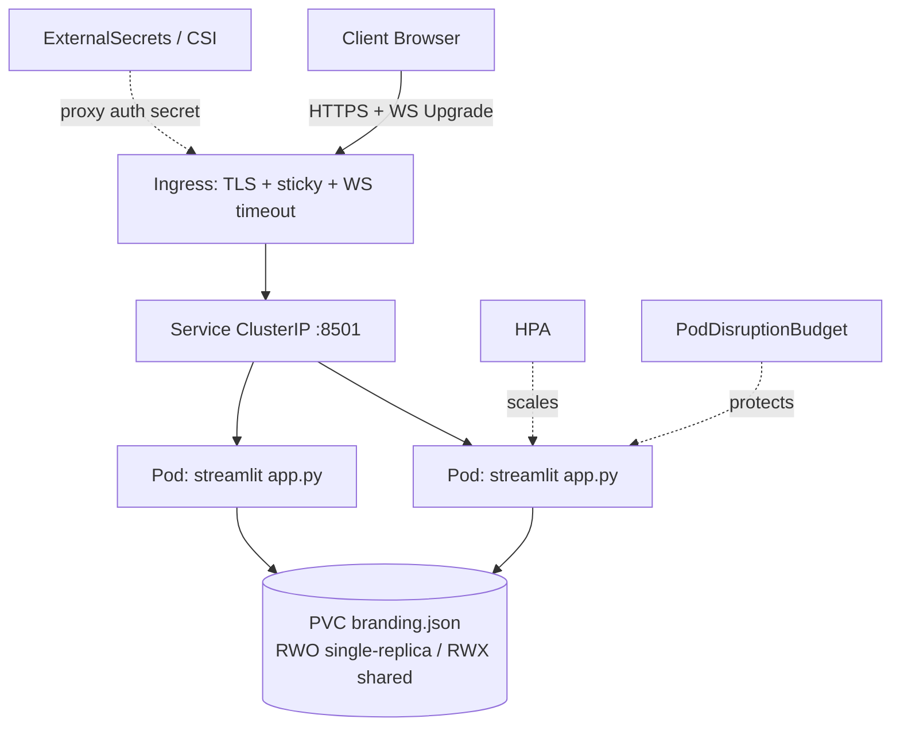

# Kubernetes — Business Insight Dashboard

Operator guide for running the **Business Insight Dashboard** on Kubernetes
(EKS, AKS, GKE, or self-managed). Covers a `Deployment`, `Service`, `Ingress`
with **session affinity** and **WebSocket** timeouts, `/_stcore/health`
readiness/liveness probes, an `HPA`, a `PodDisruptionBudget`, resource
requests/limits, storage for `branding.json`, and secret delivery for the auth
proxy.

> **What this app is:** a **Streamlit** (Python 3.11.9) dashboard. Entry point
> `app.py`, listens on **8501**. Users upload a CSV in the browser; it is parsed
> with **pandas in memory** and is **never persisted or transmitted**. The only
> durable state is `branding.json`. **No database. No built-in auth. No AI/LLM.**

> **Critical for Kubernetes:** Streamlit's interactive layer runs over
> **WebSockets**. Your `Ingress` **must** (1) enable **session affinity /
> sticky sessions** so a client stays pinned to one pod for the life of its WS
> session, and (2) allow **long WebSocket timeouts** and forward upgrade headers.
> Because a Streamlit session is bound to one pod's memory, load-balancing a
> single client across pods will break it. Keep `enableXsrfProtection = true`;
> put TLS and auth at the ingress/edge.

Sibling guides: [LOCAL_DEVELOPMENT.md](./LOCAL_DEVELOPMENT.md) ·
[SINGLE_LINUX_SERVER.md](./SINGLE_LINUX_SERVER.md)

---

## 1. Deployment architecture

An Ingress controller terminates TLS and (optionally) delegates auth to an
external OIDC gateway, then routes to a `ClusterIP` Service, which fronts a
`Deployment` of Streamlit pods. Sticky sessions ensure each browser stays on one
pod. `branding.json` is the only durable state:

- **Single replica (simplest):** a small `PersistentVolumeClaim` (RWO) mounted
  at the branding path keeps branding across restarts.
- **Multiple replicas:** either mount a **ReadWriteMany** shared volume (EFS /
  Azure Files / Filestore) so all pods see the same `branding.json`, **or**
  accept that branding is per-pod and pin replicas=1 for the branding feature.
  Uploaded CSVs are ephemeral and never written to any volume.

```
Client ──443──► Ingress (TLS, sticky, WS timeouts) ──► Service (ClusterIP) ──► Deployment pods
                                                                                   │
                                                              branding.json ◄── PVC (RWO or RWX)
```

---

## 2. Topology



---

## 3. Prerequisites

| Requirement          | Version / Note                                                       |
| -------------------- | ------------------------------------------------------------------- |
| Kubernetes           | 1.27+                                                                |
| kubectl              | Matching minor version                                              |
| Ingress controller   | ingress-nginx, AWS ALB, or equivalent with WS + affinity support   |
| Container registry   | For the `python:3.11-slim` app image                               |
| StorageClass         | RWO for single-replica branding; **RWX** (EFS/Azure Files/Filestore) for multi-replica |
| metrics-server       | Required for HPA                                                     |
| Secrets operator     | External Secrets Operator or Secrets Store CSI Driver (for proxy auth) |
| cert-manager         | (Optional) automated TLS certificates                              |

Build & push the image (uses repo `Dockerfile`):

```bash
docker build -t <registry>/business-insight-dashboard:1.0.0 ./business-insight-dashboard
docker push <registry>/business-insight-dashboard:1.0.0
```

---

## 4. Identity & credentials

The app needs **no cloud credentials** (no DB, no object store, no AI API). The
only credentials in play belong to the **auth proxy / secrets access**. Prefer
**workload identity** over static keys:

- **EKS — IRSA:** bind the pod's `ServiceAccount` to an IAM role.

  ```yaml
  apiVersion: v1
  kind: ServiceAccount
  metadata:
    name: bid
    annotations:
      eks.amazonaws.com/role-arn: arn:aws:iam::ACCOUNT:role/bid-secrets-reader
  ```

  Least-privilege policy (read only the proxy secret):

  ```json
  {
    "Version": "2012-10-17",
    "Statement": [
      {
        "Sid": "ReadProxySecret",
        "Effect": "Allow",
        "Action": ["secretsmanager:GetSecretValue"],
        "Resource": "arn:aws:secretsmanager:REGION:ACCOUNT:secret:bid/*"
      }
    ]
  }
  ```
  (GovCloud: partition `aws-us-gov`, FIPS regional endpoints.)

- **AKS — Workload Identity:** federate the `ServiceAccount` to a user-assigned
  managed identity; grant it *Key Vault Secrets User* on the vault holding the
  OIDC client secret.

- **GKE — Workload Identity:** bind the KSA to a GCP service account with
  `roles/secretmanager.secretAccessor`.

- **Fallback (static creds):** a `Secret` referenced by the auth proxy — never
  bake secrets into the image or ConfigMaps.

---

## 5. Environment variables

The app needs **very few** vars; set them on the container `env`:

| Variable                                 | Example              | Purpose                                                     |
| ---------------------------------------- | -------------------- | ---------------------------------------------------------- |
| `PORT`                                   | `8501`               | Server port the container listens on.                      |
| `STREAMLIT_SERVER_PORT`                  | `8501`               | Explicit Streamlit port.                                   |
| `STREAMLIT_SERVER_ADDRESS`               | `0.0.0.0`            | Bind all interfaces inside the pod.                        |
| `STREAMLIT_SERVER_HEADLESS`              | `true`               | No prompts / no browser auto-open.                         |
| `STREAMLIT_SERVER_ENABLE_CORS`           | `false`              | Same-origin behind ingress.                                |
| `STREAMLIT_SERVER_ENABLE_XSRF_PROTECTION`| `true`               | Keep XSRF protection on.                                   |
| `STREAMLIT_SERVER_MAX_UPLOAD_SIZE`       | `200`                | Max CSV upload (MB); align with ingress body-size limits.  |
| `STREAMLIT_BROWSER_GATHER_USAGE_STATS`   | `false`              | Disable telemetry.                                         |
| `BRANDING_FILE`                          | `/data/branding.json`| Writable branding path on the mounted volume. **Note:** the app currently hard-codes `branding.json` next to `app.py`; on a read-only root FS / multi-replica cluster, point it at the mounted PVC path (`/data`) so branding survives restarts and is shared. |

---

## 6. Configuration references

`.streamlit/config.toml` (bake into the image or a ConfigMap):

| Config key                     | Example  | Purpose                                              |
| ------------------------------ | -------- | ---------------------------------------------------- |
| `server.maxUploadSize`         | `200`    | Max upload size (MB); keep ≤ ingress body limit.     |
| `server.enableXsrfProtection`  | `true`   | XSRF protection.                                     |
| `server.enableCORS`            | `false`  | Same-origin behind ingress.                          |
| `server.headless`              | `true`   | No interactive prompts.                              |
| `theme.base`                   | `light`  | UI theme.                                            |
| `browser.gatherUsageStats`     | `false`  | Disable telemetry.                                   |

---

## Manifests

### Deployment (probes, resources, branding volume)

```yaml
apiVersion: apps/v1
kind: Deployment
metadata:
  name: bid
  labels: { app: bid }
spec:
  replicas: 1                      # see branding caveat before scaling >1
  selector:
    matchLabels: { app: bid }
  template:
    metadata:
      labels: { app: bid }
    spec:
      serviceAccountName: bid
      securityContext:
        runAsNonRoot: true
        runAsUser: 1000
        fsGroup: 1000
      containers:
        - name: app
          image: <registry>/business-insight-dashboard:1.0.0
          ports:
            - containerPort: 8501
          env:
            - { name: STREAMLIT_SERVER_HEADLESS, value: "true" }
            - { name: STREAMLIT_SERVER_ADDRESS, value: "0.0.0.0" }
            - { name: STREAMLIT_SERVER_ENABLE_XSRF_PROTECTION, value: "true" }
            - { name: STREAMLIT_BROWSER_GATHER_USAGE_STATS, value: "false" }
            - { name: STREAMLIT_SERVER_MAX_UPLOAD_SIZE, value: "200" }
            - { name: BRANDING_FILE, value: "/data/branding.json" }
          readinessProbe:
            httpGet: { path: /_stcore/health, port: 8501 }
            initialDelaySeconds: 5
            periodSeconds: 10
          livenessProbe:
            httpGet: { path: /_stcore/health, port: 8501 }
            initialDelaySeconds: 15
            periodSeconds: 20
          resources:
            requests: { cpu: "100m", memory: "256Mi" }
            limits:   { cpu: "1",    memory: "1Gi" }
          volumeMounts:
            - { name: branding, mountPath: /data }
      volumes:
        - name: branding
          persistentVolumeClaim:
            claimName: bid-branding
```

> If you cannot provision a PVC and only need ephemeral branding, replace the
> volume with `emptyDir: {}` — branding then resets on pod restart.

### PVC for branding

```yaml
apiVersion: v1
kind: PersistentVolumeClaim
metadata:
  name: bid-branding
spec:
  accessModes: ["ReadWriteOnce"]   # use ReadWriteMany (EFS/Azure Files/Filestore) if replicas > 1
  resources:
    requests:
      storage: 1Gi
```

### Service

```yaml
apiVersion: v1
kind: Service
metadata:
  name: bid
spec:
  type: ClusterIP
  selector: { app: bid }
  sessionAffinity: ClientIP        # pod-level stickiness backstop
  sessionAffinityConfig:
    clientIP: { timeoutSeconds: 10800 }
  ports:
    - port: 8501
      targetPort: 8501
```

### Ingress (sticky sessions + WebSocket timeouts) — ingress-nginx

```yaml
apiVersion: networking.k8s.io/v1
kind: Ingress
metadata:
  name: bid
  annotations:
    # --- sticky sessions (required for Streamlit WS) ---
    nginx.ingress.kubernetes.io/affinity: "cookie"
    nginx.ingress.kubernetes.io/affinity-mode: "persistent"
    nginx.ingress.kubernetes.io/session-cookie-name: "bid-affinity"
    # --- WebSocket long timeouts ---
    nginx.ingress.kubernetes.io/proxy-read-timeout: "3600"
    nginx.ingress.kubernetes.io/proxy-send-timeout: "3600"
    nginx.ingress.kubernetes.io/proxy-body-size: "200m"
    # --- TLS via cert-manager (optional) ---
    cert-manager.io/cluster-issuer: "letsencrypt-prod"
spec:
  ingressClassName: nginx
  tls:
    - hosts: ["dashboard.example.com"]
      secretName: bid-tls
  rules:
    - host: dashboard.example.com
      http:
        paths:
          - path: /
            pathType: Prefix
            backend:
              service:
                name: bid
                port: { number: 8501 }
```

> **AWS ALB alternative:** use `alb.ingress.kubernetes.io/target-group-attributes:
> stickiness.enabled=true,stickiness.type=lb_cookie` and raise the idle timeout;
> ALB supports WebSockets natively.

### HPA

```yaml
apiVersion: autoscaling/v2
kind: HorizontalPodAutoscaler
metadata:
  name: bid
spec:
  scaleTargetRef: { apiVersion: apps/v1, kind: Deployment, name: bid }
  minReplicas: 1
  maxReplicas: 5
  metrics:
    - type: Resource
      resource: { name: cpu, target: { type: Utilization, averageUtilization: 70 } }
```

> **Scaling caveat:** scaling beyond 1 replica requires a **RWX** volume (or
> ConfigMap-less shared store) for `branding.json`, otherwise each pod has its
> own branding. Sticky sessions handle the WebSocket pinning, not the shared state.

### PodDisruptionBudget

```yaml
apiVersion: policy/v1
kind: PodDisruptionBudget
metadata:
  name: bid
spec:
  minAvailable: 1
  selector:
    matchLabels: { app: bid }
```

### Proxy auth secret via ExternalSecrets (example)

```yaml
apiVersion: external-secrets.io/v1beta1
kind: ExternalSecret
metadata:
  name: bid-oauth
spec:
  refreshInterval: 1h
  secretStoreRef: { name: aws-secretsmanager, kind: ClusterSecretStore }
  target: { name: bid-oauth }
  data:
    - secretKey: client-secret
      remoteRef: { key: bid/oauth2-proxy, property: client_secret }
```

---

## 7. Verification

```bash
# 1. Health from inside the cluster
kubectl port-forward deploy/bid 8501:8501 &
curl -fsS http://localhost:8501/_stcore/health           # -> ok

# 2. Pods ready (probes on /_stcore/health passing)
kubectl get pods -l app=bid
kubectl describe ingress bid

# 3. Through the ingress
curl -fsSI https://dashboard.example.com/_stcore/health
```

In the browser at `https://dashboard.example.com`:

- [ ] Dashboard loads; no blank page / WS disconnect loop (confirms sticky sessions + WS forwarding).
- [ ] Download the sample CSV (or upload `sample_data/sample_business.csv`).
- [ ] **KPIs**, **charts** (Plotly), and **insights** render.
- [ ] Settings → Branding: save name/color/logo, then confirm on the volume:

```bash
kubectl exec deploy/bid -- cat /data/branding.json
```

---

## 8. Day-2 operations

- **Upgrades:** build/push a new image tag, `kubectl set image deploy/bid app=<registry>/business-insight-dashboard:<tag>`, watch the rollout; the readiness probe (`/_stcore/health`) gates traffic. `kubectl rollout undo deploy/bid` to roll back.
- **Scaling:** HPA scales on CPU. The app is stateless **except** `branding.json` — beyond 1 replica you need a **RWX** shared volume (EFS/Azure Files/Filestore) or branding diverges per pod. **Sticky sessions are mandatory** so a client's WebSocket stays on one pod; the `ClientIP` Service affinity + ingress cookie affinity together provide this.
- **Backups:** back up **only** the branding PVC (`/data/branding.json`); uploaded CSVs are ephemeral in pod memory and never written. Snapshot the volume via your CSI driver.
- **TLS / secret rotation:** cert-manager renews `bid-tls`; ExternalSecrets refreshes proxy auth secrets on its interval — rotate at the source secret store.
- **Logs:** `kubectl logs -l app=bid -f`; ship to your cluster logging stack.

---

## 9. Troubleshooting

| Symptom                                        | Likely cause                                                          | Fix                                                                                        |
| ---------------------------------------------- | -------------------------------------------------------------------- | ------------------------------------------------------------------------------------------ |
| Blank page / "connecting" / WS disconnects     | Ingress not sticky, or dropping WS upgrade / short timeout           | Add cookie **affinity** + `proxy-read/send-timeout: 3600`; ensure controller forwards WS.   |
| Intermittent state loss / resets mid-session   | Client bouncing between pods (no affinity)                          | Enable Service `sessionAffinity: ClientIP` **and** ingress cookie affinity.                 |
| Pods never `Ready`                             | Probe path wrong                                                    | Probe **`/_stcore/health`** on port **8501**.                                              |
| CSV upload rejected                            | `maxUploadSize` or ingress `proxy-body-size` too small             | Raise `STREAMLIT_SERVER_MAX_UPLOAD_SIZE` and `nginx.ingress.../proxy-body-size`.            |
| `/_stcore/health` 404                          | Wrong health path                                                  | Path is exactly **`/_stcore/health`**.                                                     |
| Branding resets after restart/scale            | `emptyDir` used, or replicas >1 on **RWO** volume                  | Use a PVC; for >1 replica use **RWX** shared storage, or pin `replicas: 1`.                 |
| `CrashLoopBackOff` writing branding            | Read-only root FS, branding path not writable                      | Set `BRANDING_FILE=/data/branding.json` on the mounted volume; `fsGroup` set for write.     |
| Auth proxy 500 / secret not found              | Workload identity/IRSA not bound, or secret path wrong             | Verify SA annotation + IAM/Key Vault permissions; check ExternalSecret sync status.         |
