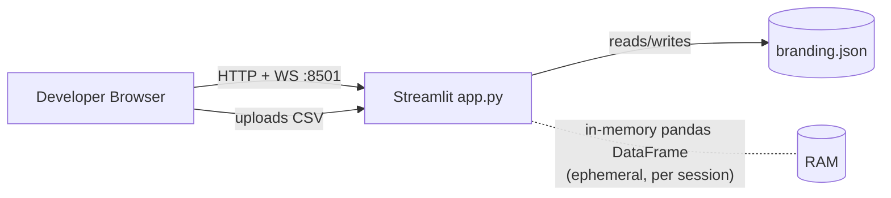

# Local Development — Business Insight Dashboard

Operator guide for running the **Business Insight Dashboard** on a developer
laptop or workstation. This is the simplest target: no cloud, no reverse proxy,
no orchestrator. Two supported paths are documented:

- **Fast path** — native Python virtualenv (fastest inner loop).
- **Container path** — Docker build + run of the repo `Dockerfile` (parity with prod images).

> **What this app is:** a **Streamlit** (Python 3.11.9) single-page dashboard.
> Entry point `app.py`, listens on **8501** locally. A user uploads a CSV in the
> browser; it is parsed with **pandas in memory** and is **never persisted or
> transmitted**. The only durable state is `branding.json` (org name, accent
> color, logo) written next to `app.py`. **No database, no auth, no AI/LLM calls.**

Sibling guides: [SINGLE_LINUX_SERVER.md](./SINGLE_LINUX_SERVER.md) ·
[KUBERNETES.md](./KUBERNETES.md)

---

## 1. Deployment architecture

A single Streamlit process bound to `localhost:8501`. The browser talks to it
over HTTP for the initial page load and then over a **WebSocket** for all
interactive updates (Streamlit's transport). There is no external state store —
uploaded CSVs live only in the session's server-side memory; `branding.json` is
the only file written to disk.

```
Developer browser  ──HTTP+WebSocket──►  streamlit run app.py  (:8501)
                                              │
                                              └─ branding.json  (next to app.py)
                                              └─ CSV parsed in-memory (pandas), ephemeral
```

Because everything is local and single-process, there are **no** load-balancer,
session-affinity, or shared-volume concerns here (those appear in the server and
Kubernetes guides).

---

## 2. Topology



---

## 3. Prerequisites

| Requirement            | Version / Note                                                   |
| ---------------------- | --------------------------------------------------------------- |
| Python                 | **3.11.9** (see `.python-version`); 3.11.x acceptable            |
| pip                    | Recent (bundled with Python 3.11)                               |
| Git                    | Any                                                              |
| Browser                | Any modern browser with WebSocket support                       |
| Docker (container path)| Docker Engine 24+ / Docker Desktop                              |
| Free port              | **8501** available on `localhost`                               |

Python dependencies (`requirements.txt`):

```
streamlit>=1.58.0
pandas>=2.1.0
plotly>=5.20.0
numpy>=1.26.0
```

No system packages are required beyond a standard Python base image.

---

## 4. Identity & credentials

**None.** Local development uses no cloud provider, no secrets, and no login.
The app ships with **no authentication** (Streamlit provides none). Do not put
this on a shared/untrusted network without a reverse proxy providing auth — see
[SINGLE_LINUX_SERVER.md](./SINGLE_LINUX_SERVER.md#4-identity--credentials).

There are no static keys, IAM roles, or managed identities in scope for a laptop
run.

---

## 5. Environment variables

The app requires **almost no** environment configuration to run locally — the
defaults are fine. These are the knobs you may set:

| Variable                                 | Example        | Purpose                                                                 |
| ---------------------------------------- | -------------- | ----------------------------------------------------------------------- |
| `PORT`                                   | `8501`         | Server port (Render/hosted sets this; locally optional).                |
| `STREAMLIT_SERVER_PORT`                  | `8501`         | Explicit Streamlit port (overrides `--server.port`).                    |
| `STREAMLIT_SERVER_ADDRESS`               | `0.0.0.0`      | Bind address; `localhost` is fine for a laptop.                         |
| `STREAMLIT_SERVER_HEADLESS`              | `true`         | Don't auto-open a browser / skip the email prompt.                      |
| `STREAMLIT_SERVER_ENABLE_CORS`           | `false`        | Leave default; only relevant behind a proxy on another origin.          |
| `STREAMLIT_SERVER_ENABLE_XSRF_PROTECTION`| `true`         | Keep XSRF protection on (default true).                                 |
| `STREAMLIT_SERVER_MAX_UPLOAD_SIZE`       | `200`          | Max CSV upload size in **MB**.                                          |
| `STREAMLIT_BROWSER_GATHER_USAGE_STATS`   | `false`        | Disable Streamlit telemetry.                                            |
| `BRANDING_FILE`                          | `./branding.json` | Optional path for `branding.json`. **Note:** the app currently hard-codes this next to `app.py`; this var is documented for parity with cloud targets where a writable/mounted path is needed. |

---

## 6. Configuration references

Streamlit can also be configured via `.streamlit/config.toml` in the project
root. Equivalent settings:

| Config key                          | Example  | Purpose                                             |
| ----------------------------------- | -------- | --------------------------------------------------- |
| `server.maxUploadSize`              | `200`    | Max upload size in MB.                               |
| `server.enableXsrfProtection`       | `true`   | XSRF protection for the WebSocket/form endpoints.   |
| `server.enableCORS`                 | `false`  | CORS toggle; keep false unless proxying cross-origin.|
| `server.headless`                   | `true`   | No auto-open browser, no interactive prompts.        |
| `theme.base`                        | `light`  | UI theme base (`light`/`dark`).                      |
| `browser.gatherUsageStats`          | `false`  | Disable telemetry.                                   |

Example `.streamlit/config.toml`:

```toml
[server]
port = 8501
address = "0.0.0.0"
headless = true
enableXsrfProtection = true
enableCORS = false
maxUploadSize = 200

[browser]
gatherUsageStats = false
```

---

## Fast path — native virtualenv

```bash
cd business-insight-dashboard
python3.11 -m venv .venv
source .venv/bin/activate          # Windows: .venv\Scripts\activate
pip install --upgrade pip
pip install -r requirements.txt

streamlit run app.py \
  --server.port 8501 \
  --server.address 0.0.0.0 \
  --server.headless true
```

Open <http://localhost:8501>.

## Container path — Docker

Builds and runs the repo `Dockerfile` (`python:3.11-slim`, non-root user `app`,
`EXPOSE 8501`, `HEALTHCHECK` on `/_stcore/health`).

```bash
cd business-insight-dashboard
docker build -t business-insight-dashboard:local .

docker run --rm -p 8501:8501 \
  -e STREAMLIT_SERVER_HEADLESS=true \
  -e STREAMLIT_BROWSER_GATHER_USAGE_STATS=false \
  --name bid business-insight-dashboard:local
```

To persist branding across container restarts, mount a volume for the branding
file:

```bash
docker run --rm -p 8501:8501 \
  -v "$PWD/branding.json:/app/branding.json" \
  business-insight-dashboard:local
```

Check the container healthcheck:

```bash
docker inspect --format '{{.State.Health.Status}}' bid
```

---

## 7. Verification

```bash
# 1. Health endpoint must return "ok"
curl -fsS http://localhost:8501/_stcore/health
# -> ok
```

Then in the browser at <http://localhost:8501>:

- [ ] Dashboard loads (no blank page / no persistent "connecting" spinner).
- [ ] Click **Download sample CSV** (or use `sample_data/sample_business.csv`) and re-upload it.
- [ ] **KPIs** render (headline metrics).
- [ ] **Charts** render (Plotly figures).
- [ ] **Insights** render (rule-based narrative).
- [ ] Open **Settings → Branding** in the sidebar, set an org name / accent color / logo, save, and confirm `branding.json` is written:

```bash
cat business-insight-dashboard/branding.json
```

---

## 8. Day-2 operations

- **Upgrades:** bump pins in `requirements.txt`, then `pip install -r requirements.txt` (venv) or rebuild the image (`docker build`). Re-run verification.
- **Scaling:** N/A locally — single process. Interactive updates ride a WebSocket, so a laptop needs no session affinity.
- **Backups:** only `branding.json` holds durable state. Copy it if you want to preserve branding; uploaded CSVs are ephemeral by design and never leave memory.
- **TLS / secrets:** none locally. Add TLS + auth only at a reverse proxy in shared environments.
- **Logs:** Streamlit logs to stdout/stderr in the terminal (venv) or `docker logs bid` (container).

---

## 9. Troubleshooting

| Symptom                                   | Likely cause                                            | Fix                                                                                     |
| ----------------------------------------- | ------------------------------------------------------- | --------------------------------------------------------------------------------------- |
| Blank page / "connecting…" never resolves | Browser blocking WebSocket, or another proxy in the way | Use a direct browser session; disable interfering extensions/proxies.                   |
| `Address already in use` on start         | Port 8501 taken                                         | Free it or run with `--server.port 8502` (and update the URL).                          |
| CSV upload rejected ("file too large")    | Exceeds `maxUploadSize`                                 | Raise `STREAMLIT_SERVER_MAX_UPLOAD_SIZE` / `server.maxUploadSize` (MB).                  |
| `curl /_stcore/health` 404                | Wrong path                                              | Health path is exactly **`/_stcore/health`**.                                           |
| Branding not saved                        | Wrong working directory / no write permission           | Run from the `business-insight-dashboard` dir; ensure the dir is writable.              |
| `ModuleNotFoundError`                      | Deps not installed / wrong venv                         | Activate `.venv` and `pip install -r requirements.txt`.                                  |
| Wrong Python version                       | System Python != 3.11                                   | Use `python3.11 -m venv .venv`; see `.python-version`.                                   |
