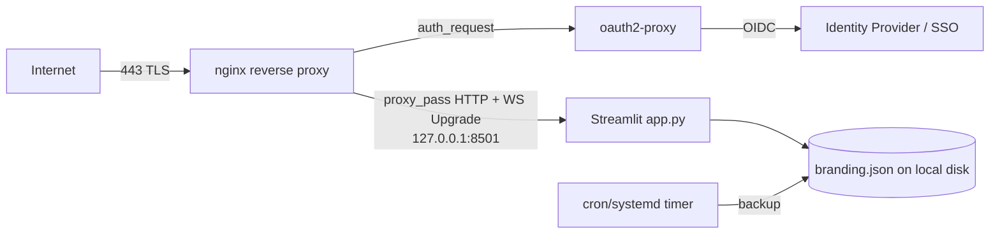

# Single Linux Server — Business Insight Dashboard

Operator guide for running the **Business Insight Dashboard** on a single Linux
VM (bare-metal, EC2, Azure VM, DigitalOcean droplet, etc.) behind an **nginx**
reverse proxy that terminates **TLS** and enforces **authentication** (via
oauth2-proxy). Two ways to run the app process are covered: a native **systemd**
unit and a **Docker Compose** stack.

> **What this app is:** a **Streamlit** (Python 3.11.9) dashboard. Entry point
> `app.py`, listens on **8501**. A user uploads a CSV in the browser; it is
> parsed with **pandas in memory** and is **never persisted or transmitted**.
> The only durable state is `branding.json` (org name, accent color, logo).
> **No database. No built-in auth. No AI/LLM calls.**

> **Streamlit transport note:** Streamlit serves interactive updates over
> **WebSockets**. nginx **must** forward the `Upgrade`/`Connection` headers, and
> because this is a single upstream there is no cross-node affinity problem — but
> as soon as you run more than one app process you need **sticky sessions**. Keep
> `enableXsrfProtection = true`; TLS and auth belong at the proxy.

Sibling guides: [LOCAL_DEVELOPMENT.md](./LOCAL_DEVELOPMENT.md) ·
[KUBERNETES.md](./KUBERNETES.md)

---

## 1. Deployment architecture

The public entry point is **nginx** on ports 80/443. nginx terminates TLS
(Let's Encrypt), delegates authentication to **oauth2-proxy** via the
`auth_request` directive, and reverse-proxies authenticated traffic — including
the **WebSocket upgrade** — to the Streamlit app on `127.0.0.1:8501`. Streamlit
runs either as a systemd service or a Docker Compose service, bound to loopback
so it is never directly reachable from the network.

The only durable state is `branding.json`; it lives on the VM's local disk and
is backed up on a schedule. Uploaded CSVs never touch disk.

```
Internet ──443 (TLS)──► nginx ──auth_request──► oauth2-proxy ──► IdP (OIDC/SSO)
                          │
                          └──proxy_pass (HTTP+WS upgrade)──► 127.0.0.1:8501  (Streamlit app.py)
                                                                   │
                                                                   └─ /var/lib/bid/branding.json
```

---

## 2. Topology



---

## 3. Prerequisites

| Requirement        | Version / Note                                                        |
| ------------------ | -------------------------------------------------------------------- |
| Linux VM           | Ubuntu 22.04/24.04 or RHEL 9 family; 1 vCPU / 1–2 GB RAM is enough    |
| Python             | **3.11.x** (native path) — see `.python-version`                     |
| Docker + Compose   | Engine 24+ and `docker compose` v2 (container path)                  |
| nginx              | 1.18+ (WebSocket proxying supported)                                 |
| certbot            | For Let's Encrypt TLS certificates                                   |
| oauth2-proxy       | 7.x (auth gateway)                                                   |
| DNS                | An A/AAAA record pointing at the VM (for TLS + OIDC redirect URI)    |
| Firewall           | Inbound 80/443 only; **8501 stays on loopback**                     |
| OIDC app registration | Client ID/secret from your IdP (Entra ID, Google, Okta, etc.)     |

---

## 4. Identity & credentials

This app has **no built-in authentication** — do not expose it directly.
Authentication is provided at the edge by **oauth2-proxy** federating to your
IdP over OIDC. Prefer the VM's **managed/workload identity** where available:

- **AWS EC2:** attach an **instance profile (IAM role)** so certbot DNS plugins,
  SSM Parameter Store, or Secrets Manager access need **no static keys**. Grant
  only what's used, e.g. read of the oauth2-proxy client secret:

  ```json
  {
    "Version": "2012-10-17",
    "Statement": [
      {
        "Sid": "ReadProxySecret",
        "Effect": "Allow",
        "Action": ["secretsmanager:GetSecretValue"],
        "Resource": "arn:aws:secretsmanager:REGION:ACCOUNT:secret:bid/oauth2-proxy-*"
      }
    ]
  }
  ```
  (GovCloud: use partition `aws-us-gov` and the FIPS regional endpoints.)

- **Azure VM:** enable a **system-assigned managed identity** and grant it
  `get`/`list` on the Key Vault holding the OIDC client secret (RBAC role
  *Key Vault Secrets User*). No secrets on disk.

- **Fallback (static creds):** if no managed identity exists, store the OIDC
  client secret and cookie secret in a root-owned `0600` env file
  (`/etc/oauth2-proxy.env`) — never in the app repo, never in git.

The Streamlit app itself needs **no cloud credentials** (no DB, no object store,
no AI API).

---

## 5. Environment variables

The app requires **almost no** configuration. Set these on the systemd unit or
in the Compose file:

| Variable                                 | Example                 | Purpose                                                        |
| ---------------------------------------- | ----------------------- | -------------------------------------------------------------- |
| `PORT`                                   | `8501`                  | Server port (loopback bind).                                   |
| `STREAMLIT_SERVER_PORT`                  | `8501`                  | Explicit Streamlit port.                                       |
| `STREAMLIT_SERVER_ADDRESS`               | `127.0.0.1`             | Bind loopback so only nginx can reach it.                      |
| `STREAMLIT_SERVER_HEADLESS`              | `true`                  | No browser auto-open / no prompts.                             |
| `STREAMLIT_SERVER_ENABLE_CORS`           | `false`                 | Same-origin behind nginx; keep off.                            |
| `STREAMLIT_SERVER_ENABLE_XSRF_PROTECTION`| `true`                  | Keep XSRF protection on.                                       |
| `STREAMLIT_SERVER_MAX_UPLOAD_SIZE`       | `200`                   | Max CSV upload in **MB** (align with nginx `client_max_body_size`). |
| `STREAMLIT_BROWSER_GATHER_USAGE_STATS`   | `false`                 | Disable telemetry.                                             |
| `BRANDING_FILE`                          | `/var/lib/bid/branding.json` | Writable path for branding. **Note:** the app currently hard-codes `branding.json` next to `app.py`; on a server, point the app at (or symlink) a stable writable path like `/var/lib/bid/` so upgrades/redeploys don't wipe branding. |

---

## 6. Configuration references

`.streamlit/config.toml` (or the env vars above):

| Config key                     | Example  | Purpose                                              |
| ------------------------------ | -------- | ---------------------------------------------------- |
| `server.maxUploadSize`         | `200`    | Max upload size (MB) — keep ≤ nginx body limit.      |
| `server.enableXsrfProtection`  | `true`   | XSRF protection.                                     |
| `server.enableCORS`            | `false`  | Same-origin behind proxy.                            |
| `server.headless`              | `true`   | No interactive prompts.                              |
| `theme.base`                   | `light`  | UI theme.                                            |
| `browser.gatherUsageStats`     | `false`  | Disable telemetry.                                   |

---

## Run option A — systemd (native)

```bash
sudo useradd --system --home /opt/bid --shell /usr/sbin/nologin bid
sudo mkdir -p /opt/bid /var/lib/bid && sudo chown -R bid:bid /opt/bid /var/lib/bid
# deploy code into /opt/bid/business-insight-dashboard, create venv, install reqs
sudo -u bid python3.11 -m venv /opt/bid/.venv
sudo -u bid /opt/bid/.venv/bin/pip install -r /opt/bid/business-insight-dashboard/requirements.txt
```

`/etc/systemd/system/bid.service`:

```ini
[Unit]
Description=Business Insight Dashboard (Streamlit)
After=network.target

[Service]
User=bid
Group=bid
WorkingDirectory=/opt/bid/business-insight-dashboard
Environment=STREAMLIT_SERVER_HEADLESS=true
Environment=STREAMLIT_SERVER_ENABLE_XSRF_PROTECTION=true
Environment=STREAMLIT_BROWSER_GATHER_USAGE_STATS=false
Environment=BRANDING_FILE=/var/lib/bid/branding.json
ExecStart=/opt/bid/.venv/bin/streamlit run app.py \
  --server.port 8501 --server.address 127.0.0.1 --server.headless true
Restart=on-failure
RestartSec=3
# hardening
NoNewPrivileges=true
ProtectSystem=strict
ProtectHome=true
ReadWritePaths=/var/lib/bid
PrivateTmp=true

[Install]
WantedBy=multi-user.target
```

```bash
sudo systemctl daemon-reload
sudo systemctl enable --now bid
```

## Run option B — Docker Compose

`docker-compose.yml`:

```yaml
services:
  app:
    build: ./business-insight-dashboard
    image: business-insight-dashboard:latest
    restart: unless-stopped
    environment:
      STREAMLIT_SERVER_HEADLESS: "true"
      STREAMLIT_SERVER_ENABLE_XSRF_PROTECTION: "true"
      STREAMLIT_BROWSER_GATHER_USAGE_STATS: "false"
    ports:
      - "127.0.0.1:8501:8501"     # loopback only; nginx fronts it
    volumes:
      - bid-branding:/app/branding.json
volumes:
  bid-branding:
```

## nginx reverse proxy + TLS + WebSocket

`/etc/nginx/sites-available/bid.conf` (WebSocket upgrade is mandatory):

```nginx
map $http_upgrade $connection_upgrade {
    default upgrade;
    ''      close;
}

server {
    listen 443 ssl http2;
    server_name dashboard.example.com;

    ssl_certificate     /etc/letsencrypt/live/dashboard.example.com/fullchain.pem;
    ssl_certificate_key /etc/letsencrypt/live/dashboard.example.com/privkey.pem;

    client_max_body_size 200m;   # keep >= Streamlit maxUploadSize

    # --- auth gateway ---
    location = /oauth2/auth { proxy_pass http://127.0.0.1:4180; }
    location /oauth2/ {
        proxy_pass http://127.0.0.1:4180;
        proxy_set_header Host              $host;
        proxy_set_header X-Real-IP         $remote_addr;
        proxy_set_header X-Forwarded-Proto $scheme;
    }

    location / {
        auth_request /oauth2/auth;
        error_page 401 = /oauth2/sign_in;

        proxy_pass http://127.0.0.1:8501;
        proxy_http_version 1.1;

        # WebSocket upgrade — required for Streamlit
        proxy_set_header Upgrade    $http_upgrade;
        proxy_set_header Connection $connection_upgrade;

        proxy_set_header Host              $host;
        proxy_set_header X-Real-IP         $remote_addr;
        proxy_set_header X-Forwarded-For   $proxy_add_x_forwarded_for;
        proxy_set_header X-Forwarded-Proto $scheme;

        proxy_read_timeout 3600s;   # long-lived WS
        proxy_send_timeout 3600s;
    }
}

server {
    listen 80;
    server_name dashboard.example.com;
    return 301 https://$host$request_uri;
}
```

Obtain the certificate:

```bash
sudo certbot --nginx -d dashboard.example.com
```

## oauth2-proxy (auth gateway)

```bash
oauth2-proxy \
  --provider=oidc \
  --oidc-issuer-url=https://login.microsoftonline.com/<tenant>/v2.0 \
  --client-id=$OIDC_CLIENT_ID \
  --client-secret=$OIDC_CLIENT_SECRET \
  --cookie-secret=$OAUTH2_PROXY_COOKIE_SECRET \
  --email-domain=example.com \
  --http-address=127.0.0.1:4180 \
  --reverse-proxy=true \
  --upstream=static://202     # nginx handles proxying to Streamlit
```

Secrets come from the VM's managed identity / Secrets Manager / Key Vault (see §4).

---

## 7. Verification

```bash
# 1. App health via loopback (bypasses proxy)
curl -fsS http://127.0.0.1:8501/_stcore/health          # -> ok

# 2. Through nginx + TLS (will 302 to sign_in until authenticated)
curl -fsSI https://dashboard.example.com/_stcore/health
```

In an authenticated browser session at `https://dashboard.example.com`:

- [ ] Dashboard loads; no blank page / no WebSocket disconnect loop.
- [ ] Download the sample CSV (or upload `sample_data/sample_business.csv`).
- [ ] **KPIs**, **charts** (Plotly), and **insights** all render.
- [ ] Settings → Branding: set name/color/logo, save, then confirm on the server:

```bash
sudo cat /var/lib/bid/branding.json     # or: docker volume inspect bid-branding
```

---

## 8. Day-2 operations

- **Upgrades:** bump `requirements.txt`, then `pip install -r requirements.txt && systemctl restart bid` (native) or `docker compose build && docker compose up -d` (container). Re-run §7.
- **Scaling:** the app is stateless **except** `branding.json`. A single VM = single upstream, so affinity is a non-issue. If you add app replicas (multiple ports / multiple containers), you **must** enable **sticky sessions** (e.g. nginx `ip_hash` or a cookie-based `sticky` upstream) because Streamlit's WebSocket session is pinned to one worker, and you must put `branding.json` on **shared storage** or it will diverge per replica.
- **Backups:** back up **only** `/var/lib/bid/branding.json` (uploaded CSVs are ephemeral and never written). Example daily timer:

  ```bash
  install -o root -m 700 -d /var/backups/bid
  # cron: 0 2 * * *  cp /var/lib/bid/branding.json /var/backups/bid/branding-$(date +\%F).json
  ```
- **TLS / secret rotation:** certbot auto-renews (`systemctl status certbot.timer`); rotate the oauth2-proxy cookie/client secret in Secrets Manager / Key Vault and restart oauth2-proxy.
- **Logs:** `journalctl -u bid -f` (native) or `docker compose logs -f app`; nginx access/error logs under `/var/log/nginx/`.

---

## 9. Troubleshooting

| Symptom                                          | Likely cause                                                         | Fix                                                                                       |
| ------------------------------------------------ | ------------------------------------------------------------------- | ----------------------------------------------------------------------------------------- |
| Blank page / repeated "connecting" / WS drops    | nginx not forwarding `Upgrade`/`Connection` headers                 | Add the `map $http_upgrade` block + `proxy_set_header Upgrade/Connection` (see config).    |
| Works alone, breaks with >1 replica              | No **session affinity**                                             | Enable sticky sessions (`ip_hash`/cookie) so a client stays on one Streamlit worker.       |
| CSV upload rejected                              | `maxUploadSize` or nginx `client_max_body_size` too small          | Raise both; keep `client_max_body_size` ≥ `server.maxUploadSize`.                          |
| `502 Bad Gateway`                                | App not listening / crashed                                        | `systemctl status bid` / `docker compose ps`; check it's on `127.0.0.1:8501`.              |
| `/_stcore/health` returns 404                    | Wrong health path                                                  | Path is exactly **`/_stcore/health`**.                                                     |
| Redirect loop at sign-in                         | oauth2-proxy redirect URI mismatch                                 | Register `https://dashboard.example.com/oauth2/callback` in the IdP.                       |
| Branding resets after redeploy                   | `branding.json` written to ephemeral app dir                       | Point `BRANDING_FILE` (or symlink) at `/var/lib/bid` / a named volume.                     |
| TLS handshake / cert errors                      | Cert not issued or expired                                         | `sudo certbot renew`; check `certbot.timer`.                                               |
