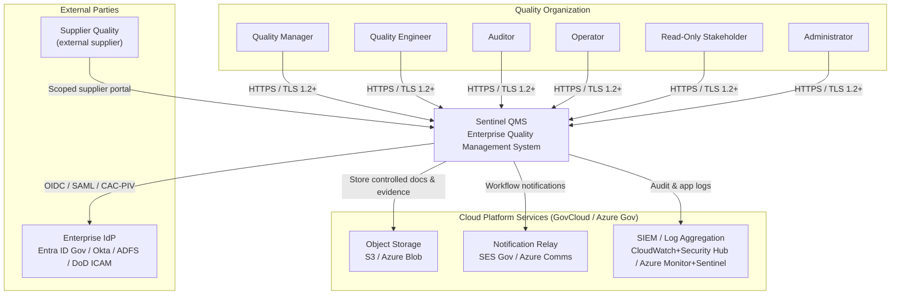
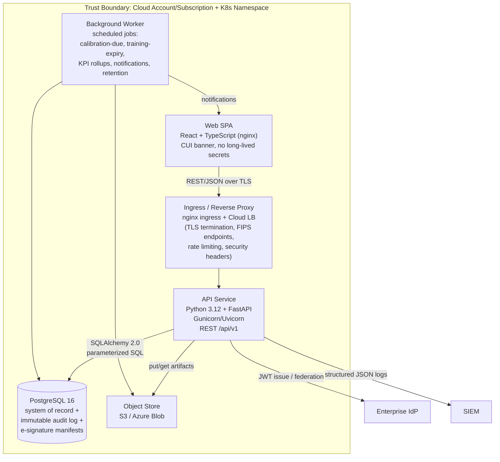
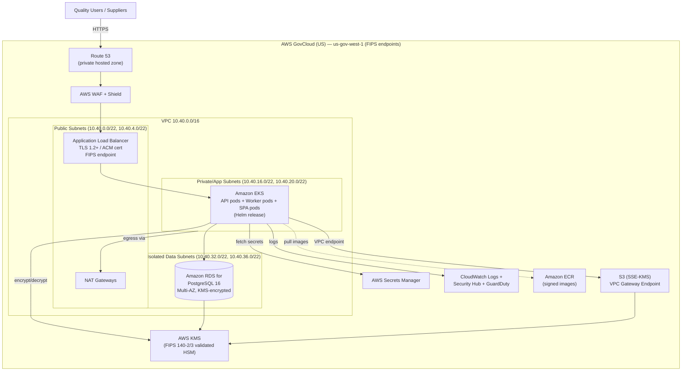
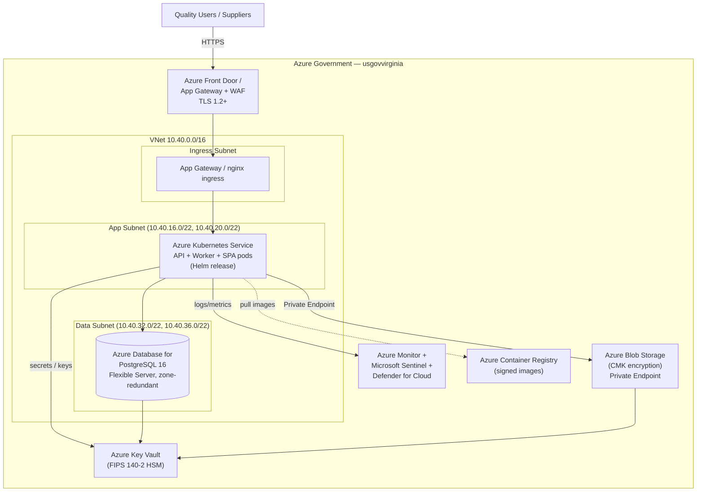

# Architecture Diagrams

This document collects the rendered **Mermaid** diagrams for Sentinel QMS: the C4 system-context and
container views, the deployment topologies for **AWS GovCloud (US)** and **Microsoft Azure Government**,
and a representative data-flow for a signature-bearing write. Diagrams render natively on GitHub.

For the narrative description of these diagrams, see [overview.md](overview.md).

---

## 1. System Context (C4 — Level 1)



---

## 2. Container View (C4 — Level 2)



---

## 3. Deployment — AWS GovCloud (US)



---

## 4. Deployment — Microsoft Azure Government



---

## 5. Data Flow — Signature-Bearing Write (NCR Disposition)

```mermaid
sequenceDiagram
    autonumber
    participant U as User (Browser SPA)
    participant LB as Ingress (TLS/FIPS)
    participant API as FastAPI Service
    participant AZ as RBAC Dependency
    participant SVC as NCR Service
    participant ES as E-Signature Service
    participant DB as PostgreSQL (txn)
    participant AUD as Audit Log
    participant Q as Worker Queue
    participant S as SIEM

    U->>LB: POST /api/v1/nonconformances/{id}/disposition (JWT)
    LB->>API: forward over private subnet
    API->>API: validate JWT (sig, exp, type)
    API->>AZ: require_permission(ncr:disposition)
    AZ-->>API: user authorized
    API->>SVC: validate request (Pydantic) + state machine
    SVC->>ES: capture e-signature (re-auth: password/CAC-PIN)
    ES-->>SVC: signature manifest (who/what/when/why + record hash)
    SVC->>DB: BEGIN; UPDATE ncr SET disposition...
    SVC->>AUD: INSERT audit row (actor, action, before/after hash, IP, session)
    DB-->>SVC: COMMIT
    SVC->>Q: enqueue notifications (originator, CAPA owner)
    API-->>U: 200 OK (serialized response)
    API->>S: structured JSON access/audit log line
```

---

## 6. CI/CD Pipeline (GitHub Actions)

```mermaid
graph LR
    DEV["Developer<br/>feature branch"] -->|PR| GH["GitHub"]
    GH --> LINT["ruff lint +<br/>type checks"]
    LINT --> TEST["pytest +<br/>coverage gate"]
    TEST --> SCAN["SAST + dependency scan +<br/>secret scan + container scan"]
    SCAN --> BUILD["Build images<br/>(backend, frontend)"]
    BUILD --> SIGN["Sign images<br/>(cosign) + SBOM"]
    SIGN --> PUSH["Push to ECR / ACR"]
    PUSH --> STG["Deploy to Staging<br/>(Helm)"]
    STG --> SMOKE["Smoke tests"]
    SMOKE --> APPROVE{"Manual<br/>approval"}
    APPROVE -->|approved| PROD["Deploy to Production<br/>(GovCloud / Azure Gov)"]
```


