# Data Model

This document describes the Sentinel QMS relational data model: a high-level entity-relationship (ER)
overview in Mermaid, a table-by-table data dictionary organized by module, and the controlled
record-numbering scheme. The system of record is **PostgreSQL 16**; all tables carry tenant scope,
audit timestamps, and (where applicable) optimistic-concurrency version columns.

---

## 1. Conventions

All business tables share a common set of columns unless noted otherwise:

| Column | Type | Purpose |
|--------|------|---------|
| `id` | `uuid` (PK) | Surrogate primary key (UUID v4) |
| `organization_id` | `uuid` (FK) | Tenant scope; enforced by app filter + PostgreSQL RLS |
| `record_number` | `text` (unique per type) | Human-readable controlled number (see §5) |
| `created_at` | `timestamptz` | Insert time (UTC) |
| `updated_at` | `timestamptz` | Last-modified time (UTC), maintained on update |
| `created_by` | `uuid` (FK → `users`) | Originating user |
| `updated_by` | `uuid` (FK → `users`) | Last user to modify |
| `version` | `integer` | Optimistic-concurrency token |

- **Soft deletes** are not used for quality records; instead records move through *retired/obsolete/closed*
  states and remain for retention. The audit log is **append-only**.
- **Enumerations** (statuses, dispositions, severities) are stored as `text` constrained by `CHECK`
  constraints and validated by Pydantic at the API boundary.
- **Foreign keys** are enforced at the database level; cross-module links (e.g., NCR → CAPA) use FKs.

---

## 2. ER Overview

```mermaid
erDiagram
    ORGANIZATION ||--o{ USER : "scopes"
    ORGANIZATION ||--o{ DOCUMENT : "owns"
    USER ||--o{ USER_ROLE : "has"
    ROLE ||--o{ USER_ROLE : "granted via"
    USER ||--o{ AUDIT_LOG : "acts"
    USER ||--o{ ESIGNATURE : "signs"

    DOCUMENT ||--o{ DOCUMENT_REVISION : "versions"
    DOCUMENT_REVISION ||--o{ ESIGNATURE : "approved by"

    NONCONFORMANCE ||--o{ NCR_DISPOSITION : "dispositioned by"
    NONCONFORMANCE ||--o{ MRB_RECORD : "reviewed by"
    NONCONFORMANCE }o--o| CAPA : "may trigger"
    NONCONFORMANCE }o--o| SUPPLIER : "attributed to"

    CAPA ||--o{ CAPA_STEP : "8D steps"
    CAPA ||--o{ CAPA_ACTION : "actions"
    CAPA }o--o| AUDIT_FINDING : "may originate from"

    AUDIT_PLAN ||--o{ AUDIT_EVENT : "schedules"
    AUDIT_EVENT ||--o{ AUDIT_FINDING : "raises"

    SUPPLIER ||--o{ SCAR : "issued"
    SUPPLIER ||--o{ SUPPLIER_RATING : "scored"
    SUPPLIER ||--o{ ASL_ENTRY : "listed on"

    EQUIPMENT ||--o{ CALIBRATION_EVENT : "calibrated"
    EQUIPMENT }o--o| SUPPLIER : "calibrated by"

    TRAINING_COURSE ||--o{ TRAINING_RECORD : "completed as"
    USER ||--o{ TRAINING_RECORD : "earns"

    CHANGE_REQUEST ||--o{ CHANGE_TASK : "tasks"
    CHANGE_REQUEST }o--o{ DOCUMENT : "affects"

    RISK ||--o{ RISK_ASSESSMENT : "scored"

    INSPECTION ||--o{ INSPECTION_RESULT : "records"
    FAI_REPORT ||--o{ FAI_CHARACTERISTIC : "AS9102 forms"
    FAI_REPORT }o--o| INSPECTION : "based on"

    MANAGEMENT_REVIEW ||--o{ MGMT_REVIEW_INPUT : "inputs"
    MANAGEMENT_REVIEW ||--o{ MGMT_REVIEW_ACTION : "outputs"

    COMPLAINT ||--o| RMA : "may create"
    COMPLAINT }o--o| CAPA : "may trigger"

    ATTACHMENT }o--|| DOCUMENT : "files"
```



> The diagram is intentionally abridged; every business entity also relates to `ORGANIZATION`,
> `AUDIT_LOG`, and (for signature-bearing actions) `ESIGNATURE`.

---

## 3. Table-by-Table Data Dictionary

### 3.1 Identity, Access & Cross-Cutting

| Table | Key columns | Description |
|-------|-------------|-------------|
| `organizations` | `id`, `name`, `cui_handling`, `itar_controlled` | Tenant root. Flags drive RLS scope and export-control gating. |
| `users` | `id`, `email`, `display_name`, `password_hash`, `auth_source`, `is_active`, `last_login_at` | User accounts. `auth_source` ∈ {local, oidc, saml, cac_piv}. |
| `roles` | `id`, `name` | The seven roles (Admin, Quality Manager, Quality Engineer, Auditor, Supplier Quality, Operator, Read-Only). |
| `user_roles` | `user_id`, `role_id` | Many-to-many role assignment. |
| `audit_log` | `id`, `actor_id`, `action`, `entity_type`, `entity_id`, `before_hash`, `after_hash`, `source_ip`, `session_id`, `occurred_at` | **Append-only**, tamper-evident audit trail. Insert-only; UPDATE/DELETE blocked by trigger + revoked grants. |
| `esignatures` | `id`, `signer_id`, `entity_type`, `entity_id`, `meaning`, `record_hash`, `reauth_method`, `signed_at` | 21 CFR Part 11-style manifest: who/what/when/why + bound record hash. |
| `attachments` | `id`, `entity_type`, `entity_id`, `storage_key`, `original_filename`, `content_type`, `sha256`, `size_bytes` | Metadata for binary artifacts stored in S3/Blob with randomized `storage_key`. |
| `notifications` | `id`, `user_id`, `kind`, `payload`, `read_at` | Workflow notifications (due dates, approvals, escalations). |

### 3.2 Document & Records Control

| Table | Key columns | Description |
|-------|-------------|-------------|
| `documents` | `id`, `record_number` (DOC-…), `title`, `doc_type`, `owner_id`, `status`, `current_revision_id` | Controlled document master. `status` ∈ {draft, in_review, approved, released, obsolete}. |
| `document_revisions` | `id`, `document_id`, `revision`, `change_summary`, `effective_date`, `storage_key`, `approved_by`, `approved_at` | Immutable revision history; each release is a new revision approved via e-signature. |
| `document_acknowledgements` | `id`, `revision_id`, `user_id`, `acknowledged_at` | Read-and-understood acknowledgements for released documents. |

### 3.3 Nonconformance (NCR / MRB)

| Table | Key columns | Description |
|-------|-------------|-------------|
| `nonconformances` | `id`, `record_number` (NCR-…), `title`, `description`, `severity`, `source`, `part_number`, `lot_serial`, `quantity_affected`, `supplier_id`, `status` | NCR header. `status` ∈ {open, in_review, dispositioned, closed}. |
| `ncr_dispositions` | `id`, `ncr_id`, `disposition`, `justification`, `signed_by`, `signed_at` | Disposition decision: use-as-is, rework, repair, scrap, return-to-supplier (RTV). Signature-bearing. |
| `mrb_records` | `id`, `ncr_id`, `board_members`, `decision`, `convened_at`, `minutes` | Material Review Board record for use-as-is/repair dispositions (AS9100D 8.7). |

### 3.4 CAPA (8D)

| Table | Key columns | Description |
|-------|-------------|-------------|
| `capas` | `id`, `record_number` (CAPA-…), `title`, `problem_statement`, `source`, `priority`, `owner_id`, `status`, `due_date`, `closed_at` | CAPA header. `source` links NCR / audit finding / complaint. `status` ∈ {open, containment, root_cause, corrective_action, verification, closed}. |
| `capa_steps` | `id`, `capa_id`, `step` (D1–D8), `content`, `completed_at` | 8D discipline steps (D1 team … D8 closure). |
| `capa_actions` | `id`, `capa_id`, `action_type`, `description`, `owner_id`, `due_date`, `status`, `effectiveness_verified` | Containment / corrective / preventive actions and effectiveness verification. |

### 3.5 Audit Management

| Table | Key columns | Description |
|-------|-------------|-------------|
| `audit_plans` | `id`, `record_number` (AUD-…), `title`, `audit_type`, `scope`, `standard`, `year` | Annual/program audit schedule. `audit_type` ∈ {internal, supplier, layered, certification}. |
| `audit_events` | `id`, `plan_id`, `lead_auditor_id`, `auditee`, `scheduled_date`, `status`, `clauses_in_scope` | Individual audit instance. |
| `audit_findings` | `id`, `audit_event_id`, `record_number` (FND-…), `finding_type`, `clause_ref`, `description`, `capa_id`, `status` | Findings. `finding_type` ∈ {major_nc, minor_nc, observation, ofi}. Major/minor link to a CAPA. |

### 3.6 Supplier Quality (ASL / SCAR / Ratings)

| Table | Key columns | Description |
|-------|-------------|-------------|
| `suppliers` | `id`, `record_number` (SUP-…), `name`, `cage_code`, `approval_status`, `commodity`, `risk_level` | Supplier master. `approval_status` ∈ {prospective, approved, conditional, disqualified}. |
| `asl_entries` | `id`, `supplier_id`, `scope`, `effective_date`, `expiry_date`, `restrictions` | Approved Supplier List entries (scope/commodity, special-process approvals). |
| `scars` | `id`, `record_number` (SCAR-…), `supplier_id`, `ncr_id`, `issue`, `response_due`, `response`, `status` | Supplier Corrective Action Requests; suppliers respond via scoped portal. |
| `supplier_ratings` | `id`, `supplier_id`, `period`, `otd_score`, `quality_score`, `responsiveness_score`, `composite_score`, `rating` | Periodic scorecards (on-time delivery, PPM/quality, responsiveness). |

### 3.7 Calibration & Equipment

| Table | Key columns | Description |
|-------|-------------|-------------|
| `equipment` | `id`, `record_number` (EQP-…), `asset_tag`, `description`, `manufacturer`, `model`, `serial_number`, `location`, `calibration_interval_days`, `next_due_date`, `status` | Measurement & test equipment (M&TE) and tooling register. |
| `calibration_events` | `id`, `equipment_id`, `performed_at`, `performed_by`, `calibration_supplier_id`, `result`, `certificate_key`, `as_found`, `as_left`, `next_due_date` | Calibration history with NIST-traceable certificates. `result` ∈ {pass, pass_with_adjustment, fail, limited}. |

### 3.8 Training & Competency

| Table | Key columns | Description |
|-------|-------------|-------------|
| `training_courses` | `id`, `record_number` (TRN-…), `title`, `competency_area`, `recurrence_months`, `required_roles` | Course/qualification catalog. |
| `training_records` | `id`, `course_id`, `user_id`, `completed_at`, `expires_at`, `score`, `evidence_key`, `status` | Per-user completion & competency evidence. `status` ∈ {current, expiring, expired}. |

### 3.9 Change Management (ECN / ECO)

| Table | Key columns | Description |
|-------|-------------|-------------|
| `change_requests` | `id`, `record_number` (ECN-…/ECO-…), `title`, `change_type`, `description`, `justification`, `impact_assessment`, `disposition`, `status`, `owner_id` | Engineering Change Notice/Order. `status` ∈ {draft, under_review, approved, implemented, verified, closed}. |
| `change_tasks` | `id`, `change_request_id`, `description`, `owner_id`, `due_date`, `completed_at` | Implementation tasks and verification steps. |
| `change_affected_items` | `change_request_id`, `document_id` / `part_number` | Documents and parts affected by the change. |

### 3.10 Risk Management

| Table | Key columns | Description |
|-------|-------------|-------------|
| `risks` | `id`, `record_number` (RSK-…), `title`, `category`, `context`, `owner_id`, `status` | Risk register entry (quality, operational, supply-chain, compliance). |
| `risk_assessments` | `id`, `risk_id`, `likelihood`, `severity`, `rpn`, `controls`, `residual_likelihood`, `residual_severity`, `assessed_at` | Periodic assessments; `rpn` = likelihood × severity (risk-based thinking, ISO 9001 cl. 6.1). |

### 3.11 Inspection & First Article (FAI / AS9102)

| Table | Key columns | Description |
|-------|-------------|-------------|
| `inspections` | `id`, `record_number` (INS-…), `part_number`, `lot_serial`, `inspection_type`, `inspector_id`, `result`, `performed_at` | Receiving/in-process/final inspection records. |
| `inspection_results` | `id`, `inspection_id`, `characteristic`, `nominal`, `tolerance`, `measured`, `pass_fail` | Per-characteristic measured results. |
| `fai_reports` | `id`, `record_number` (FAI-…), `part_number`, `part_revision`, `inspection_id`, `form1`, `form2`, `form3`, `status` | AS9102 First Article Inspection Report (Forms 1/2/3). |
| `fai_characteristics` | `id`, `fai_report_id`, `char_number`, `requirement`, `result`, `tooling`, `nonconformance_ref` | AS9102 Form 3 characteristic accountability. |

### 3.12 Management Review

| Table | Key columns | Description |
|-------|-------------|-------------|
| `management_reviews` | `id`, `record_number` (MR-…), `meeting_date`, `chair_id`, `attendees`, `status` | Management review meeting record (ISO 9001 cl. 9.3). |
| `mgmt_review_inputs` | `id`, `review_id`, `input_type`, `summary`, `data_ref` | Standard inputs (audit results, customer feedback, KPI performance, CAPA status, risks). |
| `mgmt_review_actions` | `id`, `review_id`, `action`, `owner_id`, `due_date`, `status` | Output actions and resource decisions. |

### 3.13 Customer Complaints / RMA

| Table | Key columns | Description |
|-------|-------------|-------------|
| `complaints` | `id`, `record_number` (CMP-…), `customer`, `part_number`, `description`, `severity`, `capa_id`, `status` | Customer complaint intake and triage. |
| `rmas` | `id`, `record_number` (RMA-…), `complaint_id`, `disposition`, `received_at`, `resolution`, `status` | Return Material Authorization lifecycle. |

### 3.14 Dashboard / KPIs

KPIs are computed views/materialized rollups rather than primary tables:

| View / rollup | Source | Description |
|---------------|--------|-------------|
| `kpi_ncr_aging` | `nonconformances` | Open NCRs by age bucket and severity. |
| `kpi_capa_ontime` | `capas`, `capa_actions` | CAPA on-time closure rate and overdue counts. |
| `kpi_supplier_scorecards` | `supplier_ratings` | Composite supplier performance trend. |
| `kpi_calibration_due` | `equipment` | Equipment due/overdue for calibration. |
| `kpi_training_status` | `training_records` | Competency currency by role/area. |
| `kpi_audit_findings` | `audit_findings` | Open findings by type and clause. |

---

## 4. Audit Log & E-Signature Integrity

- The `audit_log` table is **insert-only**. A `BEFORE UPDATE OR DELETE` trigger raises an exception, and
  the application database role is granted only `INSERT, SELECT` on the table.
- Each business write and its audit row are committed in the **same transaction**, guaranteeing the trail
  cannot diverge from the data.
- `before_hash`/`after_hash` are SHA-256 digests of the canonical record state, enabling tamper-evidence.
- `esignatures.record_hash` cryptographically binds a signature to the exact record state at signing time,
  supporting **non-repudiation** (21 CFR Part 11 §11.70, §11.10(e)).

---

## 5. Record Numbering Scheme

Controlled records use a deterministic, human-readable numbering format generated by the numbering
service. The pattern is:

```
<PREFIX>-<YYYY>-<ZERO-PADDED-SEQUENCE>
e.g.  NCR-2026-000147,  CAPA-2026-000058,  FAI-2026-000012
```

| Record type | Prefix | Example |
|-------------|--------|---------|
| Controlled Document | `DOC` | `DOC-2026-000231` |
| Nonconformance | `NCR` | `NCR-2026-000147` |
| Corrective/Preventive Action | `CAPA` | `CAPA-2026-000058` |
| Audit (plan/event) | `AUD` | `AUD-2026-000019` |
| Audit Finding | `FND` | `FND-2026-000042` |
| Supplier | `SUP` | `SUP-2026-000088` |
| Supplier Corrective Action Request | `SCAR` | `SCAR-2026-000027` |
| Equipment / M&TE | `EQP` | `EQP-2026-000310` |
| Training Course | `TRN` | `TRN-2026-000016` |
| Engineering Change Notice/Order | `ECN` / `ECO` | `ECN-2026-000073` |
| Risk | `RSK` | `RSK-2026-000021` |
| Inspection | `INS` | `INS-2026-000509` |
| First Article Inspection | `FAI` | `FAI-2026-000012` |
| Management Review | `MR` | `MR-2026-000004` |
| Customer Complaint | `CMP` | `CMP-2026-000034` |
| Return Material Authorization | `RMA` | `RMA-2026-000018` |

Sequence counters are allocated per `organization_id` and per record type using a transactional
counter table with row-level locking, guaranteeing **gap-free, unique** numbers even under concurrency.
The year segment rolls over on January 1 (configurable to fiscal year). Prefixes are configurable in the
administrator console — see [../user-guide/administrator-guide.md](../user-guide/administrator-guide.md).
