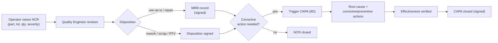
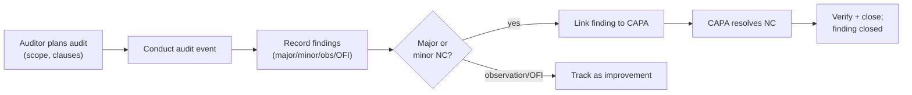
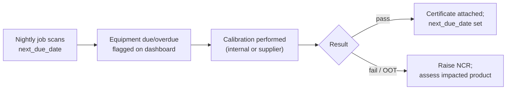
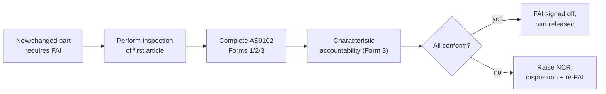

# User Guide

This guide explains how each role uses Sentinel QMS day-to-day and walks the core end-to-end quality
workflows. It assumes you have an account and the appropriate role (see the
[RBAC matrix](../architecture/security-architecture.md#32-rbac-permission-matrix)).

> **CUI notice.** When the system holds program data, screens may display Controlled Unclassified
> Information and export-controlled technical data. Observe the persistent CUI banner and your
> organization's handling rules. Do not screenshot or export controlled data outside approved channels.

---

## 1. Getting Started

1. **Sign in.** Use your organization credentials (SSO/OIDC/SAML or CAC/PIV) or local login. MFA is
   required where configured.
2. **Dashboard.** After login you land on the **Dashboard/KPIs** — open NCRs, CAPA on-time rate, supplier
   scorecards, calibration/training due, and audit findings.
3. **Navigation.** Modules are listed in the left navigation; your role determines which actions you can
   take. Read-only stakeholders see data but cannot edit.
4. **Records.** Every record has a controlled number (e.g., `NCR-2026-000147`) you can search by. Actions
   that change a record's state are audited; some require an electronic signature.

---

## 2. Roles at a Glance

| Role | Primary activities |
|------|--------------------|
| **Quality Manager** | Oversees all modules, approves dispositions/closures, chairs management review |
| **Quality Engineer** | Raises/dispositions NCRs, drives CAPAs, runs inspections/FAI, manages changes |
| **Auditor** | Plans/executes audits, records findings, links them to CAPAs (read elsewhere) |
| **Supplier Quality** | Manages ASL/SCARs/ratings; external suppliers respond to SCARs/FAI via scoped access |
| **Operator** | Records nonconformances at the point of work and inspection results |
| **Read-Only** | Views records and KPIs (e.g., program managers, customers) |
| **Admin** | User/role management and configuration (see [administrator-guide.md](administrator-guide.md)) |

---

## 3. Module Walkthroughs

### 3.1 Document & Records Control
- Create a controlled document (`DOC-…`), upload content, set type and owner.
- Route for review; approvers apply an **electronic signature** to release a revision.
- Released documents request **read-and-understood acknowledgements** from affected users.
- Superseded revisions are retained; status moves draft → in_review → approved → released → obsolete.

### 3.2 Nonconformance (NCR / MRB)
- **Operators/Engineers** raise an NCR with part number, lot/serial, quantity affected, severity, source.
- A **Quality Engineer/Manager** dispositions it: use-as-is, rework, repair, scrap, or return-to-supplier.
  Use-as-is/repair convene a **Material Review Board (MRB)** record. Disposition is **signature-bearing**.
- If a corrective action is warranted, **trigger a CAPA** directly from the NCR.

### 3.3 CAPA (8D)
- Open a CAPA from an NCR, audit finding, or complaint. Work the **8D** disciplines (D1 team … D8 closure).
- Record containment, root-cause analysis, corrective and preventive actions with owners and due dates.
- Verify **effectiveness**, then close with an electronic signature. On-time closure feeds the dashboard.

### 3.4 Audit Management
- **Auditors** build an audit plan (`AUD-…`): type (internal/supplier/layered/certification), scope,
  standard, clauses.
- Conduct the audit event; record **findings** (major/minor/observation/OFI) with clause references.
- Major/minor findings **link to a CAPA** for resolution and tracking.

### 3.5 Supplier Quality (ASL / SCAR / Ratings)
- **Supplier Quality** maintains the **Approved Supplier List** and supplier statuses.
- Issue **SCARs** (`SCAR-…`) for supplier nonconformances; external suppliers respond via the scoped
  supplier portal.
- Periodic **ratings/scorecards** combine on-time delivery, quality (PPM), and responsiveness.

### 3.6 Calibration & Equipment
- Maintain the **M&TE register** (`EQP-…`): asset, interval, next-due date.
- Record **calibration events** with NIST-traceable certificates, as-found/as-left, and result.
- Equipment due/overdue surfaces on the dashboard; out-of-tolerance findings can trigger an NCR.

### 3.7 Training & Competency
- Define **courses** (`TRN-…`) mapped to roles with recurrence.
- Record **completions** with evidence and expiry; expiring/expired competencies are flagged.

### 3.8 Change Management (ECN/ECO)
- Raise an **ECN/ECO** with description, justification, and **impact assessment**.
- Link affected documents/parts; route for **approval** (signature-bearing); track implementation and
  **verification** tasks to closure.

### 3.9 Risk Management
- Maintain the **risk register** (`RSK-…`). Each assessment scores likelihood × severity (**RPN**),
  records controls, and computes **residual risk** (risk-based thinking, ISO 9001 cl. 6.1).

### 3.10 Inspection & First Article (FAI / AS9102)
- Record receiving/in-process/final **inspections** and per-characteristic results.
- Build a **FAI report** (`FAI-…`) per **AS9102** (Forms 1/2/3) with full characteristic accountability;
  **sign off** when complete.

### 3.11 Management Review
- The **Quality Manager** schedules a review (`MR-…`), captures standard **inputs** (audit results,
  customer feedback, KPI performance, CAPA status, risks), and records **output actions** with owners.

### 3.12 Customer Complaints / RMA
- Log a **complaint** (`CMP-…`); triage severity; optionally create an **RMA** (`RMA-…`) and/or trigger a
  CAPA. Resolution and customer satisfaction feed KPIs.

### 3.13 Dashboard / KPIs
- Monitor NCR aging, CAPA on-time closure, supplier scorecards, calibration/training status, and open
  audit findings. KPIs drive management review and continual improvement.

---

## 4. End-to-End Workflows

### 4.1 NCR → CAPA

### 4.2 Audit → Finding → CAPA

### 4.3 Calibration Due

### 4.4 First Article (FAI)

---

## 5. Electronic Signatures

When an action is signature-bearing (document approval, NCR/MRB disposition, CAPA closure, change
approval, FAI sign-off) you will be prompted to **re-authenticate** (password or CAC-PIN) and to confirm
the **meaning** of your signature. The signature is permanently bound to the record and appears on
exports. See [../compliance/21-cfr-part-11.md](../compliance/21-cfr-part-11.md).

---

## 6. Searching, Filtering & Exporting

- **Search** by record number, part number, or keyword.
- **Filter** lists by status, severity, supplier, owner, and date range; **sort** by any column.
- **Export** records (PDF/JSON) for audits and customer packages; exports include signature manifests and
  carry CUI/export markings per policy.

---

## 7. Tips for Auditors & Suppliers

- **Auditors** receive a read-only view across modules plus audit-write; use record exports to assemble
  objective evidence and the audit-log view to trace any record's history.
- **Suppliers** see only their own records via the scoped portal — typically open SCARs and requested FAI
  packages — and never other parties' data.
